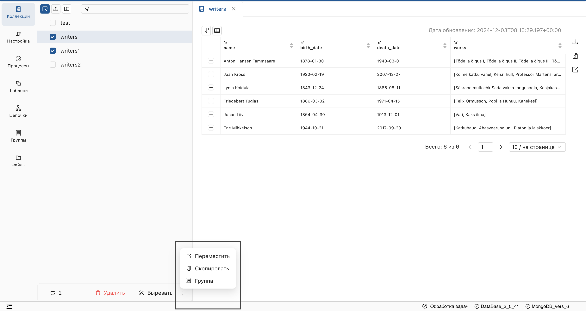
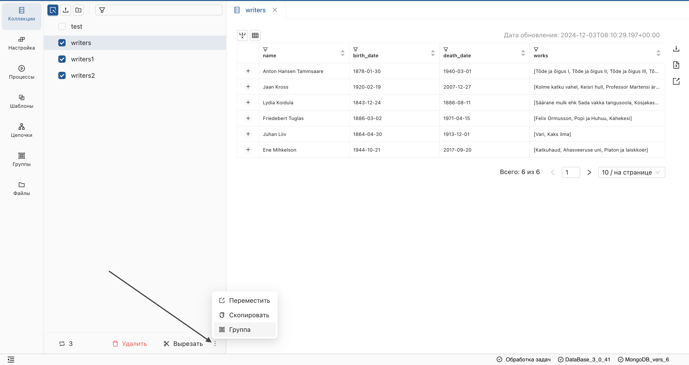
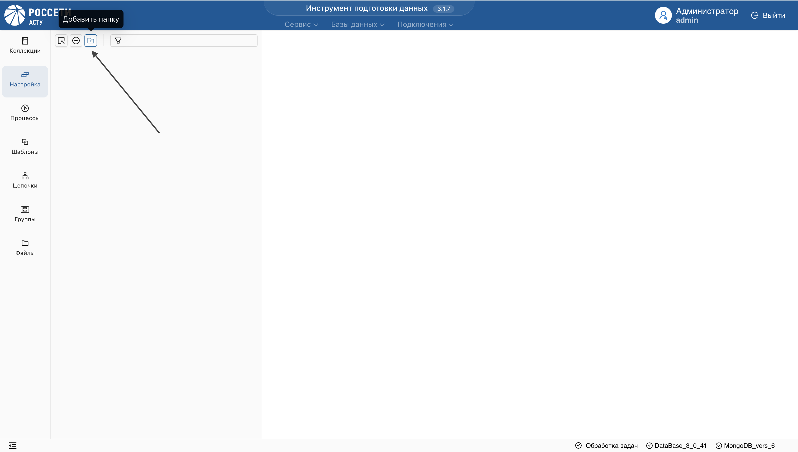
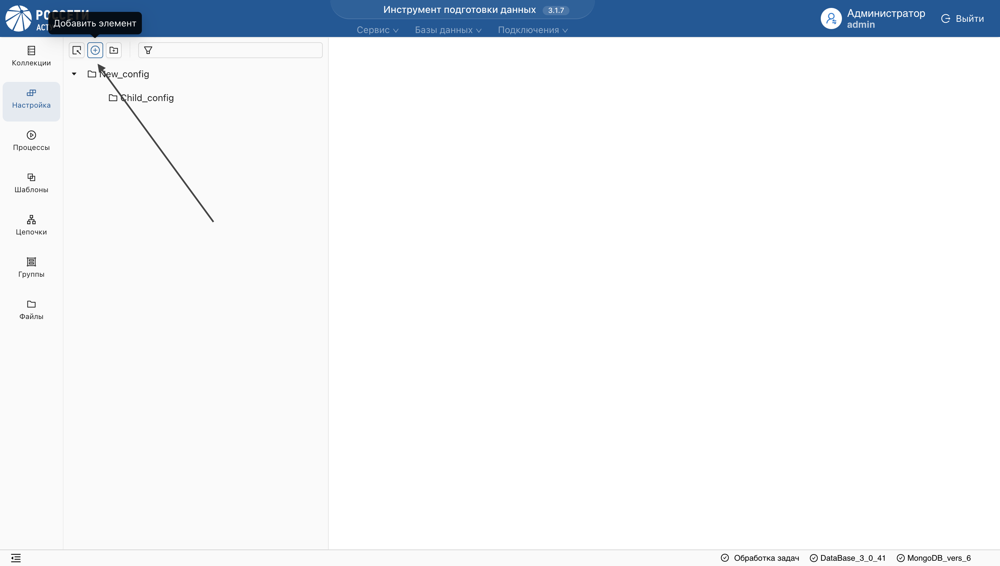
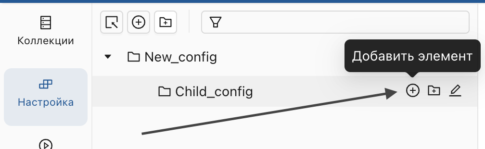
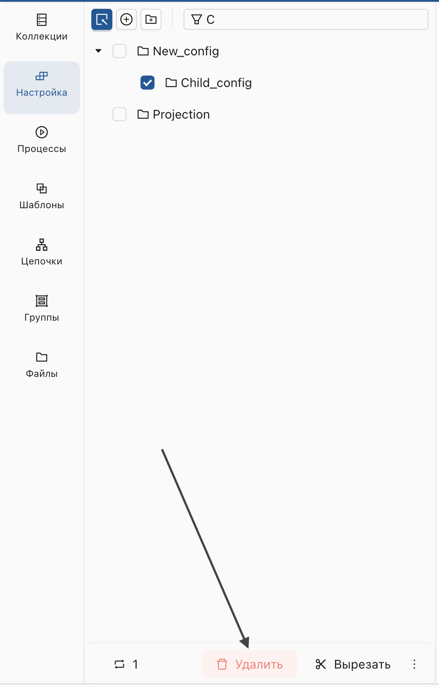

Функции, общие для всех разделов (Коллекции, Настройки процессов, Процессы, Цепочки преобразований, Шаблоны), расположены в левом вертикальном меню и включают:
* Отправку данных из одной БД в другую.
* Группировку объектов.
* Создание иерархической структуры.
* Удаление объектов.

Специфические функции, будут описаны в соответствующих разделах.

## Отправка данных из одной БД в другую
1. Перейдите в раздел, данные которого хотите отправить (например, Коллекции).
2. Включите режим массового выделения и выберите объекты.

[Работа с массовым выделением](#работа-с-массовым-выделением)

3. Наведите курсор на многоточие под списком и выберите "Переместить/Копировать".

**В открывшемся окне:**
* Выберите подключение и целевую БД.

> Вы можете создать БД непосредственно в окне перемещения - для этого просто введите имя новой БД и подтвердите действие.

> При экспорте настроек необходимо отправить коллекции-источники данных, иначе перемещенная настройка будет пустой.

## Группировка объектов
_Группировка позволяет создавать одноуровневые группы объектов в разделах: Коллекции, Настройки, Процессы, Шаблоны и Цепочки. В отличие от иерархической структуры, один и тот же объект может быть добавлен в несколько групп одновременно._
1. Перейдите в раздел, где находятся объекты, которые вы хотите добавить в группу.
2. Включите режим массового выделения и выберите объекты.
3. Наведите курсор на многоточие под списком объектов и выберите опцию "Группа".

4. Выберите уже существующую группу или создайте новую, указав ее имя.

**Результат:** Отмеченные объекты будут добавлены в указанную группу в разделе "Группы".

> Вы можете добавлять в группу объекты различных сущностей, таких как Коллекции, Настройки и Процессы.
### Удаление группы
1. Перейдите в раздел **Группы** в левом меню.
2. Выберите нужную группу и отметьте объекты, которые хотите удалить из нее.
3. Нажмите кнопку "Убрать из группы".

**Результат:** Объекты будут удалены из данной группы, но останутся в разделе, к которому они принадлежат.

> При удалении объекта из основного раздела, он автоматически удалится из всех групп.

## Группировка объектов в иерархической структуре
_Иерархическая структура позволяет организовать объекты в разделах: Коллекции, Настройка, Процессы, Шаблоны и Цепочки. В каждом разделе создается своя иерархия, где объекты могут располагаться как в корне, так и внутри папок. Папки и объекты сортируются по имени, и их имена должны быть уникальными в рамках раздела._
### Создание папки
1. Перейдите в один из разделов: Коллекции, Настройка, Процессы, Шаблоны или Цепочки.
2. На верхней панели инструментов нажмите кнопку **Создать папку**.

3. Введите имя папки и нажмите OK.

**Результат:** Папка будет создана в корне раздела. Имя папки должно быть уникальным в рамках раздела.
### Создание дочерней папки
1. Найдите папку в дереве, в которую хотите добавить дочернюю папку.
2. Нажмите на кнопку **Создать дочернюю папку** рядом с именем папки.

3. Введите имя дочерней папки и нажмите OK.

**Результат:** Дочерняя папка будет создана внутри выбранной папки.

### Создание объекта в корне
_Применимо для разделов Настройка, Шаблоны, Цепочки._

1. В разделе нажмите **Добавить элемент** на верхней панели инструментов.

2. Введите имя объекта и нажмите OK.

**Результат:** Объект будет создан в корне дерева и отображен в списке объектов. Имя объекта должно быть уникальным.

### Создание объекта внутри папки
1. Найдите папку, в которой хотите создать объект.
2. Нажмите кнопку **Добавить элемент** рядом с папкой.

3. Введите имя объекта и нажмите OK.

**Результат:** Объект будет создан внутри выбранной папки.

## Работа с массовым выделением

[Назад к разделу "Отправка данных из одной БД в другую"](#отправка-данных-из-одной-бд-в-другую)

_Массовое выделение позволяет одновременно выделить несколько объектов и папок для выполнения операций._
### Включение режима массового выделения
Нажмите на элемент **Массовое выделение** на панели инструментов.

Отметьте несколько объектов и папок.

## Вырезание и вставка выделенных объектов
1. Включите режим массового выделения и выберите объекты.
2. Нажмите кнопку "Вырезать" на нижней панели инструментов.

3. Найдите папку, куда нужно переместить объекты, и нажмите кнопку **Вставить** рядом с ее именем.

**Результат:** Выбранные объекты будут перемещены в указанную папку.

## Поиск объектов и папок
1. Введите имя объекта или папки в поле поиска на панели инструментов.
2. Нажмите Enter.

**Результат:** Найденные объекты и папки будут отображаться в своем месте в иерархии.

## Удаление объекта
_Удаление объектов доступно для всех разделов, кроме **Группы**._
1. Включите режим массового выделения и выберите объекты.
2. Нажмите кнопку "Удалить".

**Результат:** Выбранный объект будет удалён из списка.