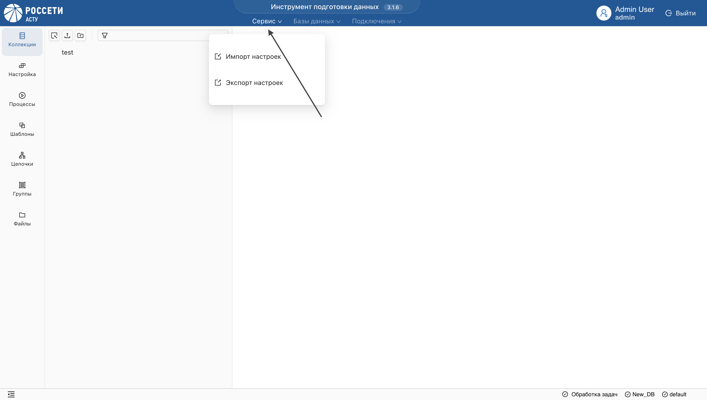

_Сервис позволяет переносить пользовательские артефакты между стендами._

**Для экспорта объектов:**

1. Выберите пользовательскую БД из списка и нажмите на "Сервис" в заголовке приложения.

2. Выберите "Экспорт настроек".
3. В появившемся окне выберите необходимые объекты и подтвердите действие.

**Результат:** будет сформирован архив файлов. 

> При необходимости включите данные связанных коллекций, установив соответствующую галочку. Скачайте архив для дальнейшего импорта на другой стенд.

**Для импорта объектов:**

1. Выберите "Импорт настроек".
2. Загрузите архив файлов и подтвердите действие.

> Для импорта доступны только файлы, экспортированные через данный сервис.