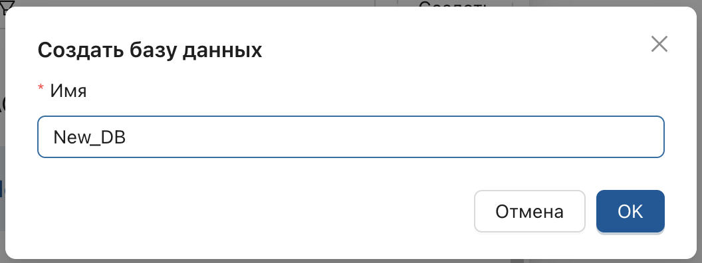
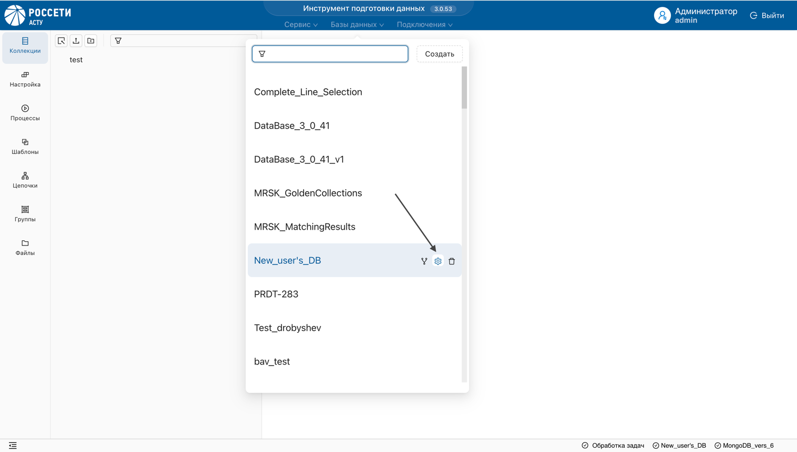
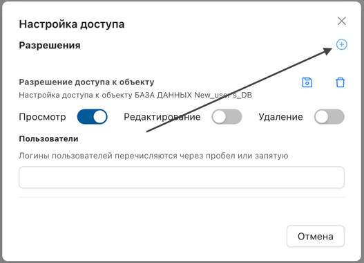

# Создание БД
Для создания новой БД:
1. Нажмите "Базы данных", чтобы отобразить список объектов.
2. В списке нажмите "Создать".

3. В открывшемся окне введите имя БД и подтвердите действие.

**Результат:**

Созданная БД отобразится в списке объектов.

# Копирование БД
_Копирование позволяет скопировать БД в пределах одного подключения._

**Для копирования БД:**

1. Вызовите список "Базы данных" и наведите курсор на необходимый объект.
2. В меню объекта нажмите на значок копирования.

3. Подтвердите действие в открывшемся окне.

**Результат:**
Копия объекта будет автоматически создана с префиксом _v.
# Настройка доступа
_Настройка доступа позволяет настроить права на просмотр и редактирование базы данных (БД) для других пользователей._

**Для настройки доступа:**
1. Вызовите список "Базы данных" и наведите курсор на необходимую пользовательскую БД.
2. В отобразившемся меню объекта нажмите на значок шестерёнки.

3. В открывшемся окне добавьте разрешения.

**Настройки доступа включают:**
- Разрешения на просмотр объектов БД, их редактирование и удаление.
- Указание логинов пользователей, которым настраивается доступ.
Для добавления ещё одной конфигурации нажмите **плюс**.

> Пользователю с правом доступа "Администратор" по умолчанию доступны разрешения на просмотр, редактирование и удаление всех БД.
