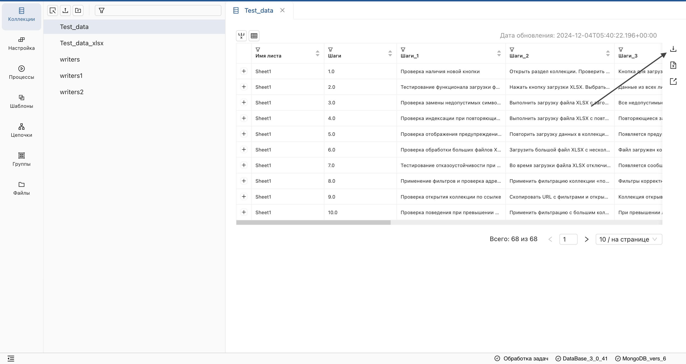
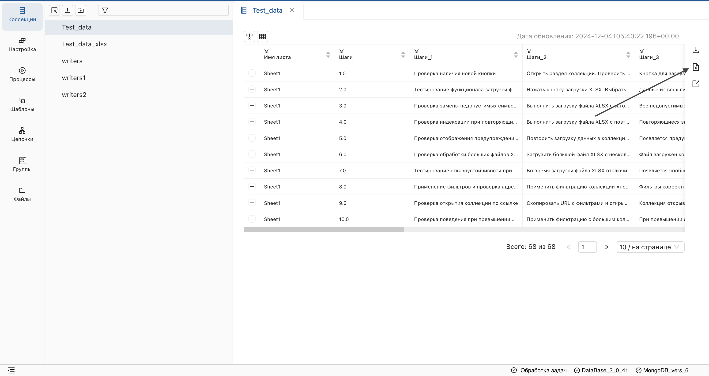
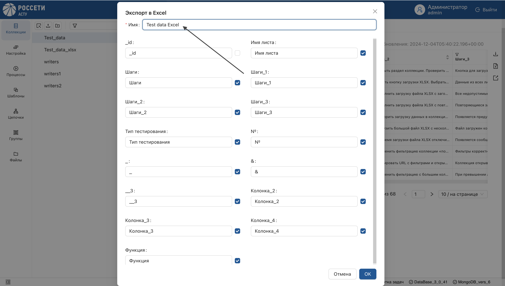
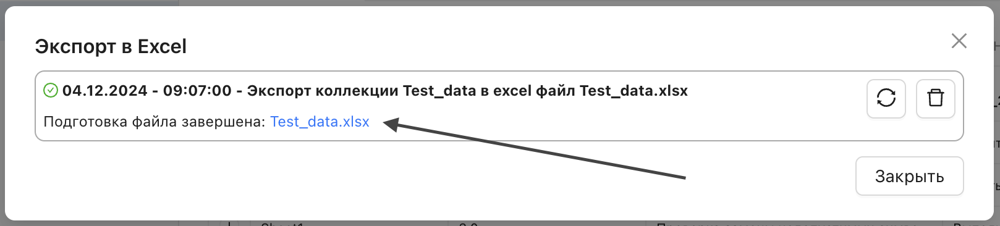
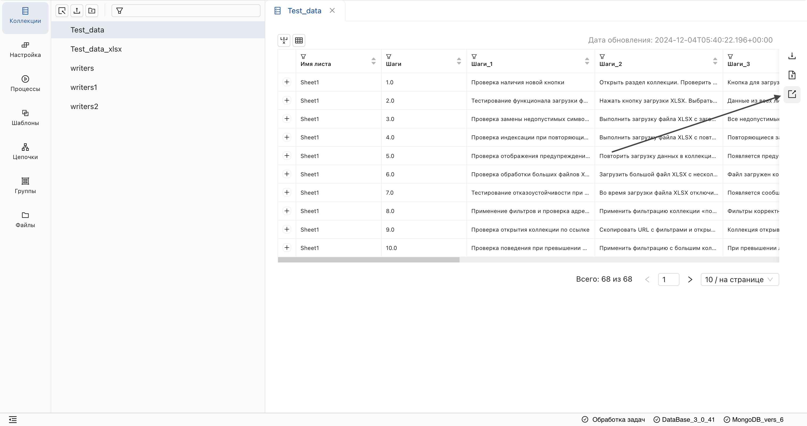
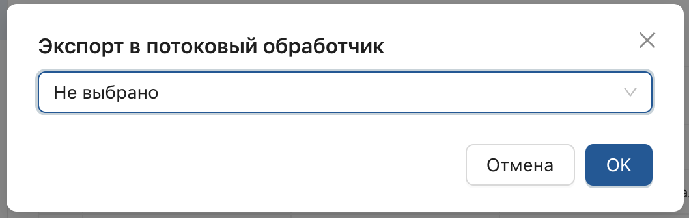

## Экспорт в файл формата CSV
Перейдите на страницу коллекции и нажмите на кнопку экспорта в правом вертикальном меню.

## Экспорт в файл формата XLSX
1. На странице коллекции нажмите кнопку вызова окна экспорта в Excel.

2. В открывшемся окне, выполните настройки экспорта и подтвердите действие.

3. Далее, в окне обработчика задач, нажмите на сформировавшуюся ссылку.

## Экспорт в потоковый обработчик
На странице коллекции:
1. Выберите опцию экспорта в потоковый обработчик на правой вертикальной панели.

2. В открывшемся окне настройте соединение и подтвердите действие.

**Результат:**

Документ будет размещен в системе доставки сообщений (Kafka) для дальнейшего его размещения в ядре интеграционной платформы.
