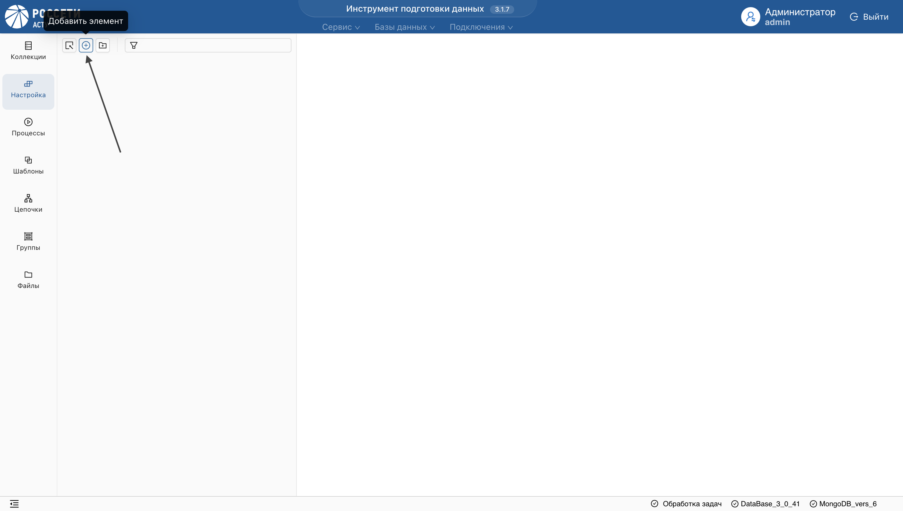
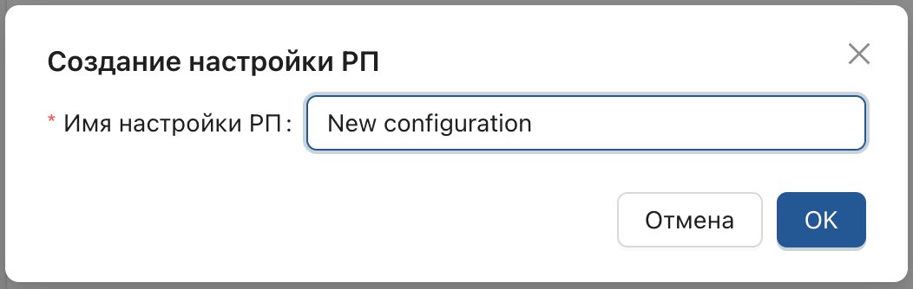
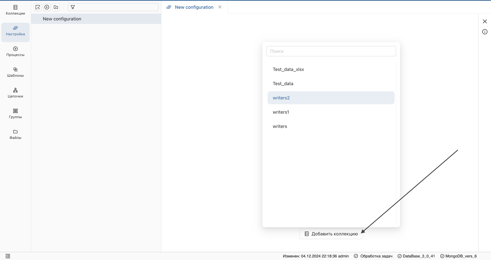
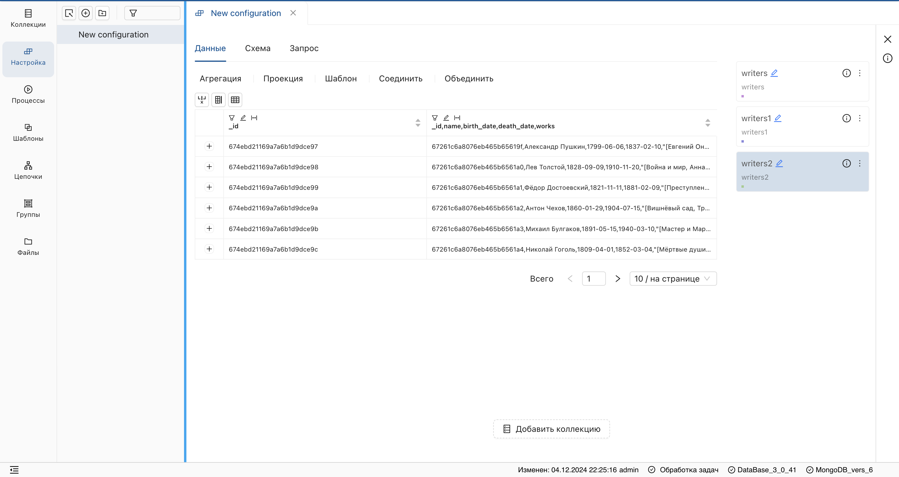
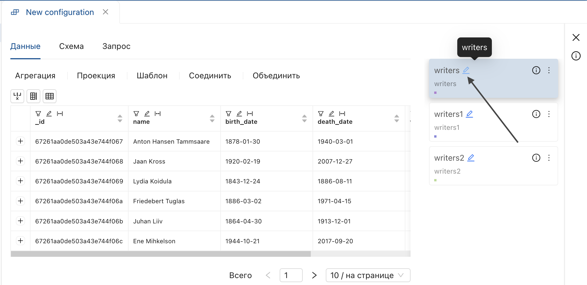
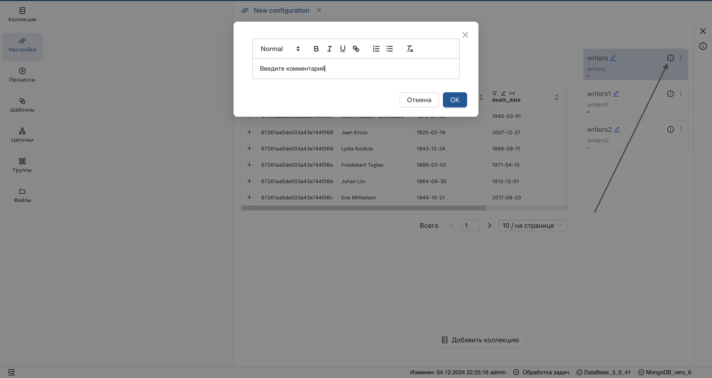
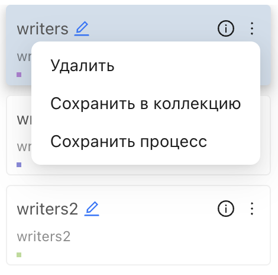

_**"Настройка"** позволяет преобразовывать данные и автоматизировать процессы. Она состоит из шагов, 
включающих таблицы коллекций и инструменты преобразования._
## Создание настройки
1. Перейдите в раздел **"Настройка"**.
2. Нажмите на **плюс** на панели над списком объектов.

3. В открывшемся окне, введите имя новой настройки и подтвердите действие.

## Добавление источников в настройку
1. Откройте настройку в рабочей области.
2. Нажмите **"Добавить коллекцию"** и выберите источники.

**Результат:** 

Источники отобразятся справа в виде **блоков** с функциональными опциями.

Каждый функциональный блок содержит:

* Функцию переименования.

* Внесение комментариев к блоку.

* Выпадающее меню.

* [Таблицу данных](../Преобразование%20данных/Таблица%20коллекции.md) с инструментами для анализа и преобразования данных.

