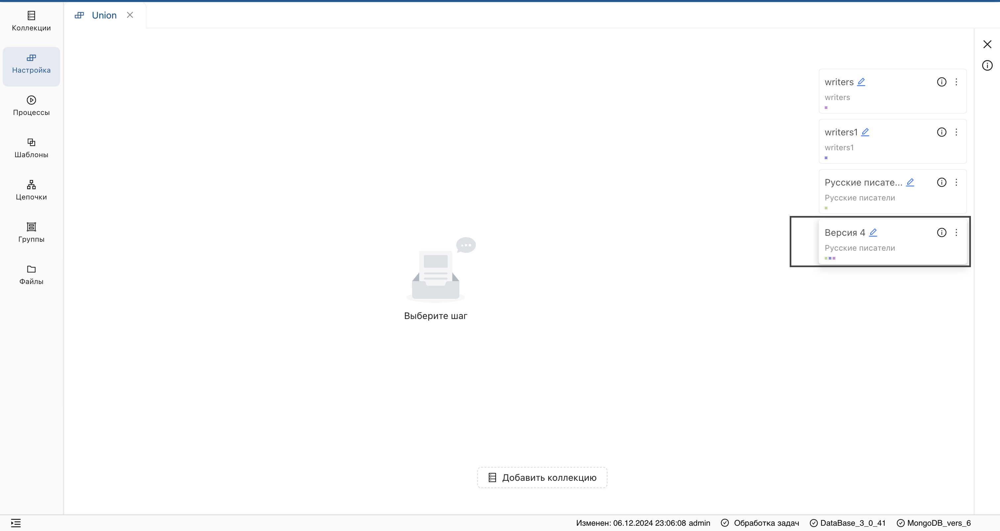
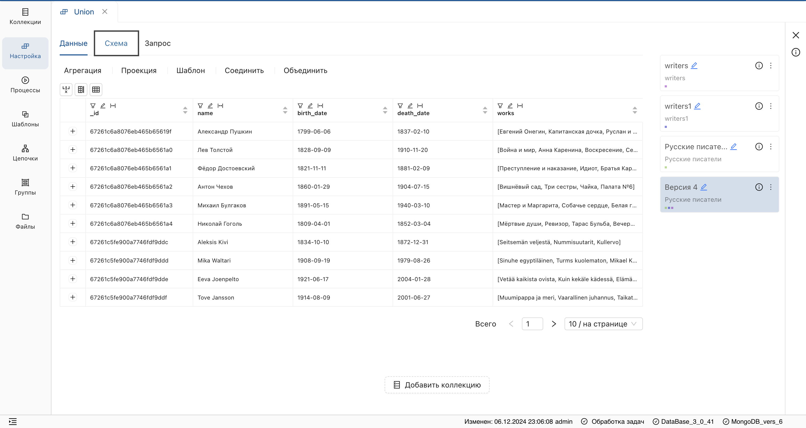
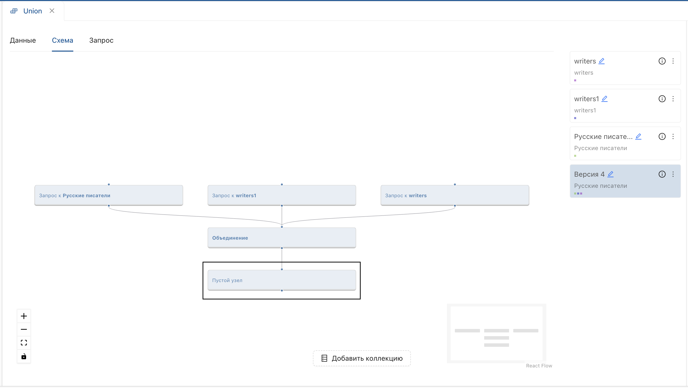
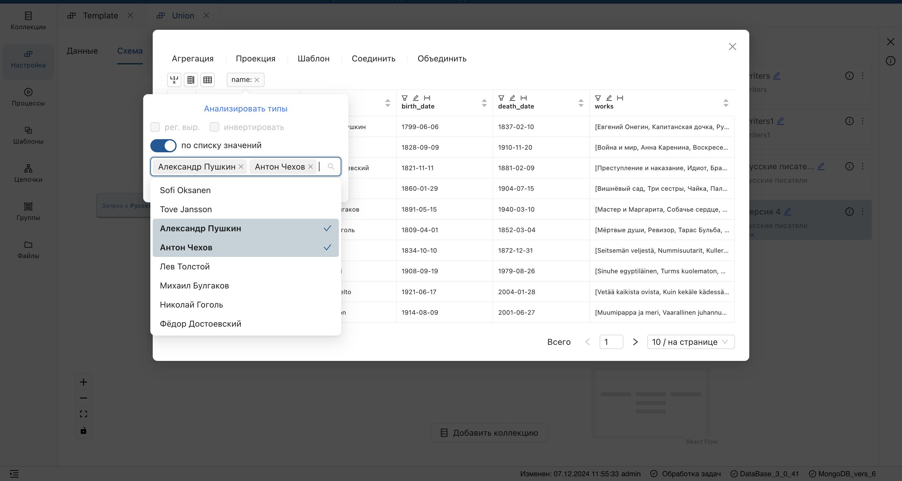
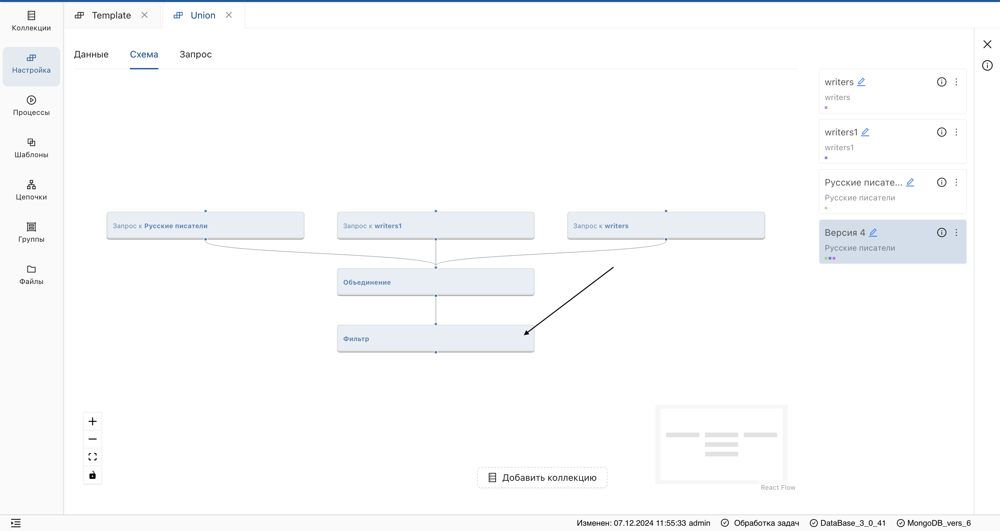
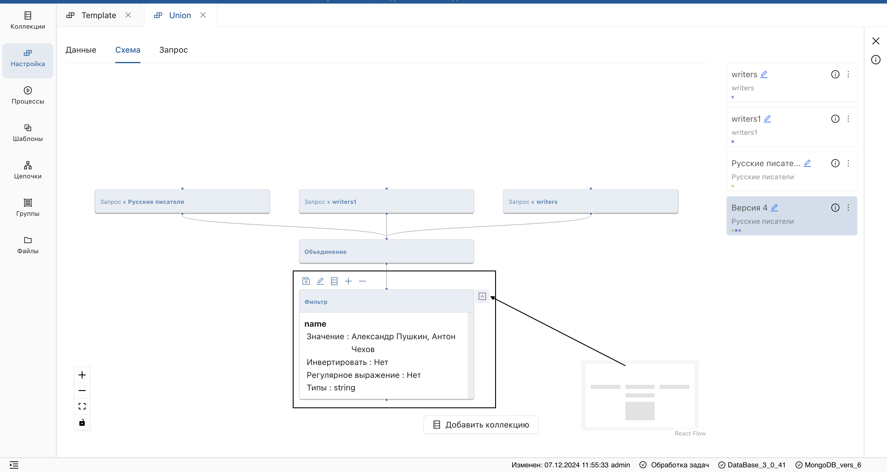

## Редактирование настройки
_Система позволяет настраивать цепочку преобразований с помощью панели инструментов и редактировать уже существующую настройку._

1. Выберите **версию настройки**, которую необходимо отредактировать.

2. Перейдите во вкладку **Схема** на странице настройки.

3. Нажмите на **блок** настройки.

**Результат:**

Отобразится функциональность **блока**, содержащая (слева направо):

* Опцию **персистирования** (отображена в виде дискеты) (1).
* Редактирование параметров настройки (2).
* Предпросмотр **версии настройки** в табличном отображении (3).
* Добавление **шага настройки** (4).
* Удаление **шага настройки** (5).
* Просмотр параметров преобразования (6).

4. Выберите нужную функцию (например, **добавление шага преобразования**).

**Результат:** будет добавлен пустой узел.

5. Отредактируйте параметры шага, нажав на кнопку **Редактирование**.

**Результат:** отобразится **таблица данных** и **инструменты преобразования**.

<ol start="6">
  <li>
    Далее, выполните необходимое преобразование (например, примените **фильтр**).
  </li>
</ol>

**Результат:**

- Пустой узел преобразуется в шаг настройки.
- Данные коллекции будут преобразованы.

> Для отображения параметров шага настройки, нажмите на блок и в отобразившемся меню разверните информацию о шаге.

