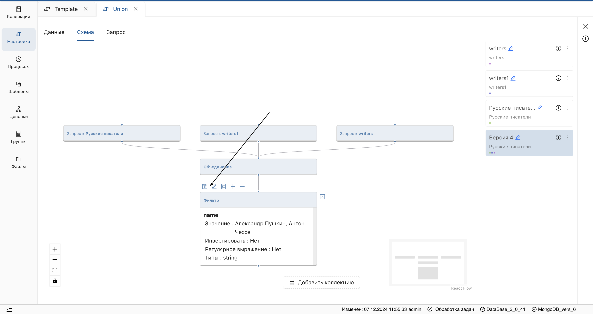
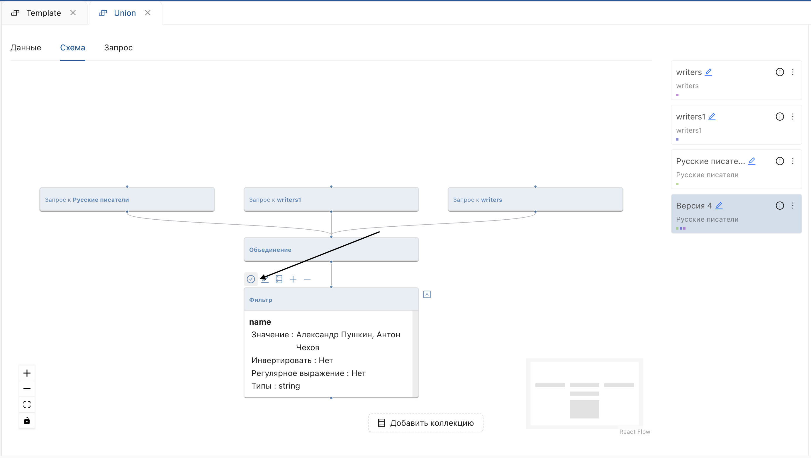

_Персистирование позволяет ускорить обработку большого количества данных путем сохранения метаданных в системную коллекцию._

### Как выполнить персистирование?

1. Перейдите в функциональный раздел **Настройки** и выберите необходимую настройку из списка.
2. Отобразите страницу версии настройки и перейдите во вкладку **"Схема"**.
3. Нажмите на блок настройки и в отобразившейся панели нажмите на значок персистирования.

   **Результат:**
   
    - Виртуальная коллекция сохранится в MongoDB. В пользовательском интерфейсе элемент персистирования изменит статус.

> Выполняйте персистирование всей цепочки преобразований, кроме источников, начиная с верхнего узла.

### Как отменить персистирование?

В некоторых случаях, например, при записи шага в процесс, персистирование необходимо снять, чтобы избежать ошибки в данных при выполнении процесса.

1. Снимите галочки со всей цепочки преобразований.
2. После снятия снова отобразится элемент персистирования.