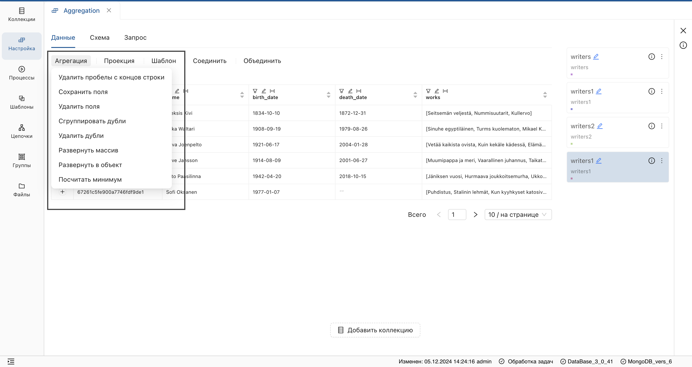
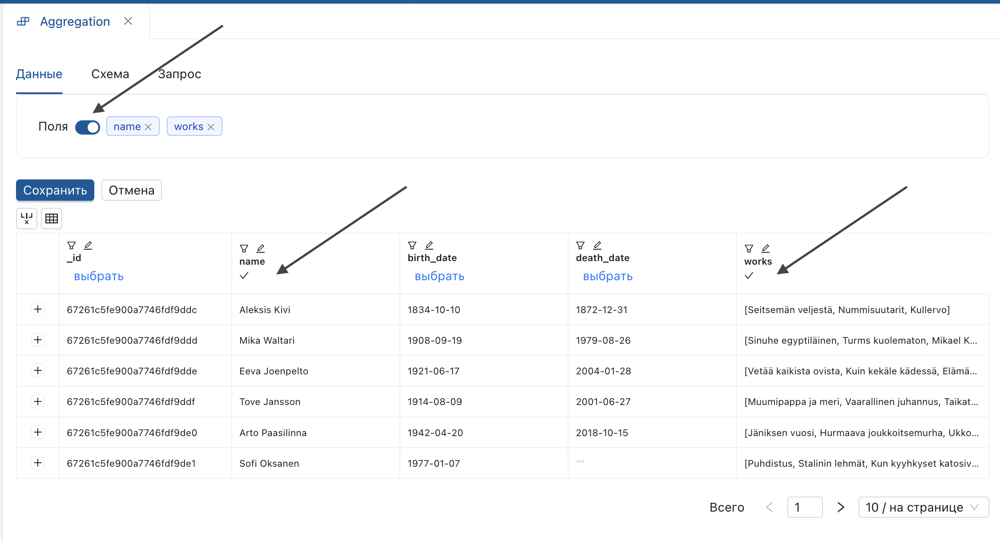
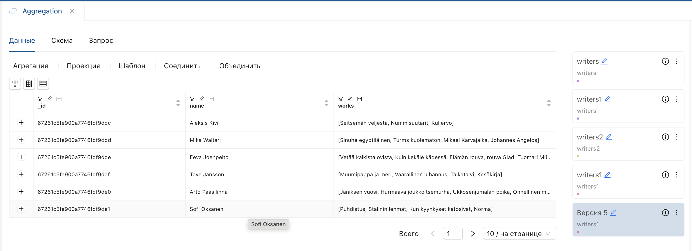
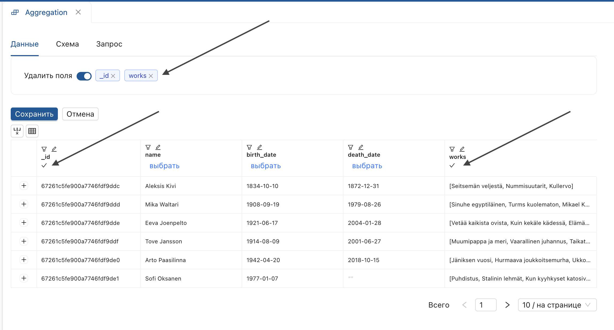
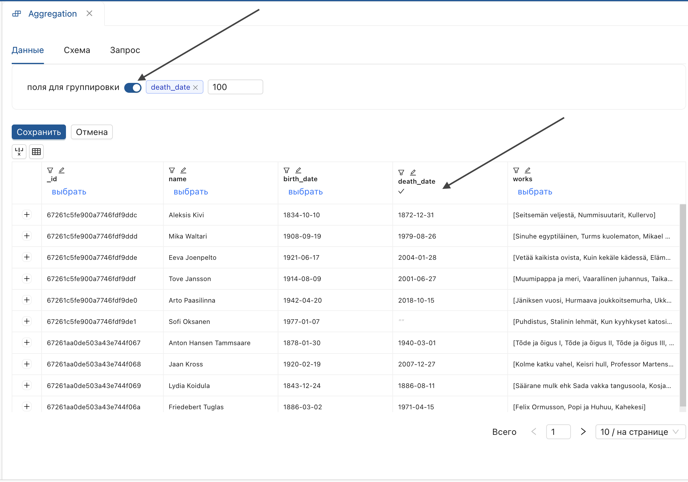

_**"Агрегация"** — модуль для преобразования данных, позволяющий выполнять одну настройку за одну версию преобразования._  
Чтобы начать работу, откройте страницу версии настройки и выберите **"Агрегация"** на функциональной панели.

**Результат:** отобразится выпадающий список агрегаций.

## Сохранить поля
1. Выберите операцию **"Сохранить поля"** из списка.
2. В открывшемся окне:
<ul>
  <li>Нажмите на переключатель.</li>
  <li>Выберите поля.</li>
</ul>

 

* Нажмите **"Сохранить"**.

**Результат**: указанные поля добавятся в **результарующую версию**.

## Удалить поля

1. Выберите операцию **"Удалить поля"** из списка.
2. В открывшемся окне:
<ul>
   <li>Нажмите переключатель.</li>
   <li>Отметьте поля, которые нужно удалить.</li>
</ul>

* Нажмите **«Сохранить»**.

**Результат**: производная версия настройки не содержит указанные поля.

## Сгруппировать дубли

1. Выберите операцию **«Сгруппировать дубли»** из списка.
2. В открывшемся окне:

<ul>
<li>Установите переключатель <b>"поля для группировки"</b>.</li>
<li>Выберите поля и нажмите <b>"Сохранить"</b>.</li>
</ul>

**Производная версия содержит:**

- Поле с отображением длины массива **"BunchSize"**.
- Поле с группами уникальных значений, вложенных в массив данных.
- Исходное поле.

Для просмотра содержимого массива дважды кликнике по нему.  
**Результат**: отобразится окно со списком полей, вложенных в массив.

При нажатии на поле отобразятся данные массива.

> **Ограничение**: размер документа — 16 Мб. Ограничение может быть превышено после группировки. 

Для корректного выполнения установите максимальное количество значений при заполнении параметров.  

Чтобы развернуть массив на верхний уровень, используйте агрегацию **"Развернуть массив"**.

## Удалить дубли

1. Выберите операцию **"Удалить дубли"** из списка.
2. В открывшемся окне:
<ul>
<li>Установите переключатель <b>"поля"</b>.</li>
<li>Выберите поля и нажмите <b>"Сохранить"</b>.</li>
</ul>

**Результат**: будет создана производная версия с уникальными значениями полей.

## Развернуть массив

Разворачивает массив данных на верхний уровень.  
Для выполнения операции используйте коллекцию с вложенным массивом данных (в таблице отображается в виде квадратных и фигурных скобок **"[количество значений{}]"**).

1. Выберите операцию **"Развернуть массив"** из списка.
2. В открывшемся окне:
<ul>
<li>Установите параметр <b>"поле"</b> по заголовку поля, содержащего массив данных.</li>
<li>Введите произвольный префикс.</li>
</ul>

<ul>
<li>Нажмите <b>"Сохранить"</b>.</li>
</ul>

**Результат**: подмассивы вынесены на верхний уровень с указанным префиксом.  

## Развернуть в объект

1. Выберите операцию **«Развернуть в объект»** из списка.
2. В открывшемся окне:
<ul>
<li>Установите параметр <b>"поле"</b> по заголовку поля, содержащего массив данных.</li>
</ul>

<ul>
<li>Нажмите <b>"Сохранить"</b>.</li>
</ul>

**Результат**: поля массива разворачиваются в объект (объект отображается с фигурными скобками).

> В результате данной функции доступно назначение параметров ко вложенным данным.

#### Назначение параметров ко вложенному объекту

Для преобразования данных во вложенном объекте:

1. Выберите операцию преобразования.
2. Откройте вложенную структуру, дважды щелкнув по ячейке.
3. Нажмите на **поле, содержащее вложенную структуру**.

> Поля со вложенными структурами отображаются контрастно.

<ol start="4">
<li>Дважды нажмите на объект для отображения данных.</li>
<li>Выставьте параметры условия.</li>
<li>Введите имя производного поля <b>"Сохранить"</b>.</li>
</ol>

**Результат**: операция будет применена к данным внутри объекта.
## Посчитать минимум
_Вычисляет минимальное значение для группы значений._

1. Выберите операцию **"Посчитать минимум"**.
2. В открывшемся окне:
<ul>
   <li>Установите переключатель <b>"поля для группировки"</b>.</li>
   <li>Выберите поля.</li>
</ul>

<ul>
   <li>Установите параметр <b>"минимум по полю"</b>.</li>
   <li>Выберите поля.</li>
</ul>

<ol start="3">
<li>Нажмите <b>"Сохранить"</b>.</li>
</ol>

**Результат**: созданы уникальные группы значений с рассчитанным минимумом для каждой.
