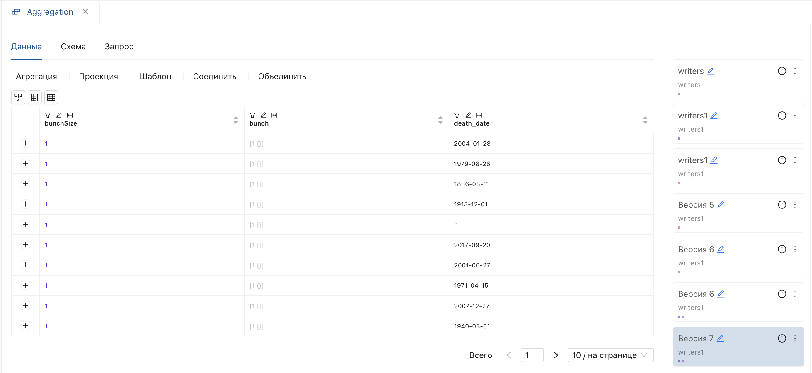
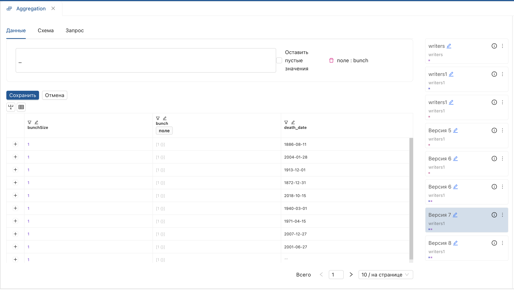
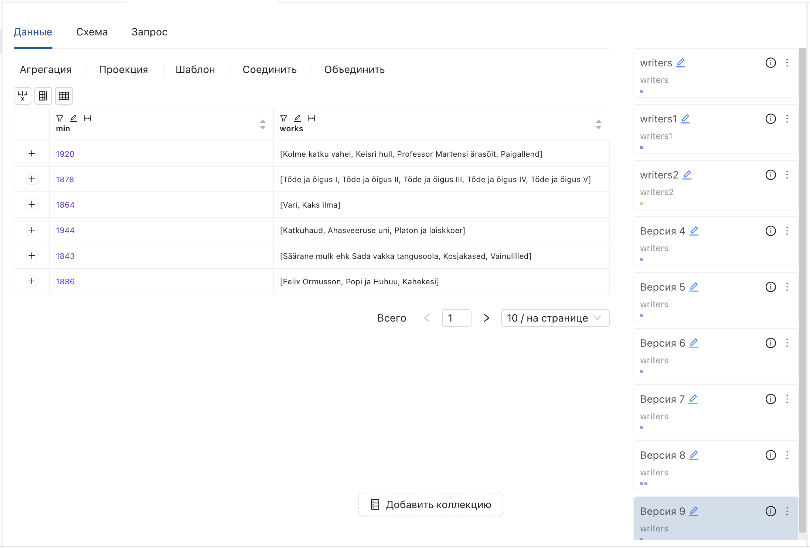

_**Агрегация** — модуль для преобразования данных, позволяющий выполнять одну настройку за одну версию преобразования._  
Чтобы начать работу, откройте страницу версии настройки и выберите **Агрегация** на функциональной панели.

**Результат:** отобразится выпадающий список агрегаций.

## Сохранить поля
1. Выберите операцию **Сохранить поля** из списка.
2. В открывшемся окне:
   - Нажмите на переключатель.
   - Выберите поля.

 
  - Нажмите **Сохранить**.
**Результат**: указанные поля добавятся в производную версию.

## Удалить поля

1. Выберите операцию **«Удалить поля»** из списка.
2. В открывшемся окне:
   - Нажмите на переключатель.
   - Отметьте поля, которые необходимо удалить.

   - Нажмите **«Сохранить»**.

**Результат**: производная версия настройки не содержит указанные поля.

## Сгруппировать дубли

1. Выберите операцию **«Сгруппировать дубли»** из списка.
2. В открывшемся окне:
   - Установите переключатель **«поля для группировки»**.
   - Выберите поля и нажмите **«Сохранить»**.

**Производная версия содержит:**

- Поле с отображением длины массива **BunchSize**.
- Поле с группами уникальных значений, вложенных в массив данных.
- Исходное поле.

Для просмотра содержимого массива дважды щелкните по нему.  
**Результат**: отобразится окно со списком полей, вложенных в массив.

При щелчке на поле отобразятся данные массива.

> **Ограничение**: размер документа — 16 Мб. Ограничение может быть превышено после группировки. 

Для корректного выполнения установите максимальное количество значений при заполнении параметров.  

Чтобы развернуть массив на верхний уровень, используйте агрегацию **Развернуть массив**.

## Удалить дубли
Удаляет дублирующие значения.
1. Выберите операцию **Удалить дубли** из списка.
2. В открывшемся окне:
   - Установите переключатель **поля**.
   - Выберите поля и нажмите **Сохранить**.

**Результат**: будет создана производная версия с уникальными значениями полей.

## Развернуть массив

Разворачивает массив данных на верхний уровень.  
Для выполнения операции используйте коллекцию с вложенным массивом данных (в таблице отображается в виде квадратных и фигурных скобок [количество значений{}]).

1. Выберите операцию **Развернуть массив** из списка.
2. В открывшемся окне:
   - Установите параметр **поле** по заголовку поля, содержащего массив данных.
   - Введите произвольный префикс.

  - Нажмите **Сохранить**.

**Результат**: подмассивы вынесены на верхний уровень с указанным префиксом.  

## Развернуть в объект

1. Выберите операцию **«Развернуть в объект»** из списка.
2. В открывшемся окне:
   - Установите параметр **«поле»** по заголовку (исходное поле должно содержать вложенный массив данных).

  - Нажмите **«Сохранить»**.

**Результат**: поля массива разворачиваются в объект (объект отображается с фигурными скобками).

> В результате данной функции доступно назначение параметров ко вложенным данным.

### Назначение параметров ко вложенному объекту

Для преобразования данных во вложенном объекте:

1. Выберите операцию преобразования.
2. Откройте вложенную структуру, дважды щелкнув по ячейке.
3. Нажмите на поле, содержащее вложенную структуру (поля со вложенными структурами отображаются контрастно).
4. Дважды щелкните на объект для отображения данных.
5. Выставьте параметры условия, введите имя производного поля и нажмите **«Сохранить»**.

**Результат**: операция будет применена к данным внутри объекта.
## Посчитать минимум

Вычисляет минимальное значение для группы значений.

1. Выберите операцию **Посчитать минимум**.
2. В открывшемся окне:
   - Установите переключатель **поля для группировки**.
   - Выберите поля.

   
   - Установите параметр **минимум по полю**.

   
3. Нажмите **Сохранит»**.

**Результат**: созданы уникальные группы значений с рассчитанным минимумом для каждой.
