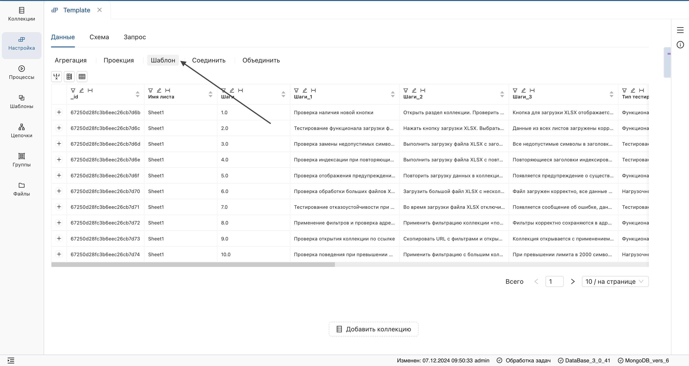
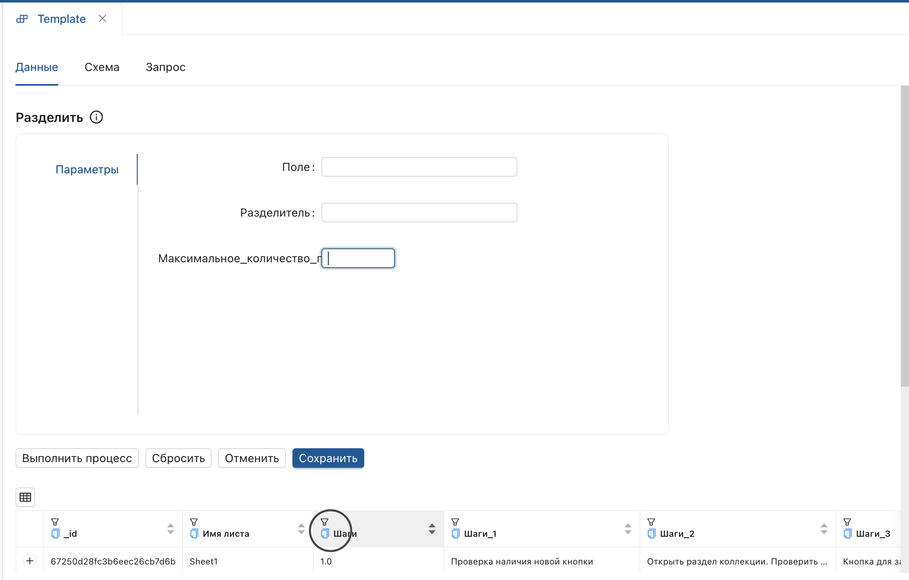
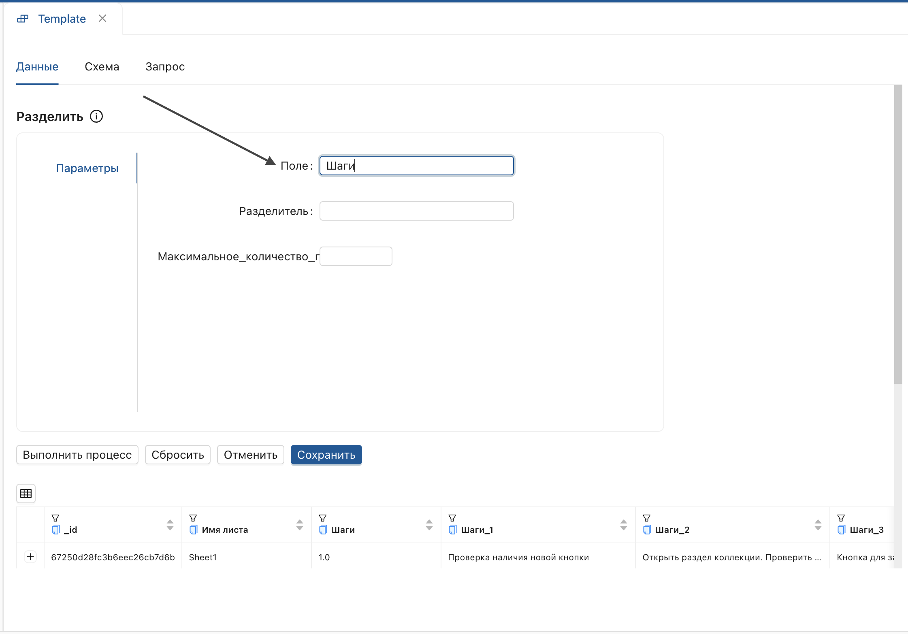

_Позволяет применить шаблоны из функционального раздела **Шаблоны** к шагу настройки._

1. Откройте страницу версии настройки и нажмите **Шаблон**.
 
2. **Выберите шаблон** из выпадающего списка.
 
3. В открывшемся окне скопируйте название поля из заголовка коллекции.
 
4. Вставьте его (Ctrl+V) в **Поле**.
 
5. Настройте прочие параметры и нажмите **Выполнить процесс**.

 > В списке отображены шаблоны, созданные в рамках текущей БД, или **Общие шаблоны**. Для присвоения функции **Общий шаблон** перейдите в функциональный раздел [Шаблоны](../../6_Шаблоны/Шаблоны.md). 

**Результат:**
К коллекции данных будут применены настройки выбранного шаблона.

 > Для каждого шаблона настраивается индивидуальный набор параметров.

Для сохранения настроек в коллекцию, нажмите **Сохранить**. Инструкцию по созданию и настройке шаблона смотрите в разделе [Шаблоны](../../6_Шаблоны/Шаблоны.md).