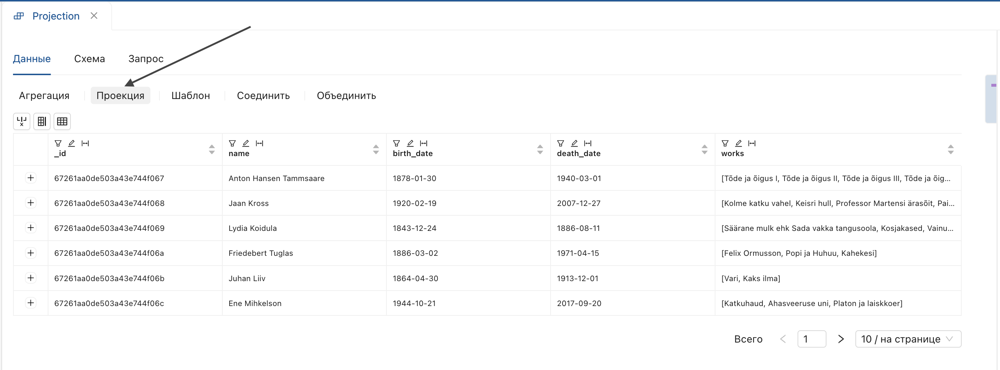
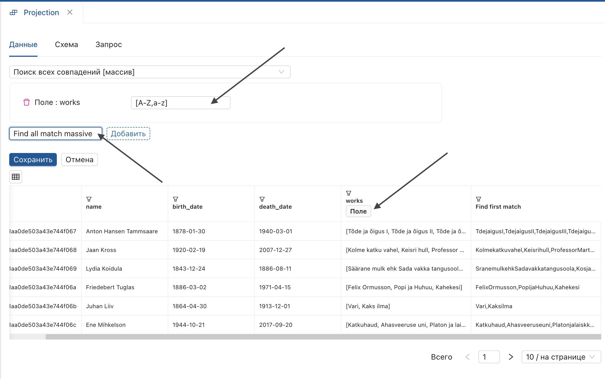
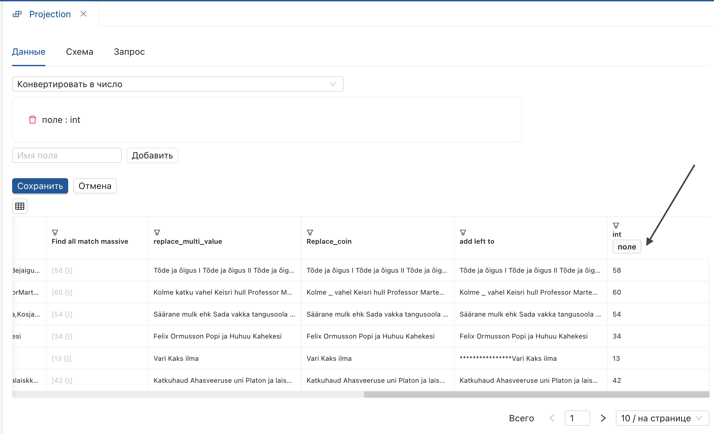
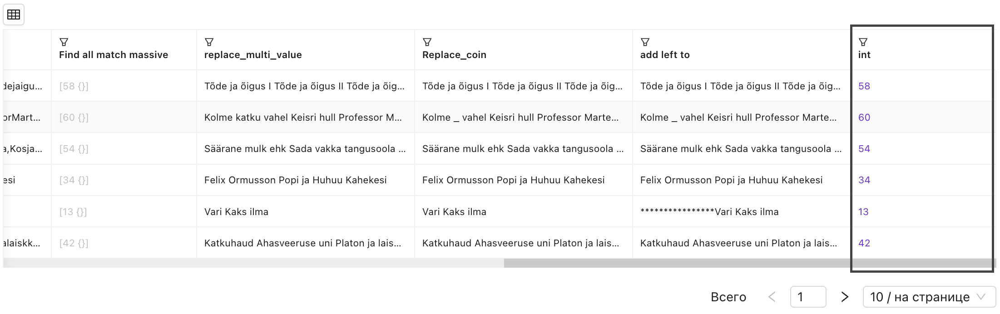
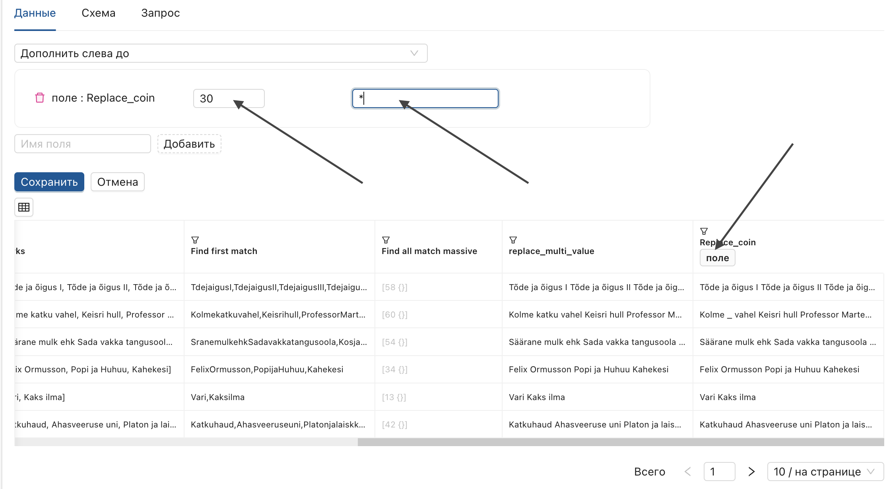
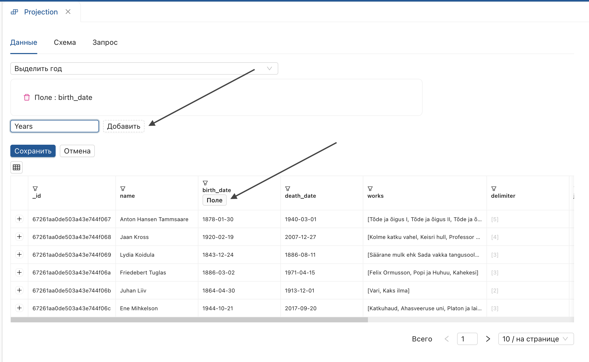
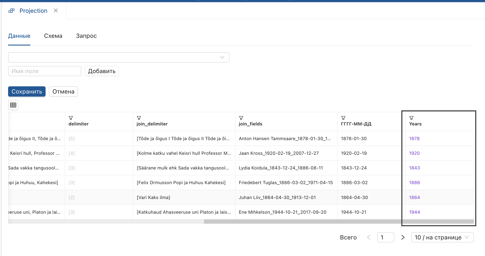
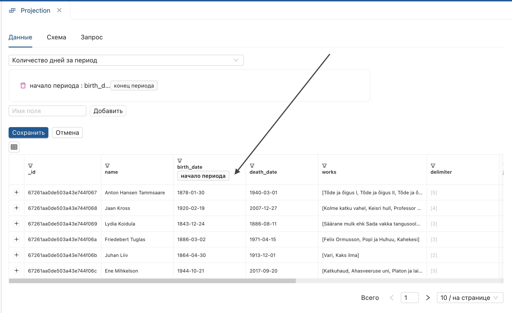
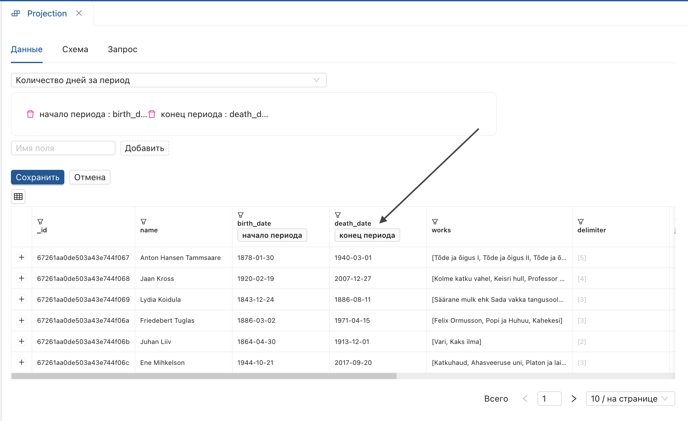

_**Проекция** — модуль для преобразования данных, позволяющий выполнять несколько настроек за одну версию преобразования._  
Чтобы начать работу, отобразите страницу версии настройки и выберите **Проекция** на функциональной панели.
 
**Результат:** откроется сессия для работы с проекциями.
## Поиск и замена
- Поиск первого совпадения: находит первое совпадение по условию.
- Поиск всех совпадений: находит все совпадения по условию.
- Поиск всех совпадений (массив): выполняет поиск всех совпадений и формирует массив значений.
- Заменить несколько значений: заменяет несколько значений через разделитель.
- Заменить совпадения: заменяет значения исходного поля на указанные в условии.
_Поиск и замена продемонстрированы на примере проекций **Поиск всех совпадений (массив)**, **Заменить несколько значений**. Для остальных операций секция добавляется по аналогии._
#### Поиск всех совпадений (массив)
1. Выберите проекцию **«Поиск всех совпадений (массив)»**.
2. Установите параметры поля и введите условие.
3. Введите имя производного поля и нажмите **«Добавить»**.
 
**Результат:** добавляется производное поле с массивом объектов.
 
#### Заменить несколько значений
1. Установите параметр **«поле»**.
 
2. Введите заменяемые значения в строке **Найти через разделитель**
 
4. Укажите разделитель.
 
4. Введите заменяющее значение в строке **Заменить (через запятую)**.
 
5. Нажмите **Добавить**.
**Результат:** производное поле содержит замененные значения.
 
> Если значение необходимо заменить на отсутствие значение, выставьте в строке **Заменить (через запятую)** только запятые.

## Работа с числами
- Конвертировать в число: конвертирует строковый тип данных в числовой.
- Римские цифры: преобразует арабские цифры в римские.
_Работа с числами продемонстрирована на примере проекции **Конвертировать в число**, для остальных операций секция добавляется по аналогии._
#### Конвертировать в число
1. Выберите проекцию **«Конвертировать в число»** из списка.
2. Установите параметр **«поле»** по заголовку.
 
3. Введите имя производного поля.
4. Нажмите **«Добавить»**.
 
**Результат:** в конец таблицы добавляется производное поле с типом данных `integer`.
## Работа со строками
- Конвертировать в строку: конвертирует числовой тип данных в строковый.
- Нижний регистр: переводит все значения в нижний регистр.
- Длина строки: отображает длину строки.
- Разбиение строки: разбивает строку по разделителю и складывает элементы в массив строк.
#### Разбиение строки
1.	Выберите проекцию "Разбиение строки" из списка.
2.	Введите символ в строке "Разделитель".
 
3. Установите параметр "поле" по заголовку.
 
4.	Введите имя производного поля и нажмите "Добавить".

> В качестве разделителя может быть использован любой символ, в том числе пробел.

**Результат**: в конец таблицы будет добавлено производное поле, содержащее массив строк.
 
Для сохранения преобразования в шаг настройки нажмите "Сохранить".
 
_Для остальных операций секция добавляется по аналогии._

- Редактирование длины строки:
    * Дополнить слева до: дополняет значение слева до указанного количества символов.
    * Дополнить справа до: дополняет значение справа до указанного количества символов.
    * Обрезать слева до: обрезает значение слева до указанного количества символов.
    * Обрезать справа до: обрезает значения справа до указанного количества символов.
    * Обрезать слева: обрезает значение слева на указанное количество символов.
    * Обрезать справа: обрезает значение справа на указанное количество символов.

_Работа со строками продемонстрирована на примере проекции **Дополнить слева до**, для остальных операций секция добавляется по аналогии._
#### Дополнить слева до
1. Назначьте параметр по заголовку.
2. Установите количество символов для дополнения строки.
3. Введите символ в поле **«Символы»**.
 
4. Введите имя производного поля.
5. Нажмите **«Добавить»**.

**Результат:** значения производного поля дополнены слева до указанного количества символов.
 
_Для остальных операций секция добавляется по аналогии._
## Работа с массивами
- Первый элемент: возвращает первый элемент массива строк на верхний уровень.
- Последний элемент: возвращает последний элемент массива строк на верхний уровень.
- Длина массива: отображает длину массива.
- Соединение массива в строку: позволяет соединить массив строк в строку.
- Разбиение строки: разбивает строку по разделителю и складывает элементы в массив строк.
#### Соединение массива строк в строку
> Проекция применима к типу данных **Массив строк** и выполняется к данным, полученным в результате применения **Разбиение строки**.

1.	Назначьте параметр "поле" по заголовку.
 
2.	Введите имя производного поля и нажмите "Добавить".

**Результат:** производное поле содержит объединенный массив строк в строку.
 
Для сохранения преобразования нажмите "Сохранить".
 
_Для остальных операций секция добавляется по аналогии._
## Объединение и преобразования
- Объединить поля: объединяет значения нескольких полей через разделитель.
#### Объединить поля
1.	Выберите проекцию "Объединить поля" из списка.
2.	Введите произвольный разделитель, например "_", в строке "Разделитель".
 
3.	Установите переключатель "поля".
4.	Отметьте поля для объединения, нажав "выбрать" в заголовках полей.
 
5.	Введите имя производного поля и нажмите "Добавить".

**Результат:** в конце таблицы будет сгенерировано производное поле, содержащее значения указанных полей, объединенные через разделитель.
 
Для сохранения преобразования в производную версию нажмите "Сохранить".
 
> Для удаления избыточных символов в производной строке, воспользуйтесь другими проекциями, например **Заменить совпадения**.
## Преобразование и форматирование дат
- Преобразование даты в формат «число-месяц-год».
- Преобразование даты в формат «год-месяц-день».
- Выделение года.
- Выделение месяца.
- Выделение дня месяца.
- Количество дней за период.
- Количество месяцев за период.
- Количество лет за период.
#### Выделение года
1. Выберите операцию «Выделение года».
2. Назначьте параметр по полю с датами (например, «1878-01-30»).
 
**Результат:** операция выделяет год (например, для даты «1878-01-30» должно возвращаться «1878»).
 
#### Количество дней за период
1. Выберите операцию "Количество дней за период".
2. Назначьте параметр "Начало периода" по полю с датами.
 
3. Назначьте параметр "Конец периода".
 
4. Введите имя производного поля и нажмите **Добавить**.
**Результат:** операция вычисляет количество дней за указанный период.
 
Для сохранения преобразования в производную версию нажмите "Сохранить".
 
_Для остальных операций секция добавляется по аналогии._

