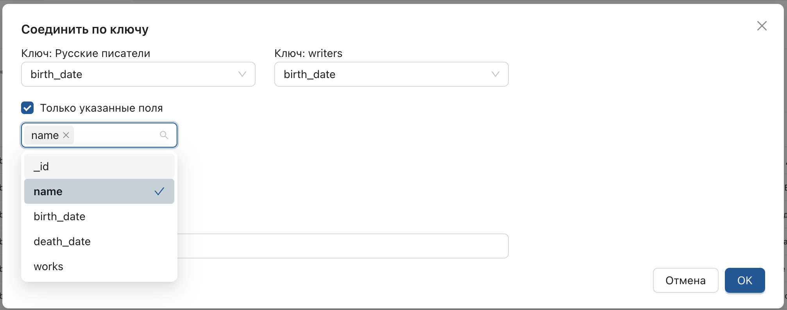

_Присоединяет значения поля по ключу._

1. Откройте настройку в рабочей области.
2. Отобразите страницу источника и нажмите **"Соединить"**.

3. В отобразившемся списке выберите присоединяемый источник или версию преобразования.

**Результат:** в рабочей области отобразится окно с параметрами.

4. Укажите ключи (поля, по которым будет выполнено присоединение источников).
5. При необходимости укажите присоединяемые поля.

Введите имя производного поля и подтвердите действие.

**Результат:**  
Будет добавлена производная версия настройки, содержащая поле с вложенным массивом данных и поле с количеством вложенных элементов.

> Операция может значительно увеличить объем данных, поэтому ограничьте количество вложенных документов в окне назначения параметров.

6. **Дополнительные действия:**
   - Дважды нажмите на значение производного поля, чтобы отобразить вложенный массив с данными в соседней вкладке.

   - Нажмите на поле, содержащее массив, чтобы отобразить его в виде таблицы.

