_Таблица отображает наборы **JSON-документов**. Строки представляют отдельные документы, а колонки — пары ключ-значение. Таблица содержит ряд **преобразований**, описанных ниже._
## Перемещение полей
1. Нажмите элемент **"Настроить поля"** над таблицей.
 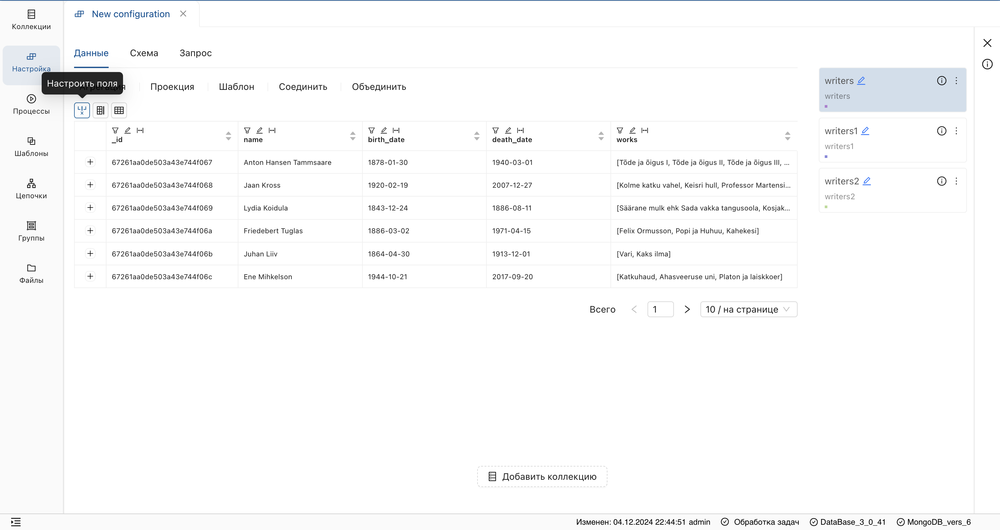
2. Захватите нужное **поле** и переместите его.
 
3. Для сохранения изменений нажмите на отобразившуюся **дискету** справа над таблицей.
 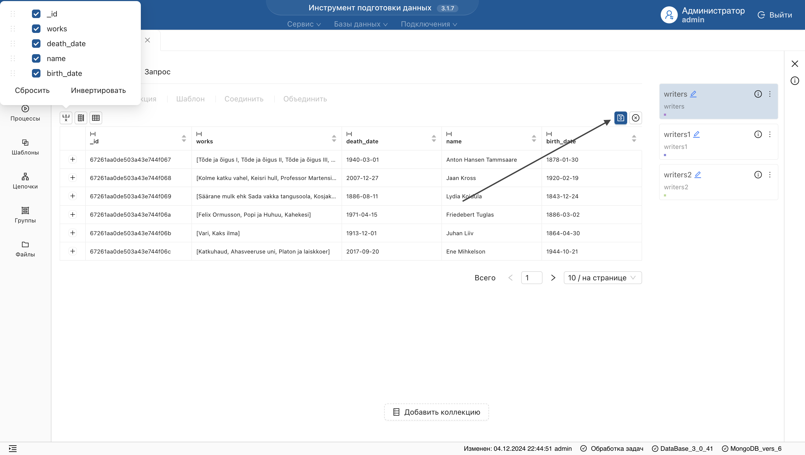
## Удаление полей
1. Нажмите элемент **"Настроить поля"** над таблицей.
2. Снимите галочки напротив полей, которые нужно удалить.
 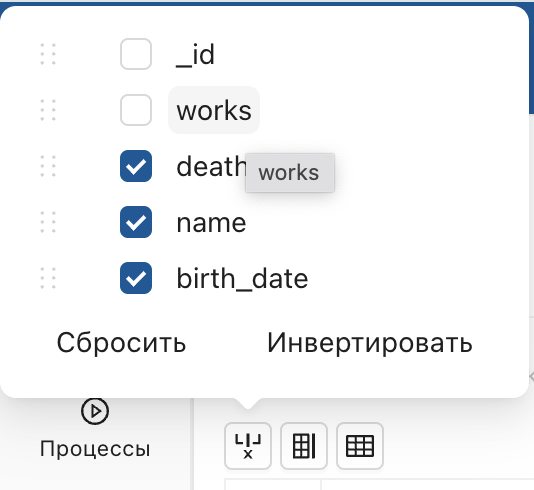
3. Для сохранения изменений нажмите на отобразившуюся **дискету** справа над таблицей.
## Добавление полей
1. На странице шага настройки нажмите кнопку **добавления поля**, введите имя поля и подтвердите действие.
 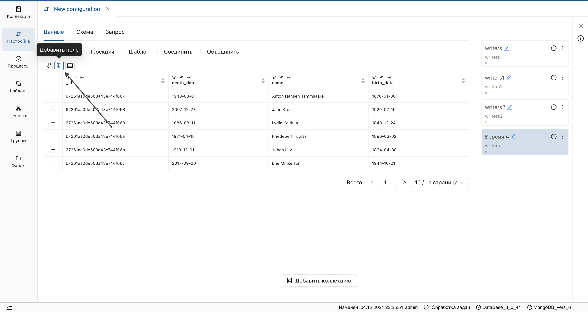
2. Для сохранения изменений нажмите на отобразившуюся дискету справа над таблицей.

> Данная функциональность позволяет вручную добавить поля, чтобы сформировать структуру данных.
## Выгрузка полей
Если не все поля отображены, нажмите значок **выгрузки полей** для их отображения.
 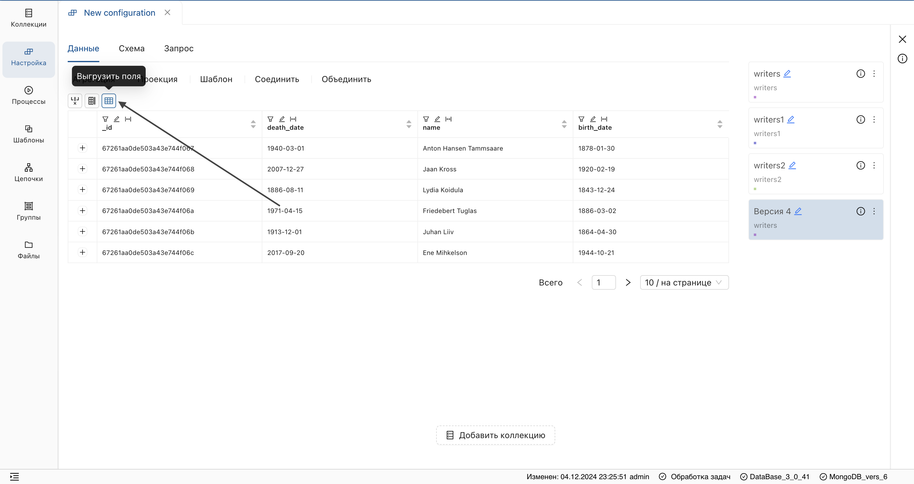
**Результат:** заголовки выгруженных полей добавятся на верхний уровень, а пересечения данных заполнятся типом данных ```null```.
> Выгрузка полей позволяет сформировать однородную структуру данных, например, в результате операции [Объединить](Объединить.md).
## Фильтр по полю таблицы
Доступны следующие типы фильтров: **строковый**, **числовой**, **по списку значений** и по **типу данных**.
#### Строковый фильтр
1. Нажмите на элемент фильтра в заголовке поля.
 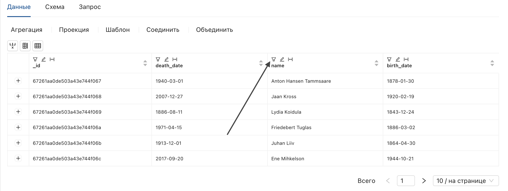
2. В отобразившейся форме введите условие поиска.
 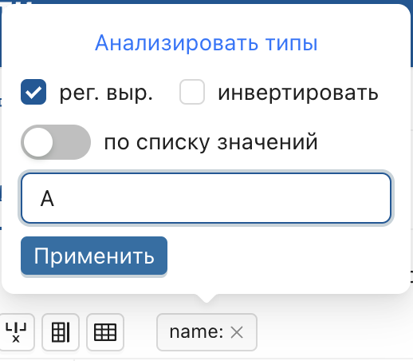
3. Нажмите **"Применить"**.
**Результат:** в указанном поле отобразятся только значения, совпавшие с условием фильтра.
4. Для сохранения результата, нажмите на отобразившуюся **дискету** справа над таблицей.

> Строковый фильтр также поддерживает поиск по регулярному выражению. Для этого установите отметку в чек-боксе **"рег.выр."**.
#### Числовой фильтр
1. Нажмите на элемент фильтра в заголовке поля.
2. В отобразившейся форме введите число и выберите оператор сравнения из списка.
 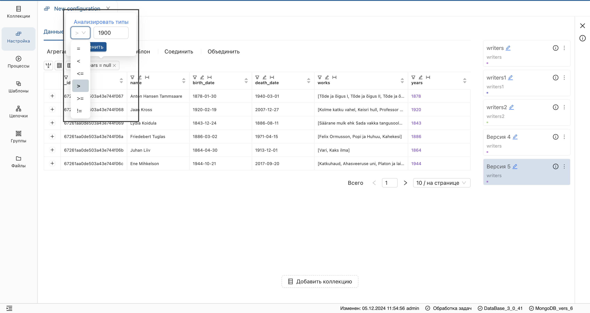
3. Нажмите **"Применить"**.
**Результат:** в указанном поле отобразятся значения, соответствующие условию фильтра.
4. Для сохранения результата, нажмите на отобразившуюся **дискету** справа над таблицей.

> Числовой фильтр применим только к типу данных ```integer``` (в системе отображаются контрастным цветом).
### Фильтр по списку значений
1. Нажмите на элемент фильтра в заголовке поля.
2. Установите переключатель **"по списку значений"**.
 
3. В отобразившемся списке выберите нужные значения и нажмите **"Применить"**.

> Список содержит уникальные значения поля.
#### Фильтр по типу данных
1. Нажмите на элемент фильтра в заголовке поля.
2. В отобразившейся форме нажмите **«анализировать типы»**.
 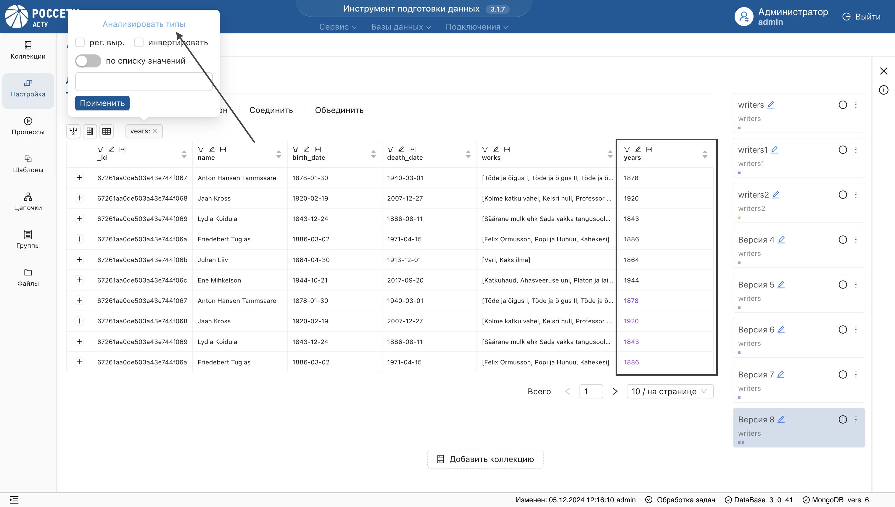
3. Выберите необходимый тип данных и нажмите **"Применить"**.
**Результат:** в указанном поле отобразится только выбранный тип данных.
## Переименование поля
1. Нажмите на элемент **"Редактировать имя"** в заголовке **поля**.
 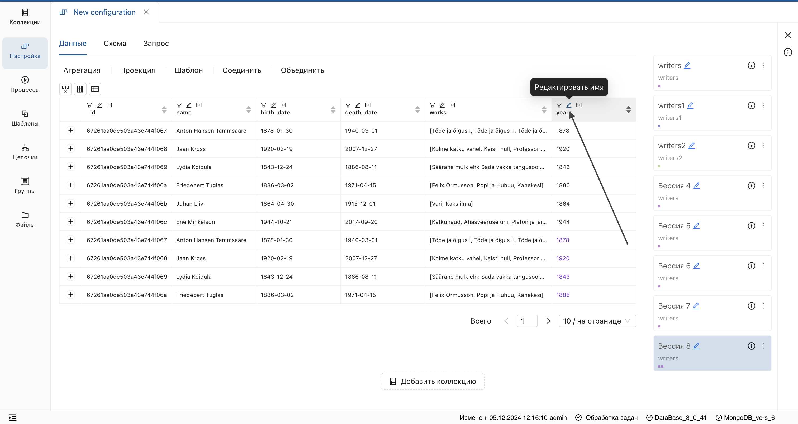
2. Введите новое имя **поля** и сохраните изменения.
## Удаление пробелов с концов строки
1. Нажмите на элемент **"Удалить пробелы с концов строк"** в заголовке поля.
 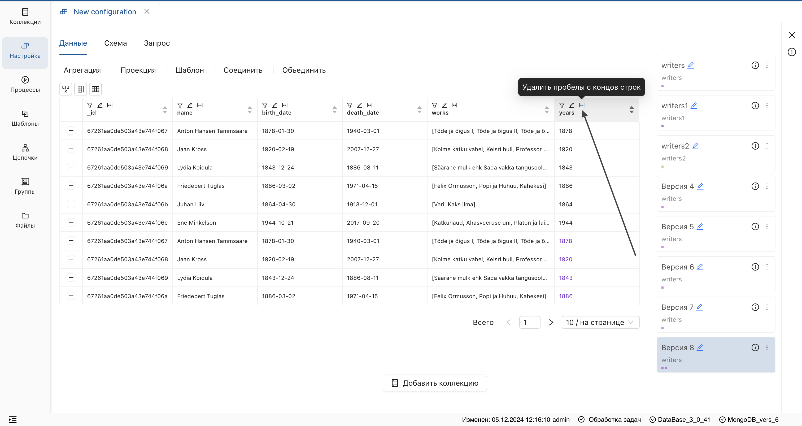
2. Для сохранения изменений нажмите на отобразившуюся дискету справа над таблицей.
## Сортировка значений
Нажмите на стрелку в заголовке поля для сортировки значений по возрастанию, убыванию или алфавиту.
 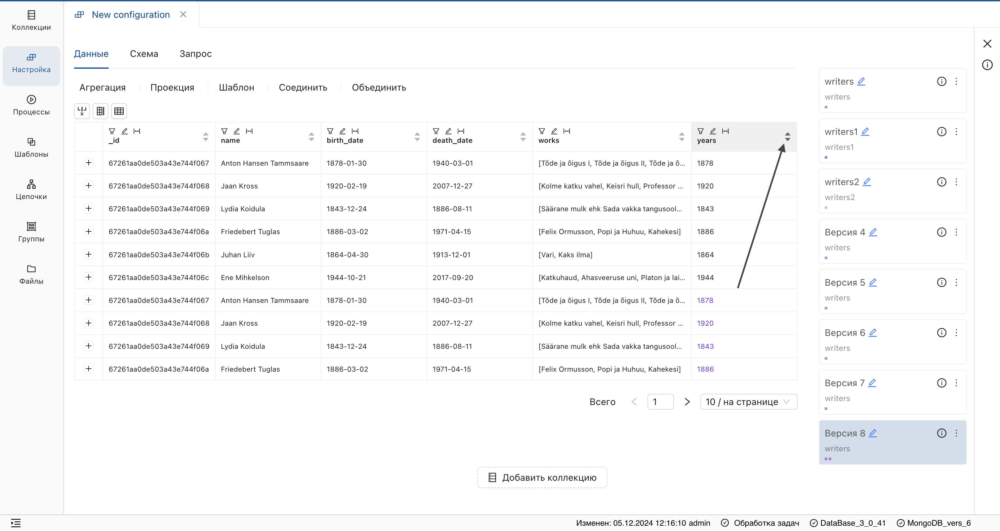
## Типы данных
Таблица поддерживает различные **типы данных**:

| Тип данных       | Представление                        |
|-------------------|-------------------------------------|
| **Строковый**    | Стандартный цвет                    |
| **Числовой**     | Контрастный цвет                    |
| **Массив значений** | Квадратные и фигурные скобки       |
| **Объект**       | Фигурные скобки                     |
| **Массив строк** | Квадратные скобки                   |

## JSON-представление документа
Для просмотра документа в формате **JSON** нажмите на **плюс** в таблице слева от значений.
 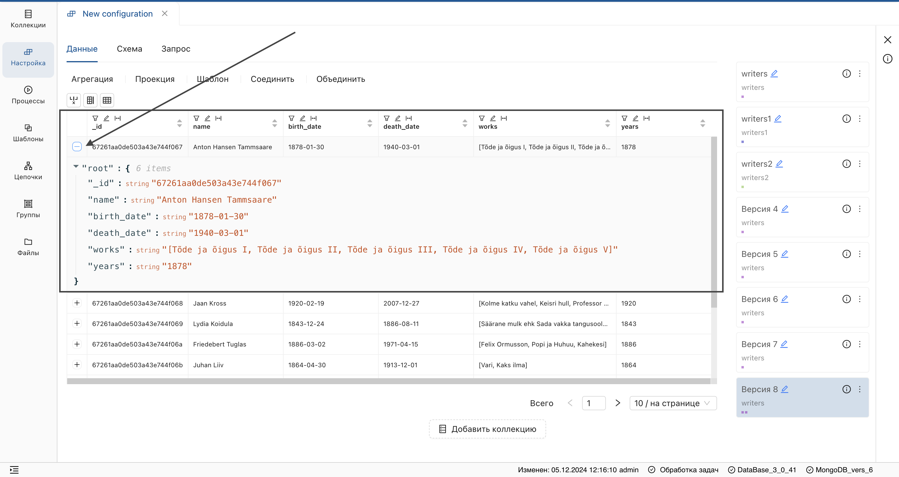
## Навигация по страницам коллекции
Внизу таблицы расположена панель пагинации, на которой отображается:

1. Общее количество значений **Всего**.
2. Элементы перехода на следующую/предыдущую страницы.
3. Указание **номера страницы**.
4. Отображение количества элементов на странице.
 