_Таблица отображает наборы JSON-документов. Строки представляют отдельные документы, а колонки — пары ключ-значение. Таблица содержит ряд преобразований, описанных ниже._
## Перемещение полей
1. Нажмите элемент **Настроить поля** над таблицей.
 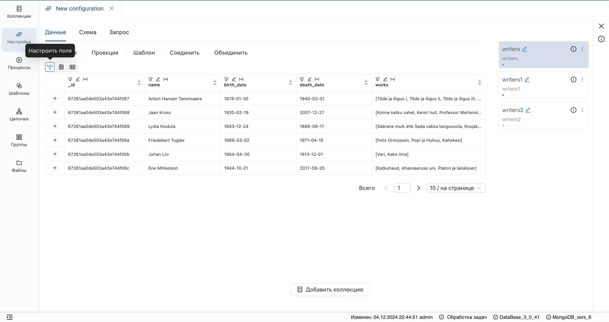
2. Захватите нужное поле и переместите его.
 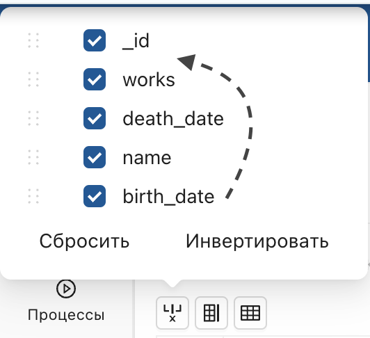
3. Для сохранения изменений нажмите на отобразившуюся **дискету** справа над таблицей.
 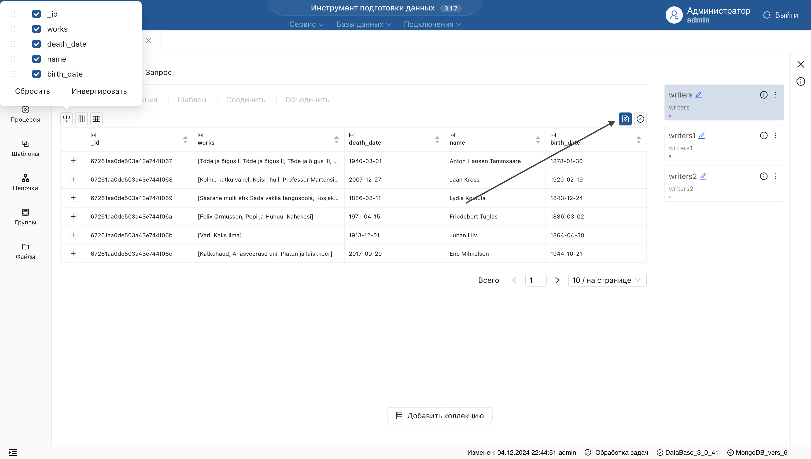
## Удаление полей
1. Нажмите элемент **Настроить поля** над таблицей.
2. Снимите галочки напротив полей, которые нужно удалить.
 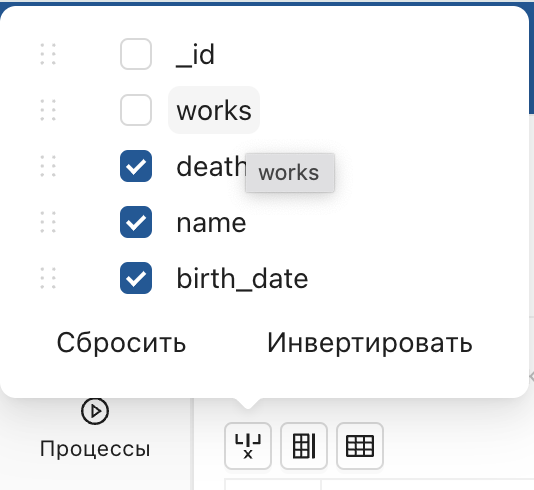
3. Для сохранения изменений нажмите на отобразившуюся **дискету** справа над таблицей.
## Добавление полей
1. На странице шага настройки нажмите кнопку **добавления поля**, введите его имя и подтвердите действие.
 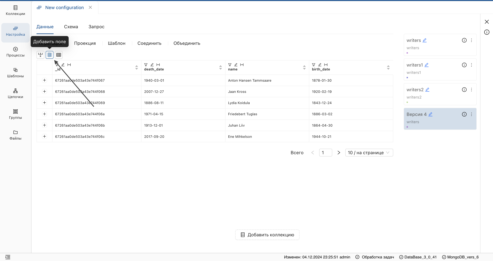
2. Для сохранения изменений нажмите на отобразившуюся дискету справа над таблицей.

> Данная функциональность позволяет вручную добавить поля, чтобы сформировать структуру данных.
## Выгрузка полей
Если не все поля отображены, нажмите значок **выгрузки полей** для их отображения.
 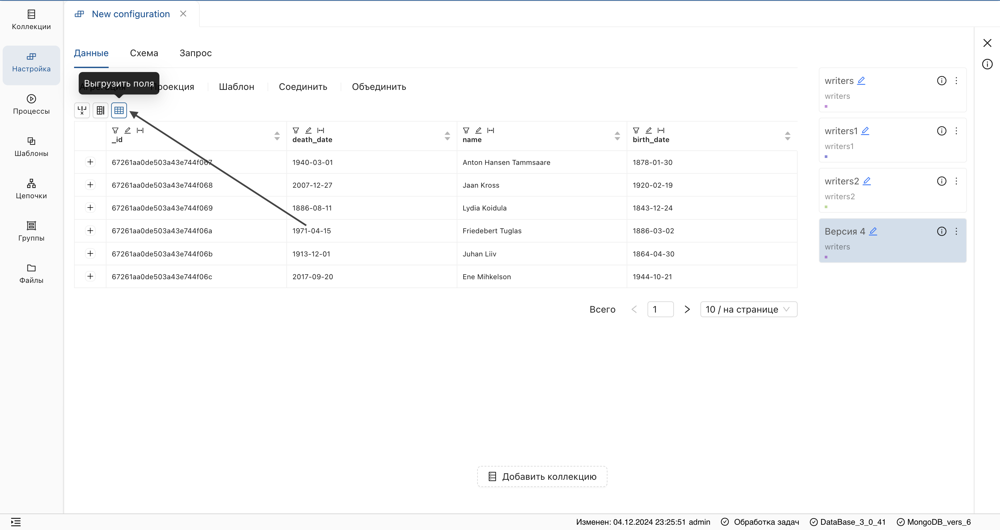
**Результат:** заголовки выгруженных полей добавятся на верхний уровень, а пересечения данных заполнятся типом данных ```null```.
> Выгрузка полей позволяет сформировать однородную структуру данных, например, в результате операции [Объединить](Объединить.md).
## Фильтр по полю таблицы
Доступны следующие типы фильтров: строковый, числовой, по списку значений и по типу данных.
### Строковый фильтр
1. Нажмите на элемент фильтра в заголовке поля.
 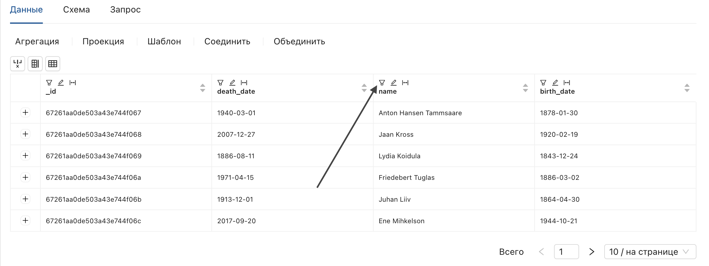
2. В отобразившейся форме введите условие поиска.
 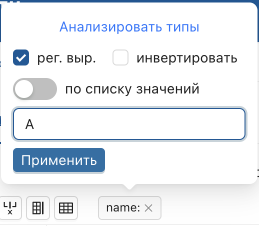
3. Нажмите **«Применить»**.
**Результат:** в указанном поле отобразятся только значения, совпавшие с условием фильтра.
4. Для сохранения результата, нажмите на отобразившуюся **дискету** справа над таблицей.

> Строковый фильтр также поддерживает поиск по регулярному выражению. Для этого установите отметку в чек-боксе **«рег.выр.»**.
### Числовой фильтр
1. Нажмите на элемент фильтра в заголовке поля.
2. В отобразившейся форме введите число и выберите оператор сравнения из списка.
 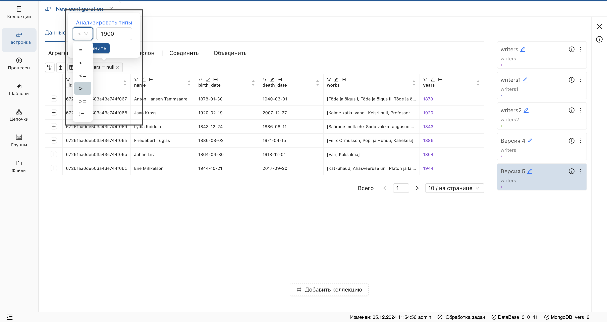
3. Нажмите **«Применить»**.
**Результат:** в указанном поле отобразятся значения, соответствующие условию фильтра.
4. Для сохранения результата, нажмите на отобразившуюся **дискету** справа над таблицей.

> Числовой фильтр применим только к типу данных ```integer``` (в системе отображаются контрастным цветом).
### Фильтр по списку значений
1. Нажмите на элемент фильтра в заголовке поля.
2. Установите переключатель **«по списку значений»**.
 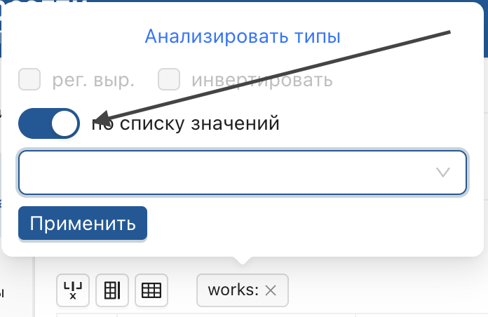
3. В отобразившемся списке выберите нужные значения.

   > Список содержит уникальные значения поля.
4. Нажмите **«Применить»**.
### Фильтр по типу данных
1. Нажмите на элемент фильтра в заголовке поля.
2. В отобразившейся форме нажмите **«анализировать типы»**.
 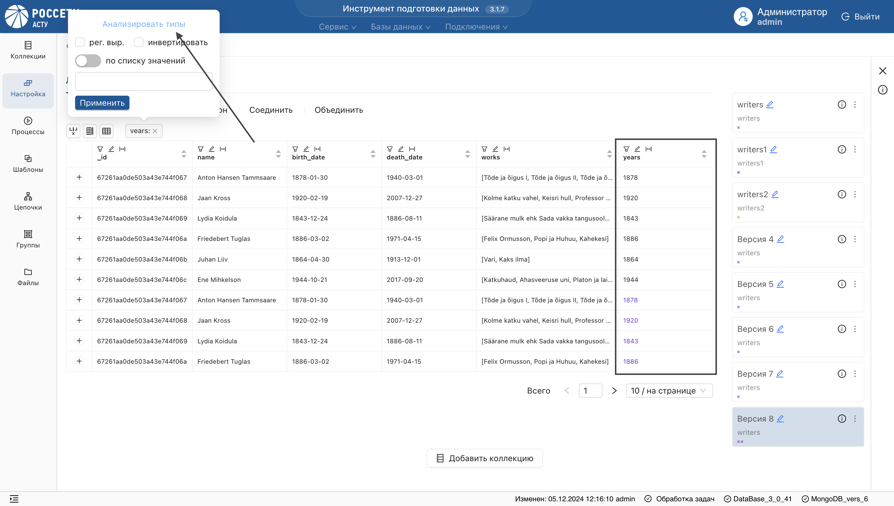
3. Выберите необходимый тип данных.
4. Нажмите **«Применить»**.
**Результат:** в указанном поле отобразится только выбранный тип данных.
## Переименование поля
1. Нажмите на элемент **Редактировать имя** в заголовке поля.
 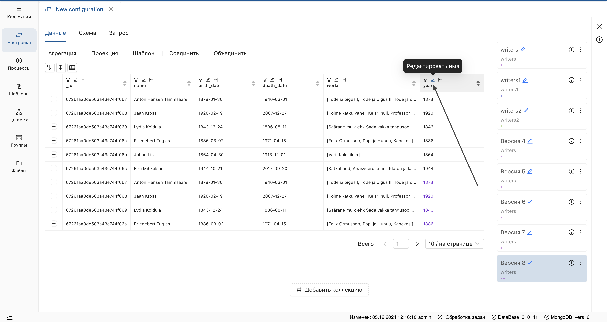
2. Введите новое имя поля и сохраните изменения.
## Удаление пробелов с концов строки
1. Нажмите на элемент **Удалить пробелы с концов строк** в заголовке поля.
 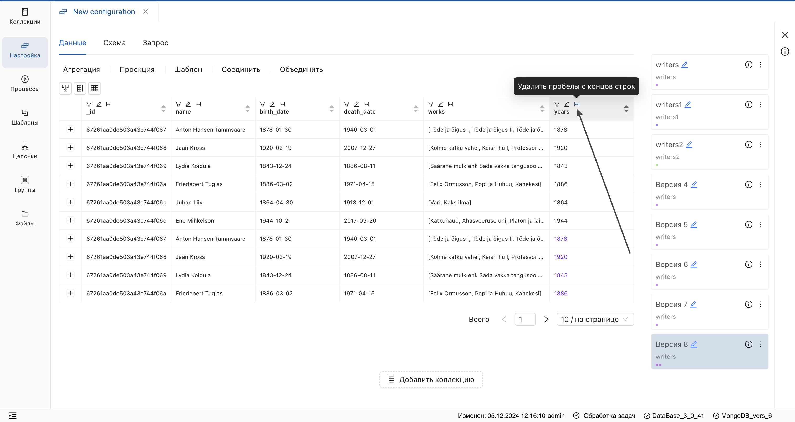
2. Для сохранения изменений нажмите на отобразившуюся дискету справа над таблицей.
## Сортировка значений
Нажмите на стрелку в заголовке поля для сортировки значений по возрастанию, убыванию или алфавиту.
 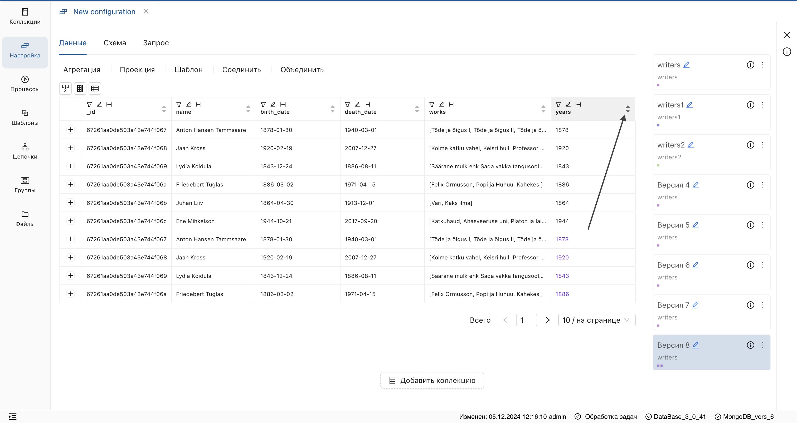
## Типы данных
Таблица поддерживает различные типы данных:

| Тип данных       | Представление                        |
|-------------------|-------------------------------------|
| **Строковый**    | Стандартный цвет                    |
| **Числовой**     | Контрастный цвет                    |
| **Массив значений** | Квадратные и фигурные скобки       |
| **Объект**       | Фигурные скобки                     |
| **Массив строк** | Квадратные скобки                   |

## JSON-представление документа
Для просмотра документа в формате **JSON** нажмите на **плюс** в таблице слева от значений.
 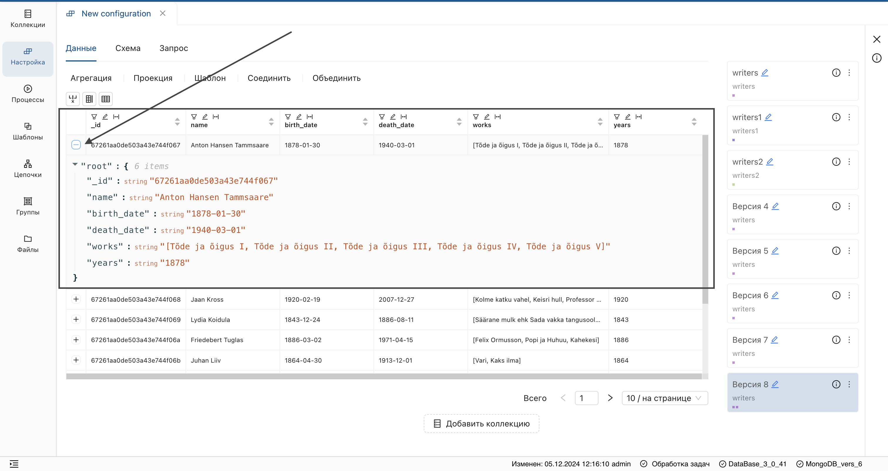
## Навигация по страницам коллекции
Внизу таблицы расположена панель пагинации, на которой отображается:

1. Общее количество значений **Всего**.
2. Элементы перехода на следующую/предыдущую страницы.
3. Указание номера страницы.
4. Отображение количества элементов на странице.
 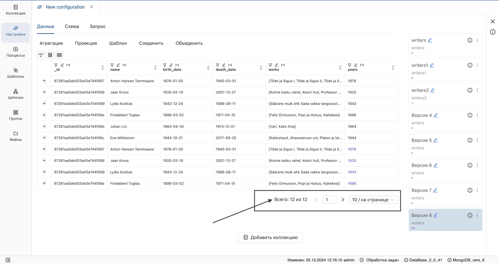