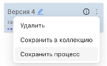
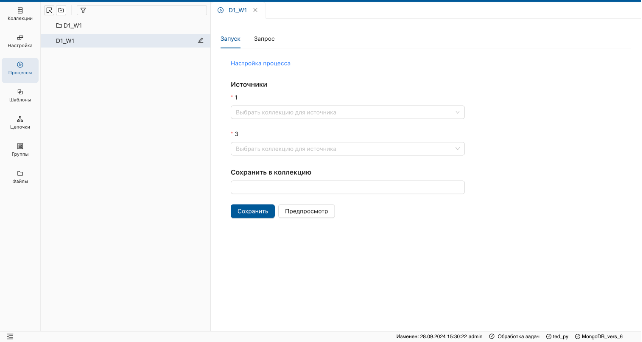
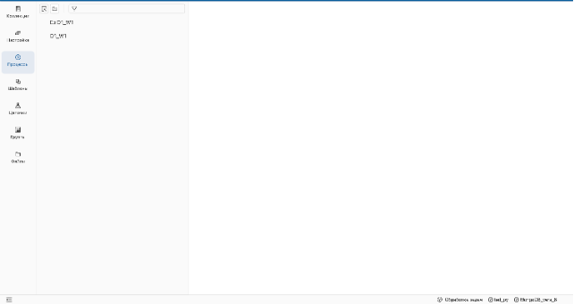
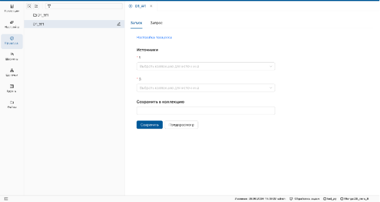

_Процесс создается в разделе **Настройки** и может быть выполнен в функциональном разделе **Процессы** и использован в функциональном разделе **Цепочки**._
## Создание процесса

1. Перейдите на страницу настройки и выполните необходимое преобразование (например, объединение двух источников).
2. Наведите курсор на троеточие и выберите **Создать процесс**.

В открывшемся окне введите:

   - Имя процесса.
   - Код.
   - Описание запроса.

>**Описание запроса** визуализируется при использовании процесса в цепочках.

**Результат:**

      Процесс отобразится в списке функционального меню раздела Процессы.

Каждый процесс представляет собой единицу преобразования, но может включать цепочку преобразований.

> Отмените **персистирование** и **выгрузку полей**, чтобы избежать потери данных.

## Выполнение процесса
1. Откройте раздел **Процессы**.
2. Отобразите страницу процесса в рабочей области.

Добавьте источники и введите имя производной коллекции.

- Для предварительного просмотра результата нажмите **"Предпросмотр"**.
- Для сохранения результата в физическую коллекцию нажмите **"Сохранить"**.

**Результат:**
      
      Выполненный процесс сохранится в список коллекций.

Для корректного выполнения процесса:

- Заголовки полей подставляемой коллекции должны совпадать с заголовками полей источника запроса.
- Если применены функции **персистирования** или **выгрузки полей**, отмените их.
