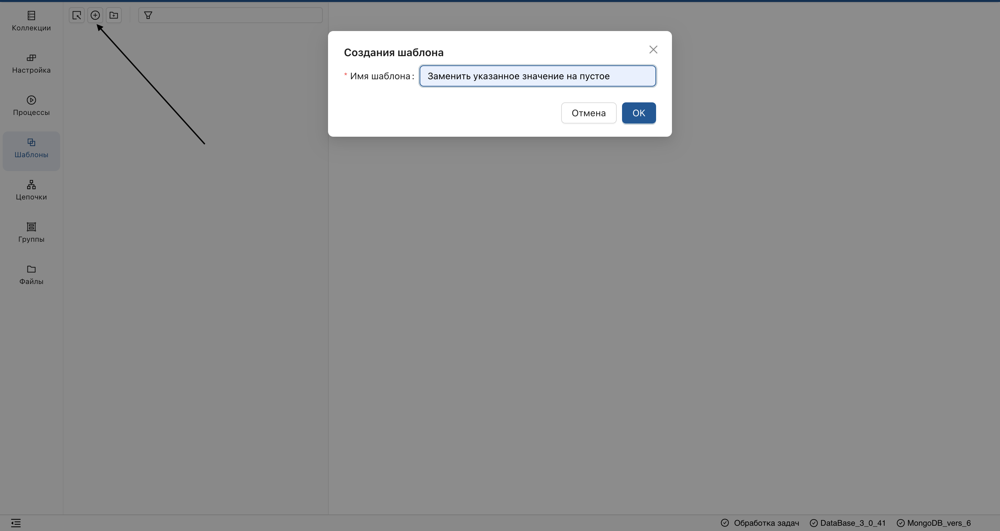
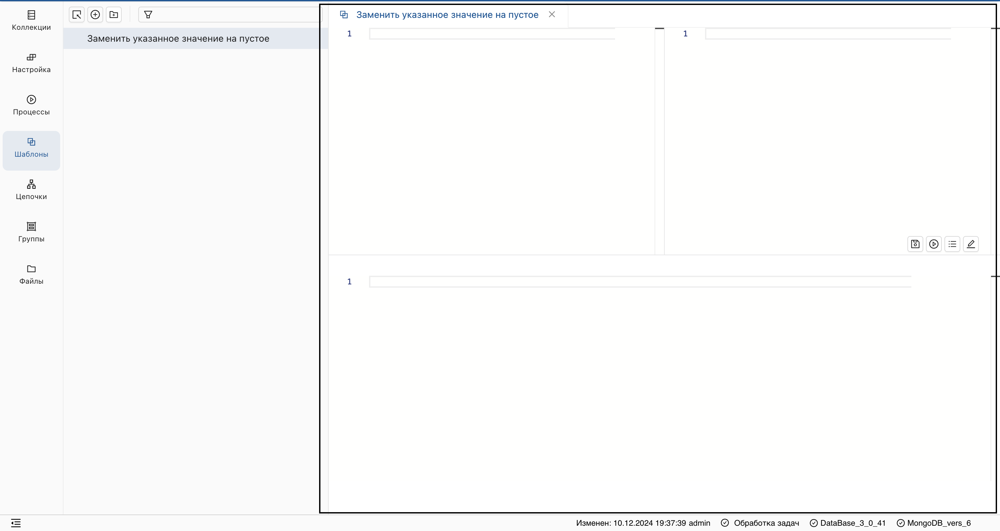
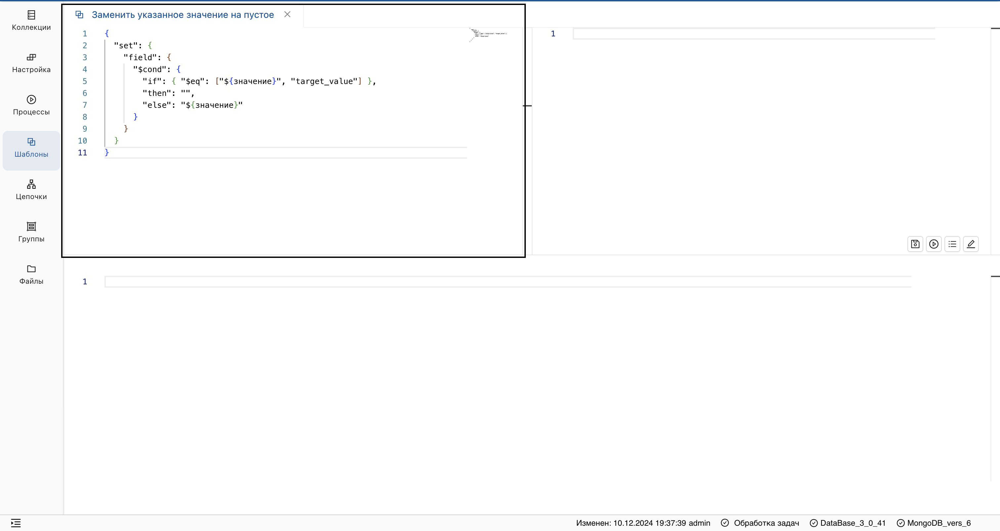
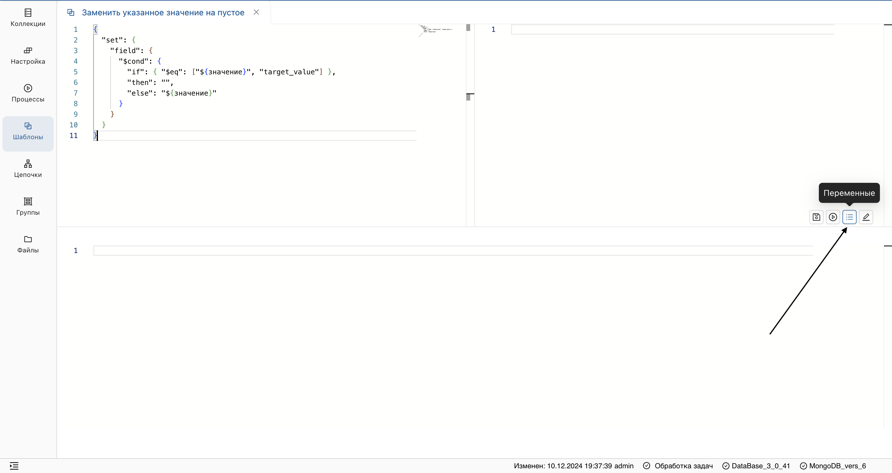
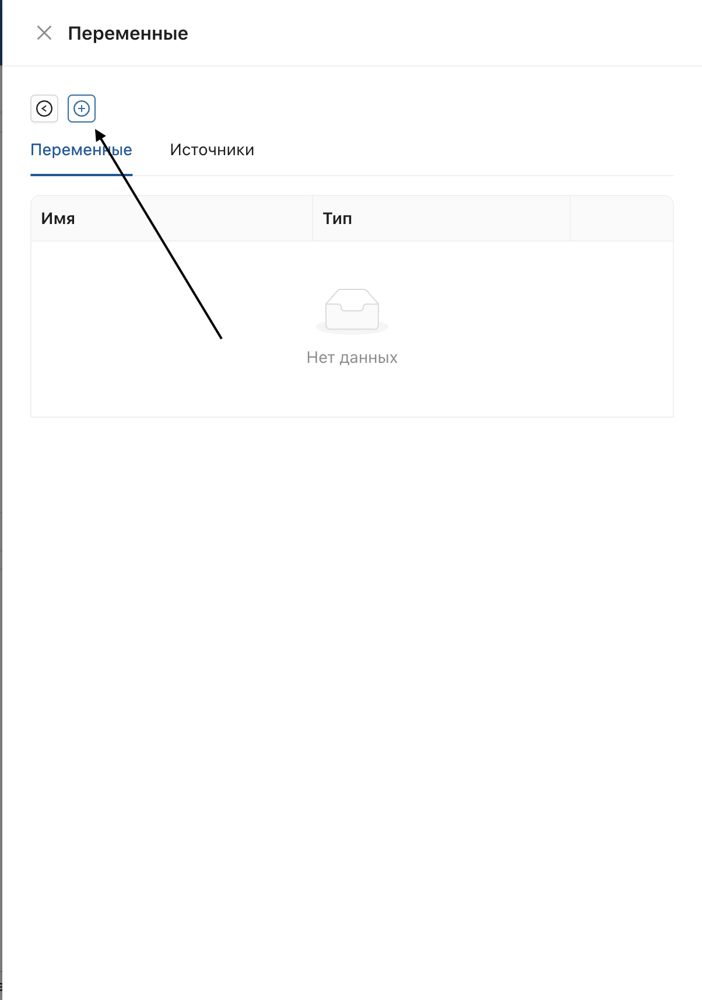
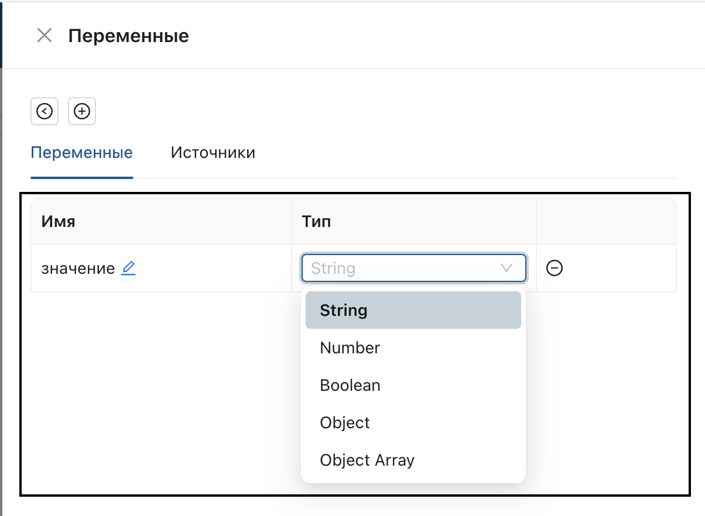
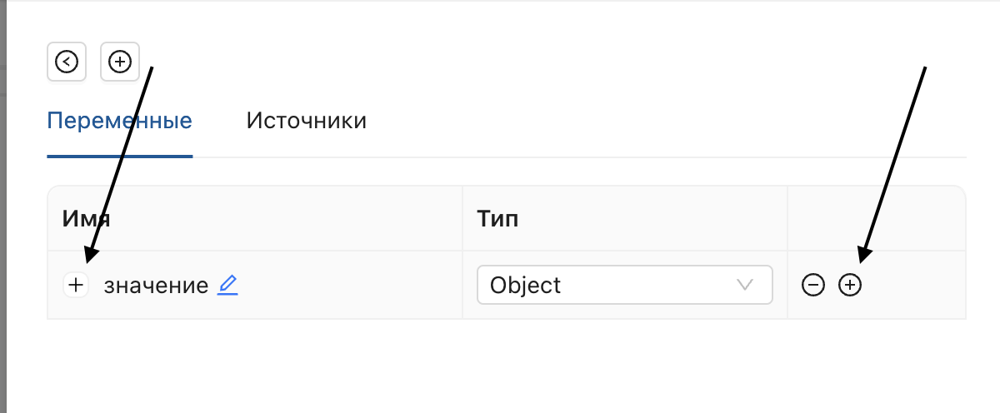
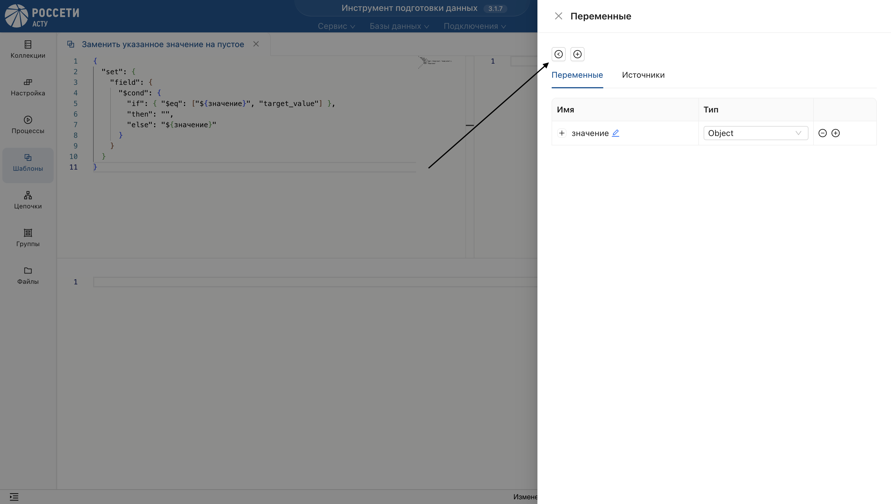
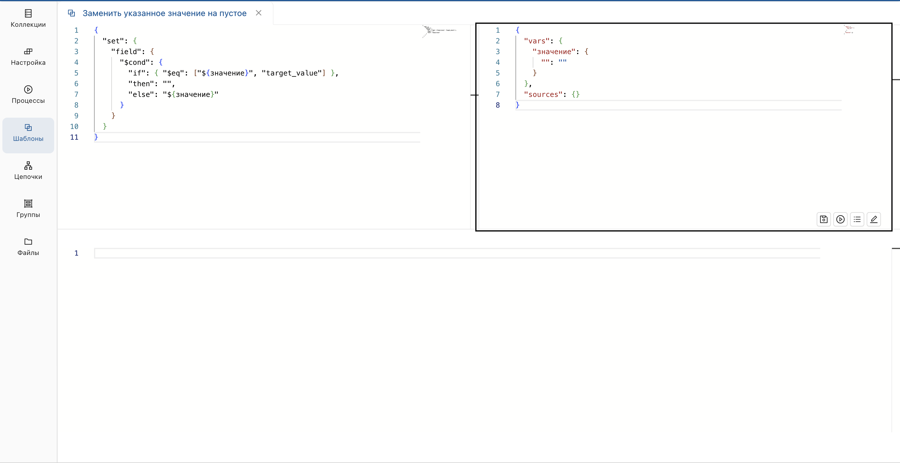
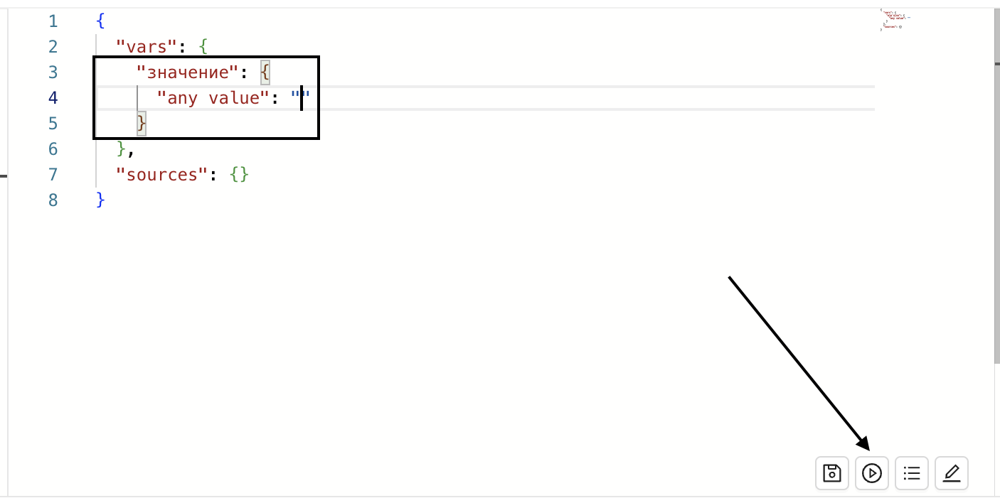

_Шаблоны позволяют настраивать цепочки преобразований с помощью шаблонизатора текста **Freemarker**._
## Создание шаблона
В разделе **"Шаблоны"** создайте новый шаблон:

   - Нажмите на **"+"** над списком объектов.
   - В открывшемся окне введите имя шаблона.
 

**Результат:** 
   - Шаблон отобразится в списке объектов в разделе **Шаблоны**.
   - В рабочей области отобразится:
     - окно для написания текста шаблона;
     - окно для настройки параметров шаблона;
     - панель для тестирования шаблона.

 
Для дальнейшей работы, перейдите на страницу шаблона.
## Написание текста шаблона
> Для написания текста шаблона необходимо знать синтаксис запросов **MongoDB** и синтаксис **Freemarker**.

- Введите текст шаблона в левом окне.

 > На верхнем уровне каждый объект содержит команду. Примеры команд: `set`, `addfields`, `group`, `unwind`, `project`.
 > Каждый объект представляет собой шаг преобразования. При написании шаблона, объект выделяется фигурными скобками.
- Пропишите параметры внутри объекта:
    * Скопируйте выражение из библиотеки **MongoDB**.
    * Выражение должно быть написано в соответствии с синтаксисом Freemarker: `${имя переменной}`.
> Параметры прописываются через точку в иерархическом порядке.
_Пример запроса "Заменить указанное значение на пустое":_
```Json
{
  "set": {
    "field": {
      "$cond": {
        "if": { "$eq": ["${значение}", "target_value"] },
        "then": "",
        "else": "${значение}"
      }
    }
  }
}
```
## Настройка параметров
> Алгоритм настройки будет различным для каждого шаблона и должен соответствовать его тексту.
- На панели инструментов нажмите на значок настройки переменных.

- В открывшемся окне добавьте переменную - нажмите "+".

- Введите имя переменной и выберите тип данных из списка.

> Имя переменной не должно содержать пробелы.
- Для создания вложенных переменных (например, для родительского типа данных "object"):
  - Добавьте вложенности при помощи плюса справа от переменной.
  - Затем добавьте переменные отобразившимся плюсом слева.

Далее, выгрузите параметры, нажав стрелку влево.

_**Результат:** в правом окне отобразятся параметры запроса._

- Протестируйте шаблон:
   - Введите тестовые значения в правом окне и выполните запуск.
   - Результат отобразится в нижнем окне.

> Периодически сохраняйте результат работы.