# Импорт JSON
Данная инструкция описывает пример настройки цепочки преобразований, включающей объект "Программный обработчик", предназначенный для импорта данных из JSON файла, размещенного в файловом хранилище.
### Шаг 1: Загрузка файла в файловое хранилище
Перейдите в раздел **"Файлы"** и загрузите файл формата JSON с данными.
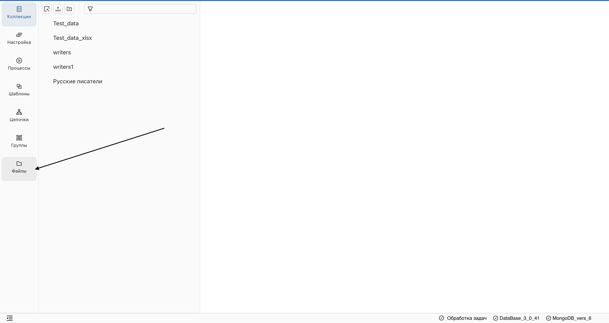
Пример файла:
```json
{
     "data": [
       {
         "id": 1,
         "name": "Объект 1"
       },
       {
         "id": 2,
         "name": "Объект 2"
       }
     ]
   }
```
> Корневой объект должен содержать одно поле с массивом объектов (в данном примере — поле data).

Убедитесь, что файл успешно добавлен в файловое хранилище.
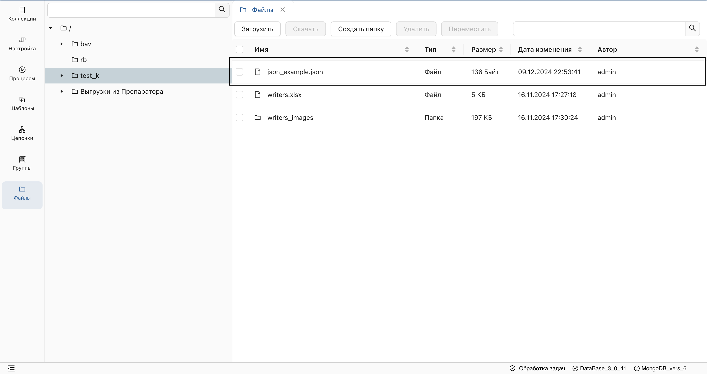
### Шаг 2: Инициализация обработчика
В разделе "**Цепочки**" настройте программный обработчик:

1. Выберите программный обработчик из списка.

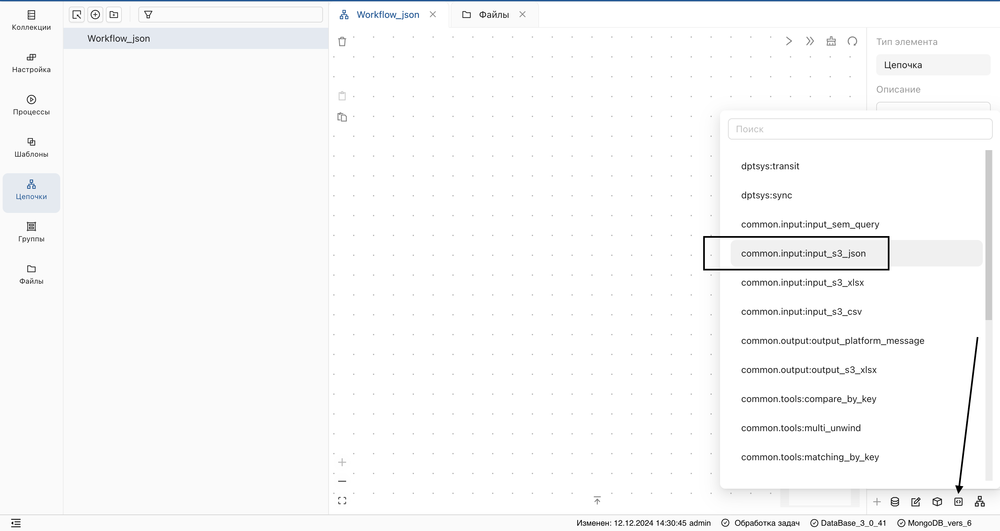
**Результат:** в рабочей области появится объект обработчика в виде блока с синим заголовком.


### Шаг 3: Настройка параметров обработчика
В разделе "Цепочки" настройте параметры процессора:

1. Нажмите **params** на блоке, в результате чего отобразится панель для настройки параметров.

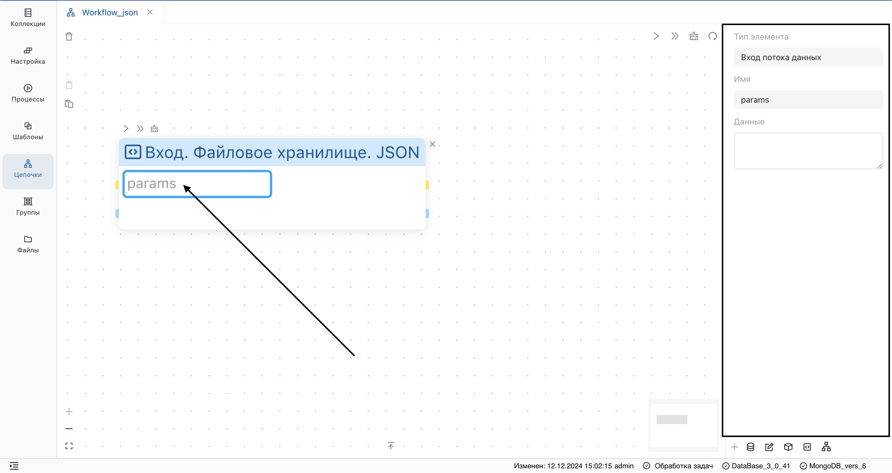
1. В форме "**Данные**" пропишите параметры процессора в формате Json:

- Скопируйте путь к загруженному JSON файлу из раздела "Файлы".

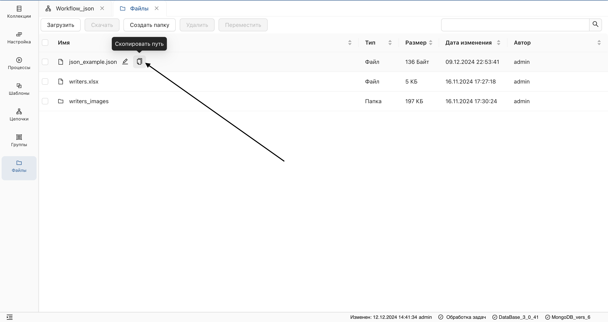

- В поле "**file_path**" подставьте путь к файлу в файловом хранилище.
- В поле "**array_field**": введите имя поля, содержащего массив объектов (в данном примере — data).

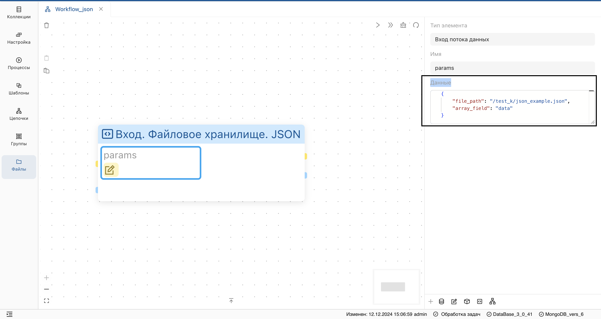
```json
{
    "file_path": "путь_к_JSON_файлу.json",
    "array_field": "data"
}
```
Сохраните импортированные данные в коллекцию:

1. Выберите коллекцию из списка на нижней панели.
 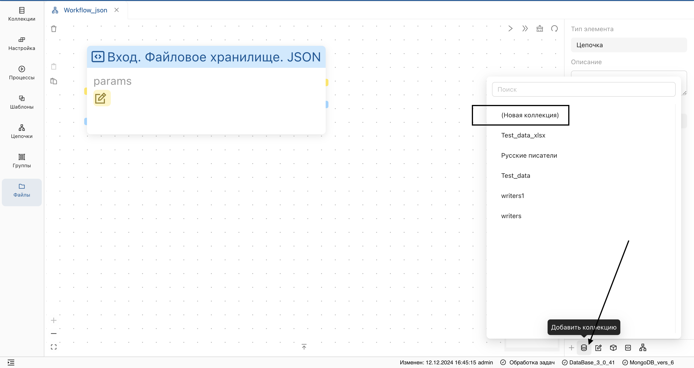
 **Результат:** в рабочей области появится объект обработчика в виде блока с желтым заголовком.
2. Подключите выходную коллекцию к обработчику.
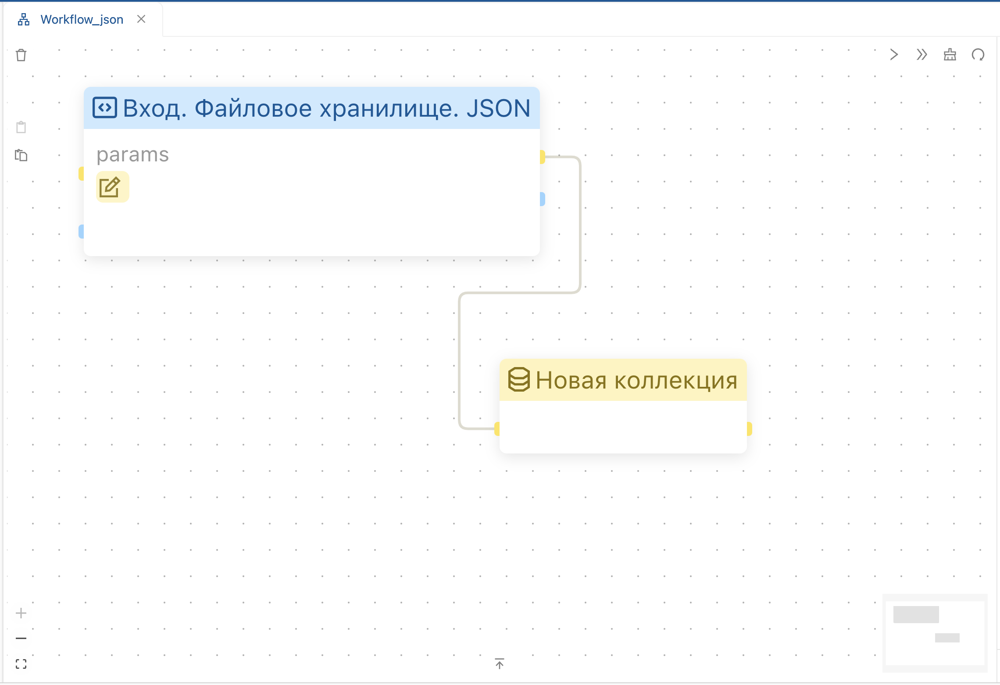
### Шаг 4: Запуск обработчика
Нажмите кнопку запуска на блоке обработчика.
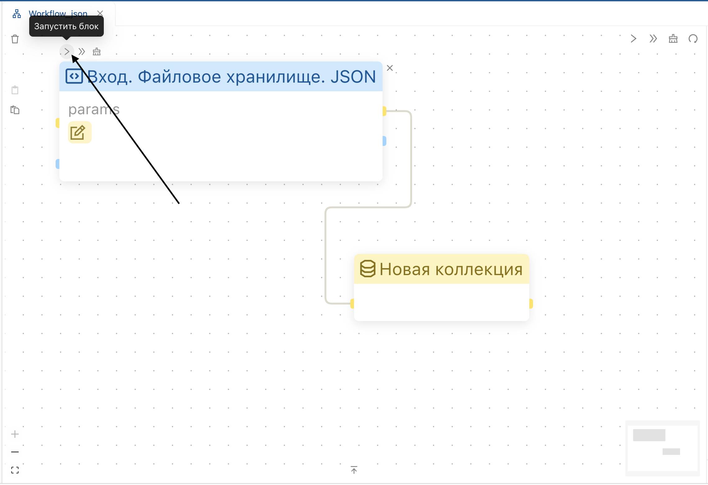
**Результат:** в рабочей области отобразится статус успешного выполнения.
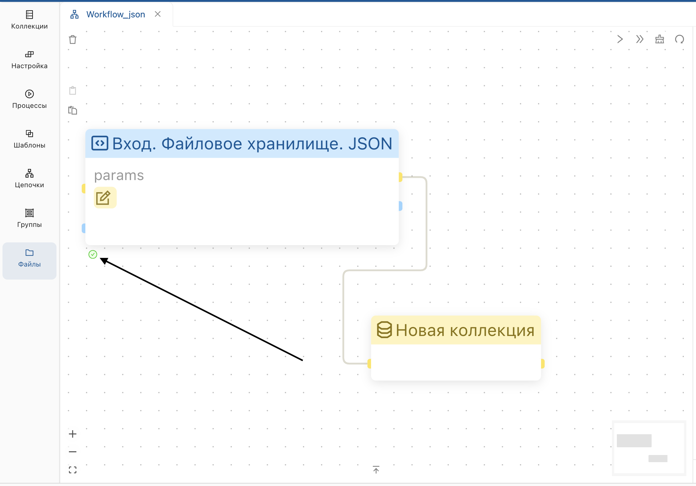
### Шаг 5: Проверка результата
В разделе "**Коллекции**" убедитесь, что данные из JSON файла корректно добавлены в выбранную коллекцию.
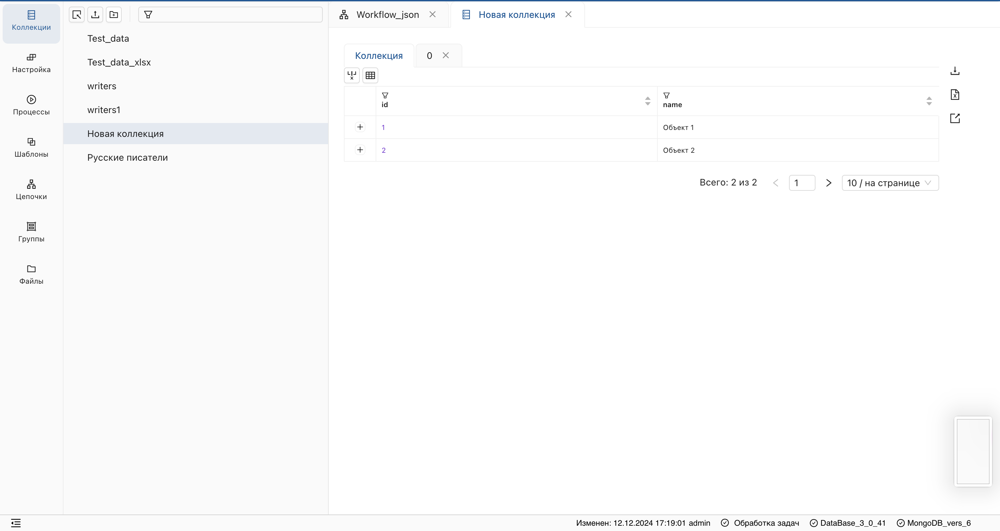
### Шаг 6: Отладка скрипта
Если обработчик возвращает ошибку:
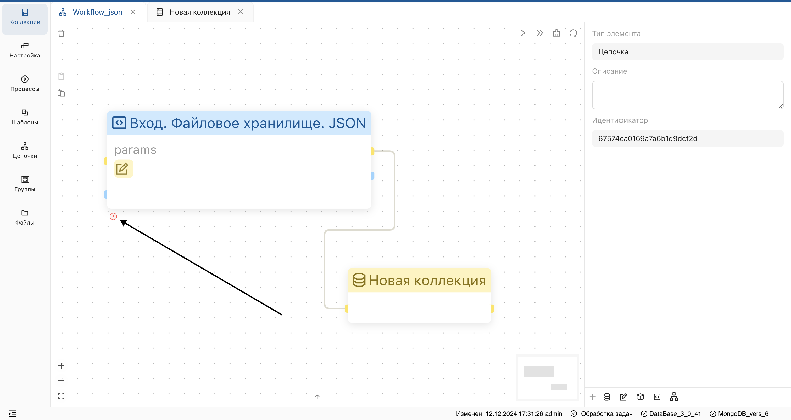

Нажмите на заголовок блока, чтобы открыть панель настройки обработчика.
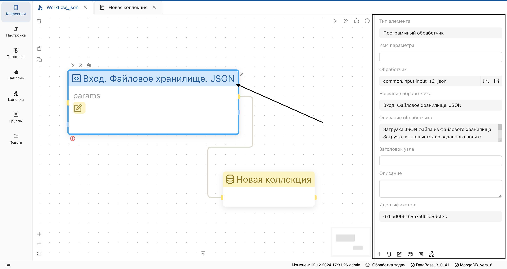
В панели настройки вызовите функцию скрипта для отладки.
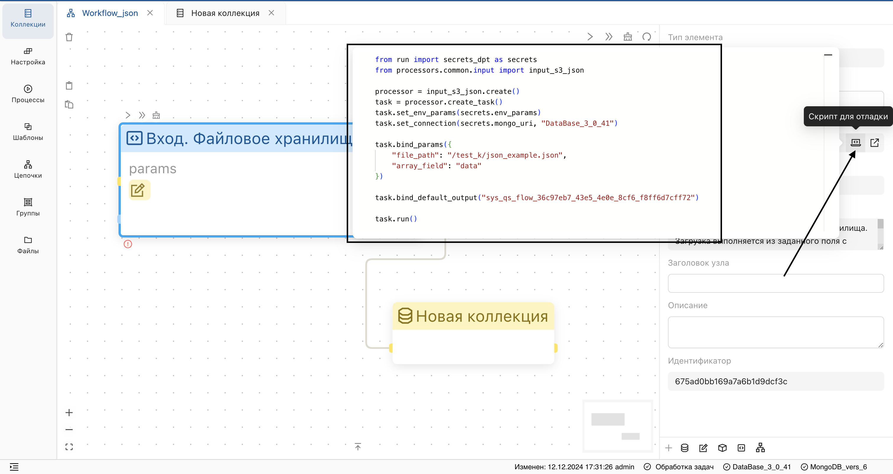
Скопируйте текст скрипта в среду разработки и выполните отладку.

# Импорт Excel
Ниже описан пример настройки цепочки преобразований, включающих объекты "Программный обработчик" и "Коллекция".
1. В разделе "Файлы" загрузите файл формата XSLX.

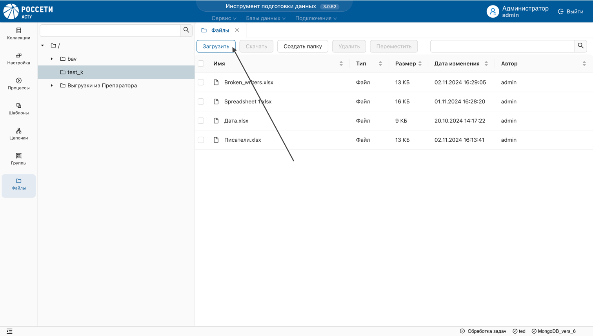

### Инициализация обработчика

1. В разделе "Цепочки" настройте обработчик.


    - Выберите обрабочик из списка.
*В результате, выбранный объект отобразится в рабочей области в виде блока с синим заголовком*

    - Скопируйте путь к файлу в разделе “Файлы”.


    - Задайте параметры в поле params:

```json
{
    "file_path": "путь_к_тестовому_файлу.xlsx"
}
```
    - Подключите выходную коллекцию к обработчику.


    - Запустите обработчик.


**Результат:** В рабочей области должен отобразиться статус успешного запуска процесса, а в списке коллекций объект с данными из хранилища.


3. Проверьте, что данные из ```XLSX``` файла корректно добавлены в раздел "Коллекции".

### Отладка скрипта

> В случае, если запуск обработчика возвращает ошибку, отладьте скрипт вручную.

4. Нажмите на заголовок блока.

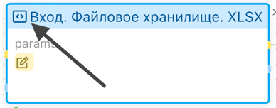

**Результат:** слева отобразится панель настройки обработчика.

5. Вызовите функцию скрипта для отладки.

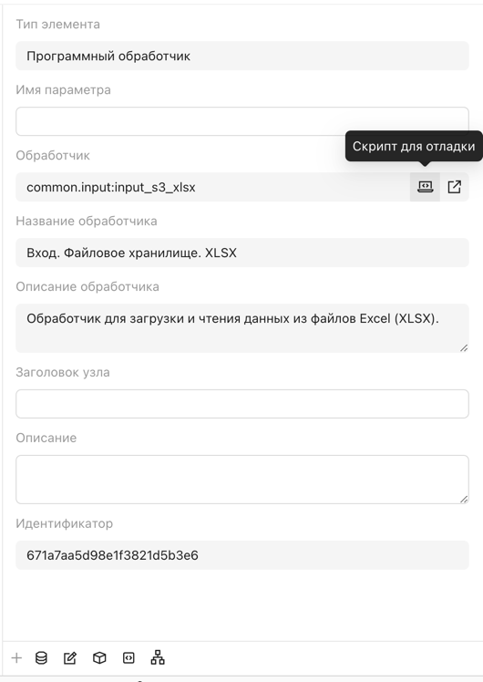

6. Скопируйте текст и отладьте его в среде разработки.


# Семантический запрос
Ниже описан пример настройки цепочки преобразований с использованием объекта "**Программный обработчик**", выполняющего семантический запрос.
### Шаг 1: Загрузка данных и подготовка
Перейдите в программное приложение **Редактор модели** и, в списке "**Онтологии**", выберите "**Семантические запросы**".
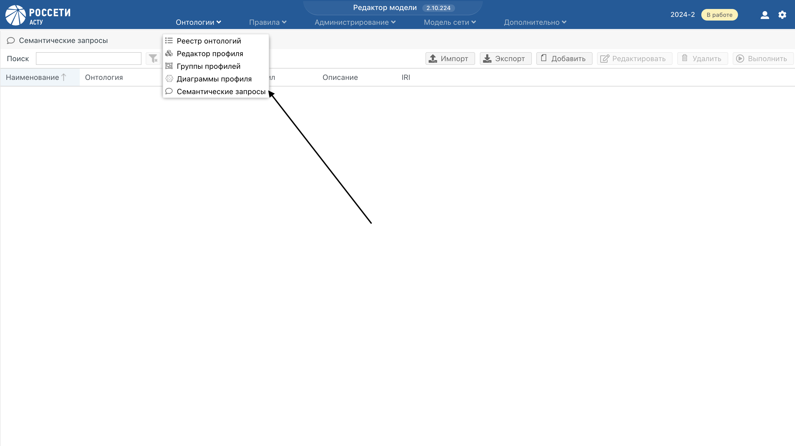
Скопируйте идентификатор запроса без префикса.
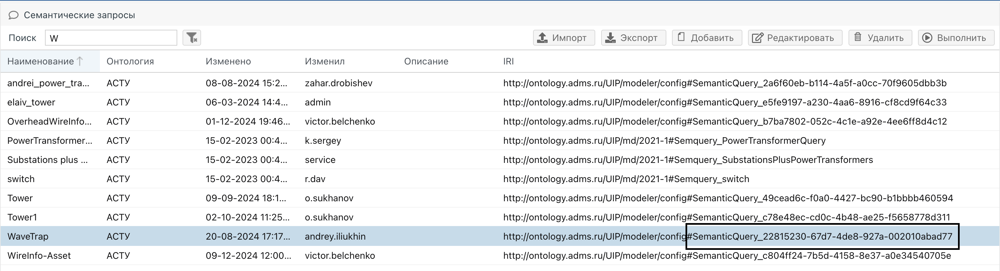
### Шаг 2: Инициализация обработчика
В разделе "Цепочки" настройте программный обработчик:
* Выберите обработчик для семантического запроса из списка.
* Обработчик отобразится в рабочей области в виде блока с синим заголовком.

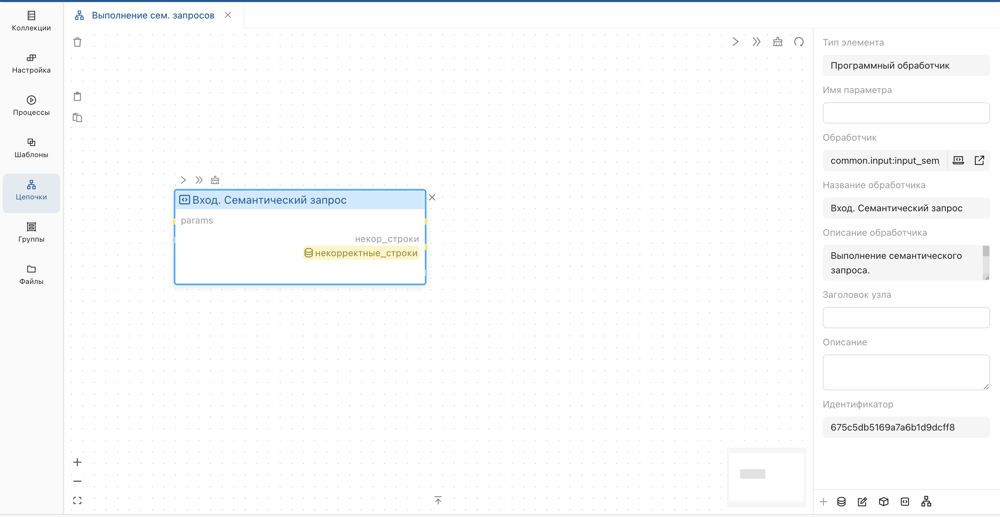
### Шаг 3: Настройка параметров обработчика
В блоке обработчика нажмите params, чтобы открыть панель настройки параметров.
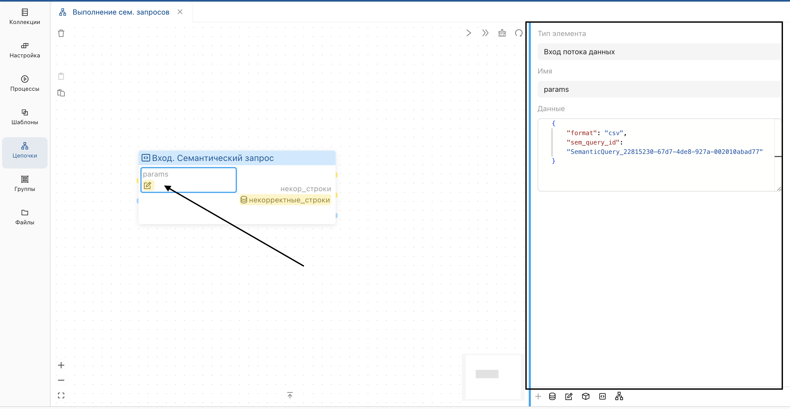
Задайте параметры обработчика в формате JSON:
* format: укажите формат данных на выходе (csv для плоского формата или json для иерархического).
* sem_query_id: задайте идентификатор семантического запроса без префикса.
* root_entity_ids: перечислите идентификаторы объектов без префиксов (необязательный параметр). Если он отсутствует, запрос применяется ко всем объектам нужного типа.
Пример параметров для csv-формата:
```json
{
    "format": "csv",
    "sem_query_id": "SemanticQuery_22815230-67d7-4de8-927a-002010abad77"
}
```
Пример параметров для json-формата:
```json
{
    "format": "json",
    "sem_query_id": "SemanticQuery_c061e503-c81c-4c64-9ad9-7047cb2e9ed6",
     "root_entity_ids": [
            "e6e30190-624c-4664-b649-47f833d2a869",
            "556bcf33-0d51-4303-b193-62a6ad389318"
        ]
}
```
Подключите выходную коллекцию:
* Выберите коллекцию из списка в нижней панели.
* Соедините блок обработчика с выходной коллекцией.
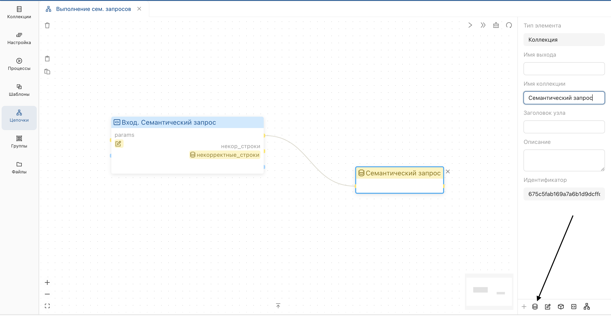
> В результате запуска обработчика может возникнуть ошибка, связанная с некорректным форматированием входного CSV-файла.
* Добавьте еще одну коллекцию на вход для записи расхождения в данных.

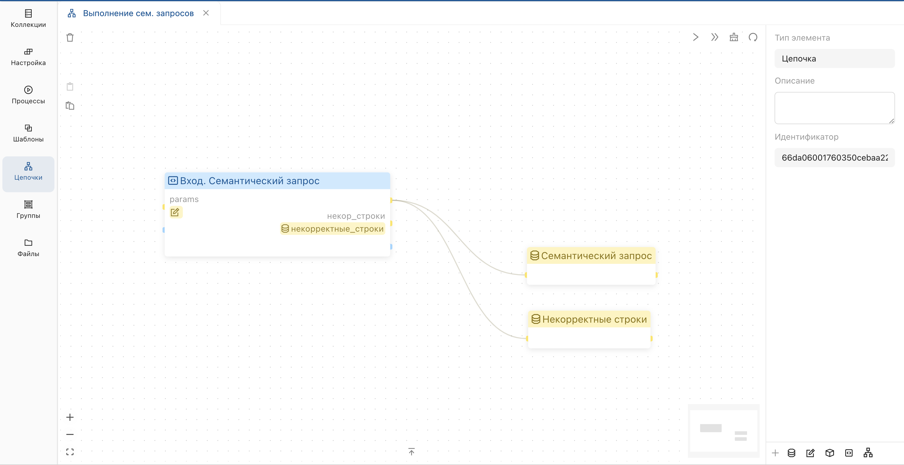
> Коллекция должна быть добавлена в тот же порт.
### Шаг 4: Запуск обработчика
Нажмите на элемент запуска блока обработчика.
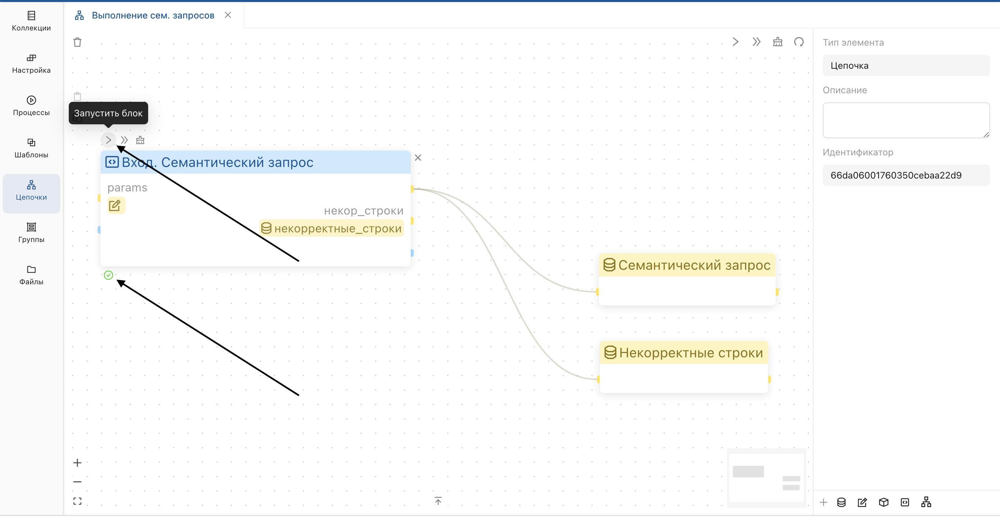
**Результат:** 
В рабочей области отобразится статус успешного выполнения. Данные будут сохранены в формате JSON или CSV в зависимости от указанных параметров.
### Шаг 5: Проверка результата
В разделе "Коллекции" убедитесь, что данные корректно добавлены в выбранную коллекцию.
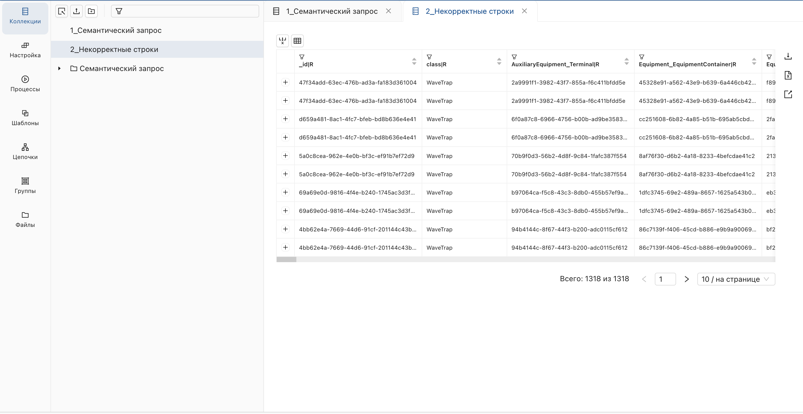
# Сопоставление
Программный обработчик "**Сопоставление**" выполняет следующие задачи:

* Сопоставление объектов из различных систем по выделенному ключу.
* Формирование выходных данных в соответствии с алгоритмом:
     * Дубликаты объектов.
     * Справочники ключей без дубликатов. 
     * Сопоставленные объекты с указанием идентификаторов систем. 
     * Несопоставленные объекты для каждой системы.
#### Входные данные
Для корректной работы обработчика необходимо соблюсти имена полей коллекции:

* Система: идентификатор системы (например, "СУПА"). 
* Тип объекта: тип объектов (например, "подстанции"). 
* Ключ: уникальный ключ для сопоставления. 
* Идентификатор: уникальный идентификатор объекта.

#### Выходные данные
После выполнения обработчика пользователь получает следующие результаты:

1. Дубликаты: список объектов, имеющих повторяющиеся ключи сопоставления. Выводится отдельно для каждой системы.
2. Справочники ключей: список входных объектов без дубликатов.
3. Сопоставленные объекты: объекты, для которых ключи совпадают, объединяются следующим образом:
    * Запись из справочника ключей системы 1 с добавлением идентификатора системы 2.
    * Запись из справочника ключей системы 2 с добавлением идентификатора системы 1.
4. Несопоставленные объекты: списки объектов, для которых не найдено совпадение по ключу, отдельно для каждой системы.

### Порядок работы

1. Добавьте обработчик в рабочую область.  
   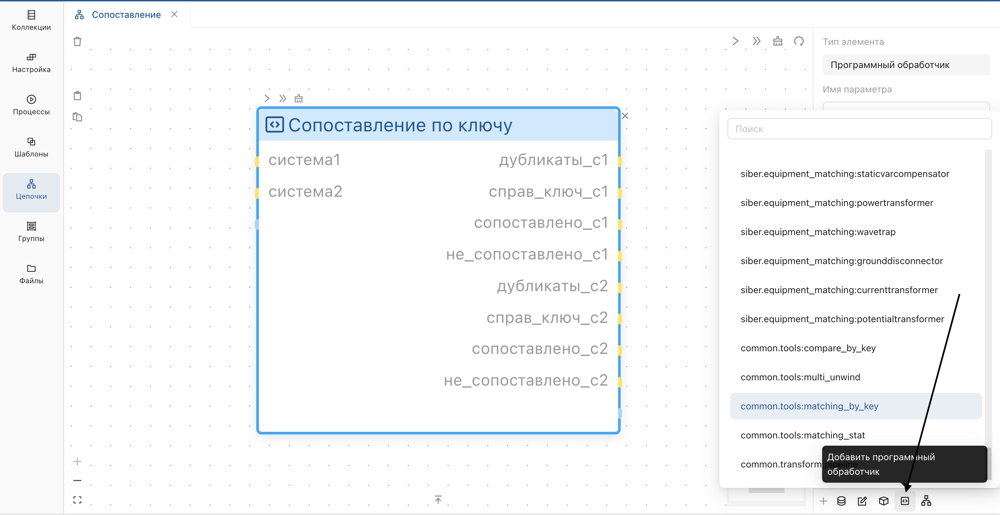

2. Добавьте входные коллекции и подключите их к процессору.  
   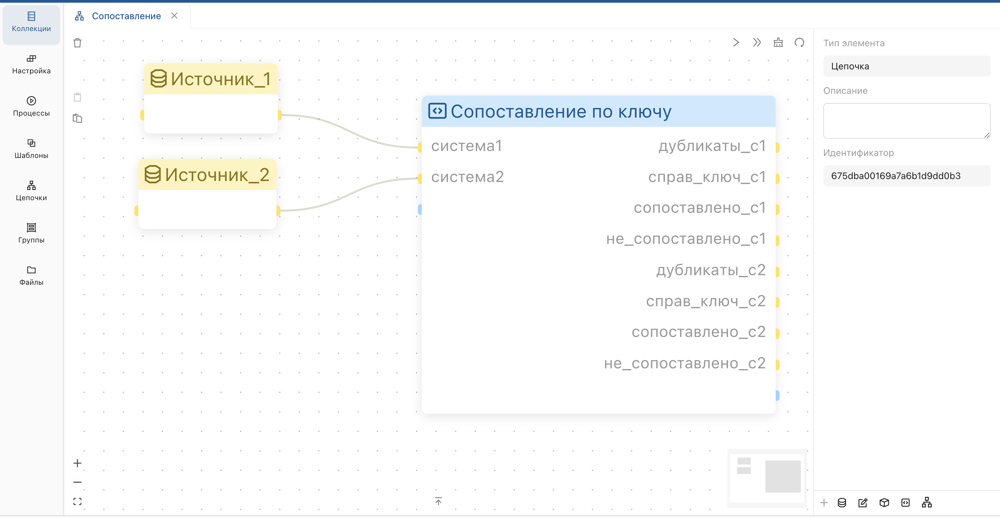

   Обработчик поддерживает два способа подключения входных данных:

   - **Явное подключение**: пользователь вручную задаёт коллекции для системы 1 и системы 2.
   - **Подключение по маске**: использованием маски можно подключить сразу несколько коллекций, соответствующих указанным условиям (например, все типы оборудования из определённой системы).

<ol start="3">
  <li>Добавьте выходные данные и задайте им имена.</li>
  <li>Запустите обработчик.</li>
</ol>

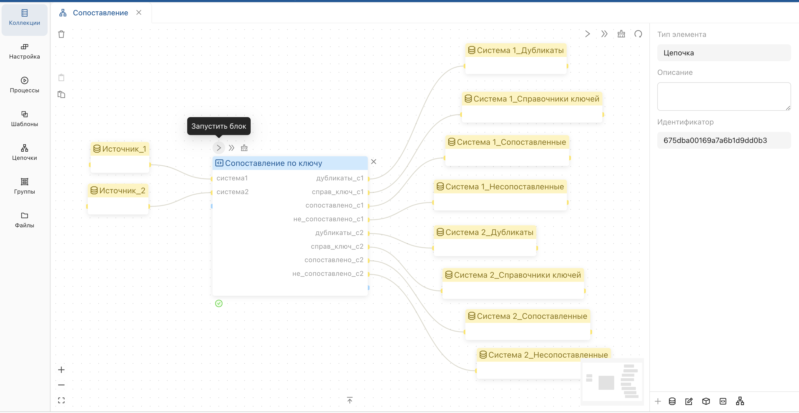

**Результат:**  
Выходные данные будут добавлены в раздел коллекции.  
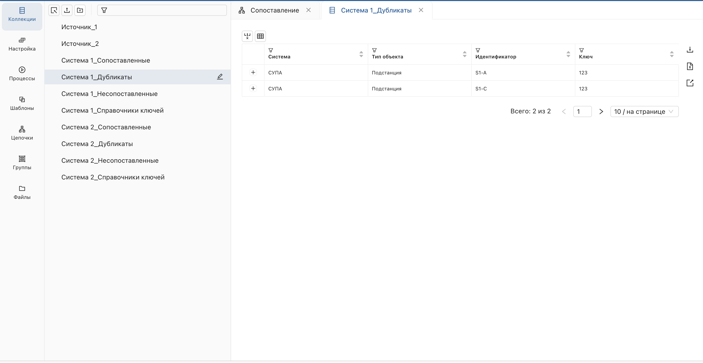

# Набор коллекций по маске
Данная функция предназначена для подключения набора коллекций в **обработчике** с использованием маски. Это позволяет:

* Обрабатывать данные сразу из нескольких коллекций.
* Разделять данные из одной коллекции (выход обработчика) на несколько коллекций.
### Входные данные
**Порядок работы:**

1. Откройте исходную цепочку преобразований.
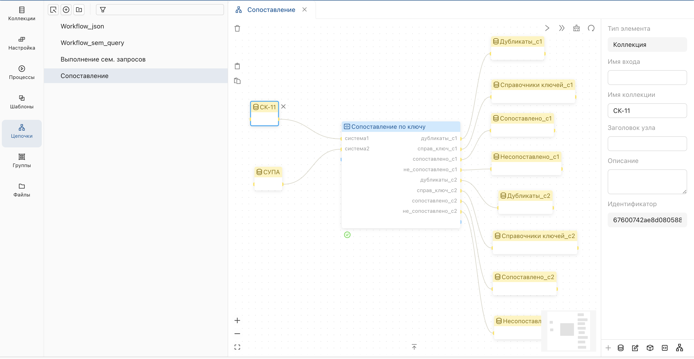
> Обратите внимание, что в источнике параметры не заполнены.
2. Задайте маску в параметрах цепочки преобразований:
    * Нажмите на объект, по которому хотите задать маску.
    * В отобразившемся окне, введите параметры маски через нижнее подчеркивание:
        * Укажите постоянную часть маски для общей части наименования коллекции.
        * Укажите переменную часть маски в фигурных скобках.
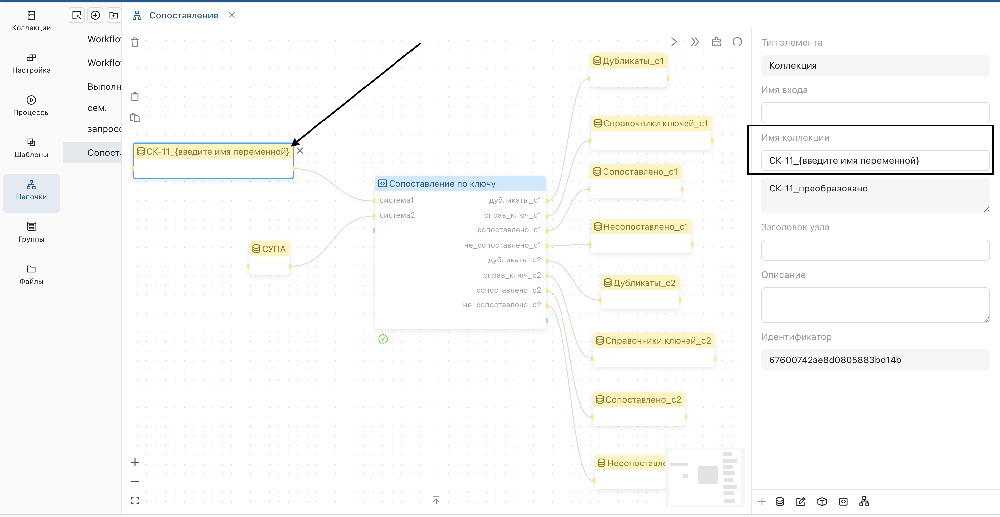

**Результат:**
Обработчик автоматически найдет все коллекции, содержащие постоянную часть маски
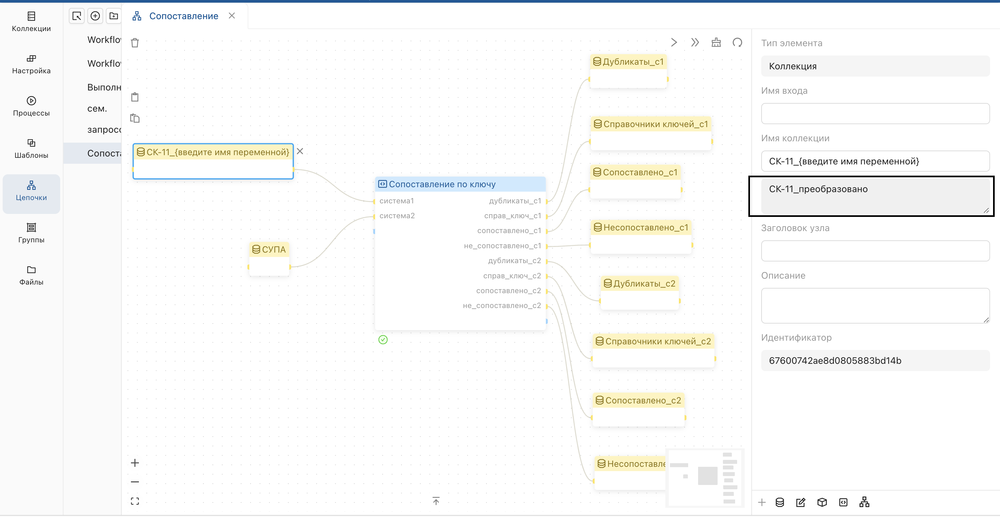

**Пример 1:**

* Введите маску **"СК-11_{x}"**, где **"СК-11"** является постоянной частью, а **"{x}"** - переменной.
* Введите маску **"СУПА_{y}"**, где **"СУПА"** является постоянной частью, а **"{y}"** - переменной.

**Результат:**

В окно с параметрами подтянутся все коллекции из текущей БД:

* В имени которых будет присутствовать постоянная часть маски **"СК-11"** и **"СУПА"**.
* Структура маски будет соответствовать - **"[постоянная часть]\_{переменная часть}"**.
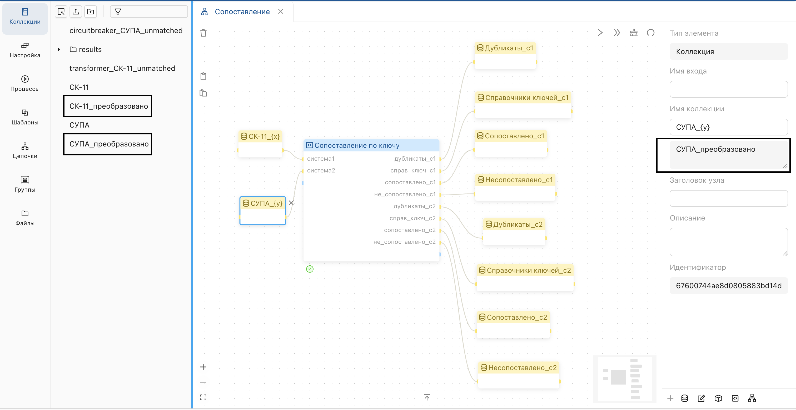
**Пример 2:**

* Задайте маску **"{x}\_{y}\_unmatched"**, где **"x"** и **"у"** - переменные, а **"unmatched"** - постоянная часть.

**Результат:**

В окно с параметрами подтянутся все коллекции из текущей БД:

* В имени которых будет присутствовать постоянная часть маски **"unmatched"**.
* Структура маски будет соответствовать - **"{переменная часть}\_{переменная часть}\_[постоянная часть]"**.
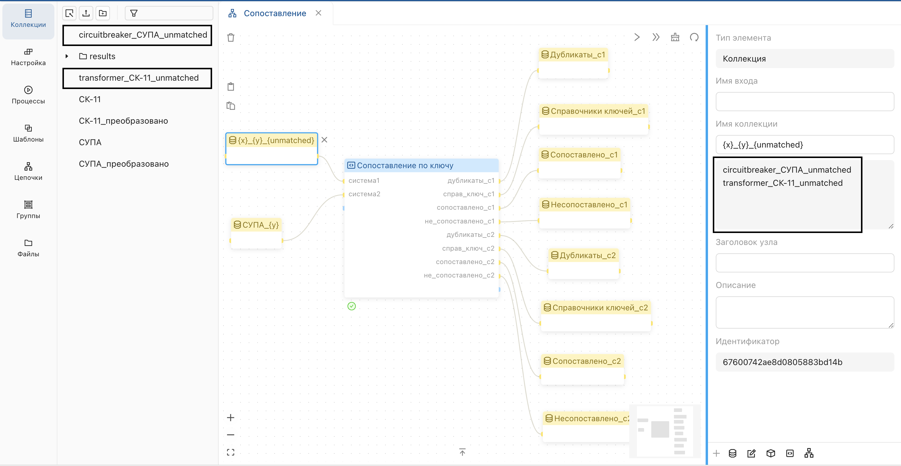
После настройки маски запустите обработчик. Для проверки результата, нажмите на необходимый блок и отобразите данные.
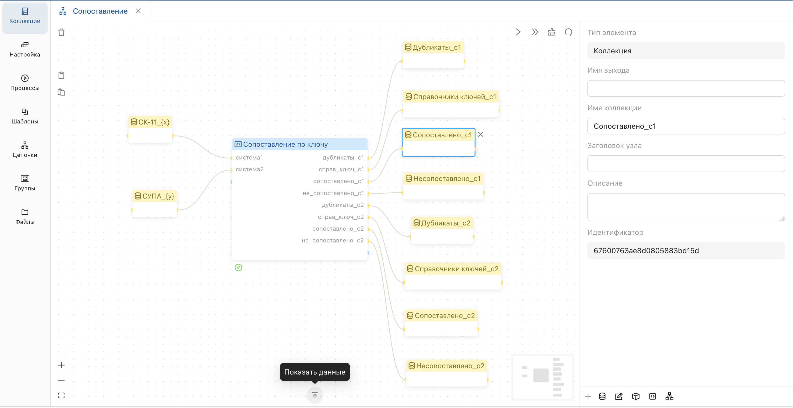

**Результат:**

Производные данные содержат поля с наименованием переменной части коллекции, а также поле, с результатом сопоставления по условию.
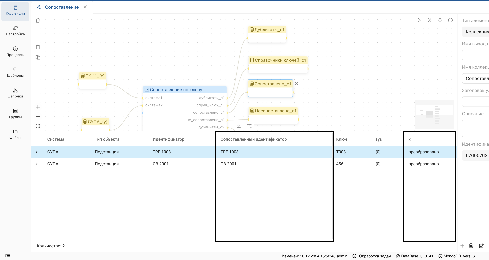

### Выходные данные
Для распределения выходных данных задайте маску по аналогии.
**Например:**

{type}_{system}_processed

**Результат:**

Обработчик создаст отдельные коллекции для каждого типа объекта и системы:

* transformer_SK-11_processed
* circuitbreaker_SPA_processed.

> Если маска не совпадает с именами коллекций, данные не будут обработаны. Имена коллекций должны быть стандартизированы и соответствовать заданной структуре.