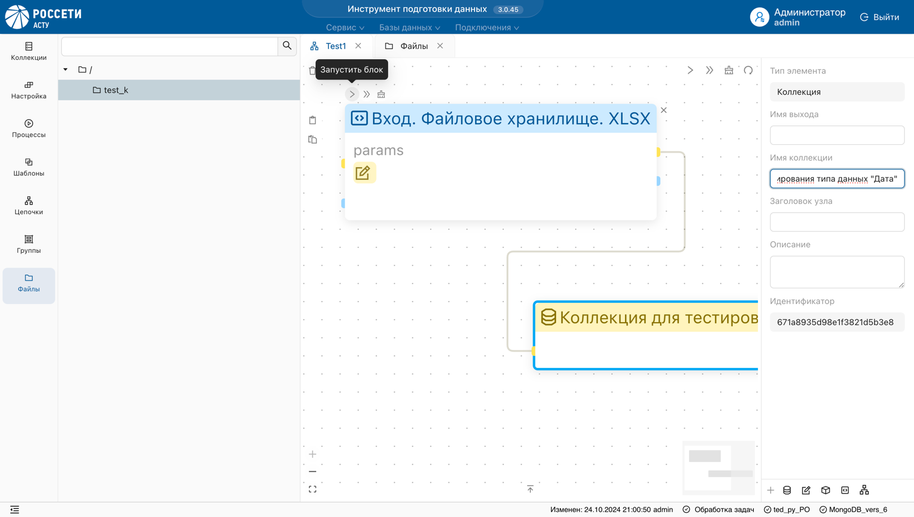

Ниже описан пример настройки цепочки преобразований, включающих объекты "Программный обработчик" и "Коллекция".
### Загрузка файла в s3

1. В разделе "Файлы" загрузите файл формата XSLX.


### Инициализация обработчика

2. В разделе "Цепочки" настройте обработчик.


    - Выберите обрабочик из списка.
*В результате, выбранный объект отобразится в рабочей области в виде блока с синим заголовком*

    - Скопируйте путь к файлу в разделе “Файлы”.


    - Задайте параметры в поле params:

```json
{
    "file_path": "путь_к_тестовому_файлу.xlsx"
}
```
    - Подключите выходную коллекцию к обработчику.


    - Запустите обработчик.



**Результат:** В рабочей области должен отобразиться статус успешного запуска процесса, а в списке коллекций объект с данными из хранилища.


3. Проверьте, что данные из ```XLSX``` файла корректно добавлены в раздел "Коллекции".

### Отладка скрипта

> В случае, если запуск обработчика возвращает ошибку, отладьте скрипт вручную.

4. Нажмите на заголовок блока.


**Результат:** слева отобразится панель настройки обработчика.

5. Вызовите функцию скрипта для отладки.


6. Скопируйте текст и отладьте его в среде разработки.


