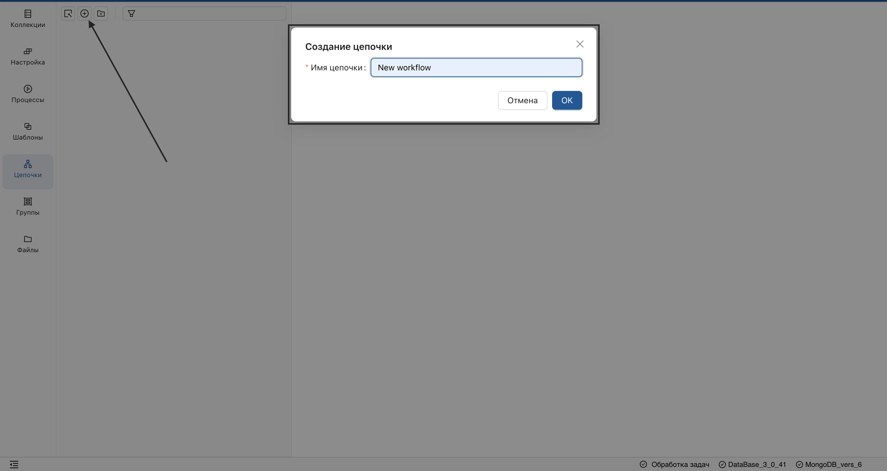
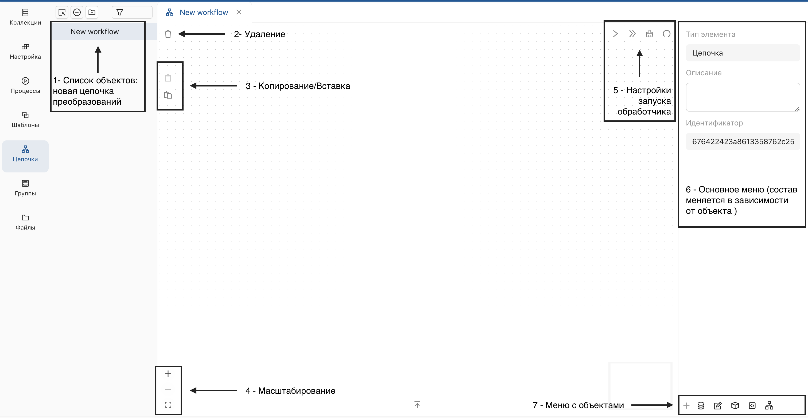
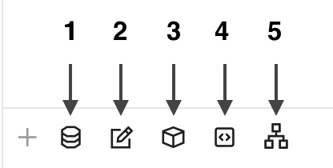
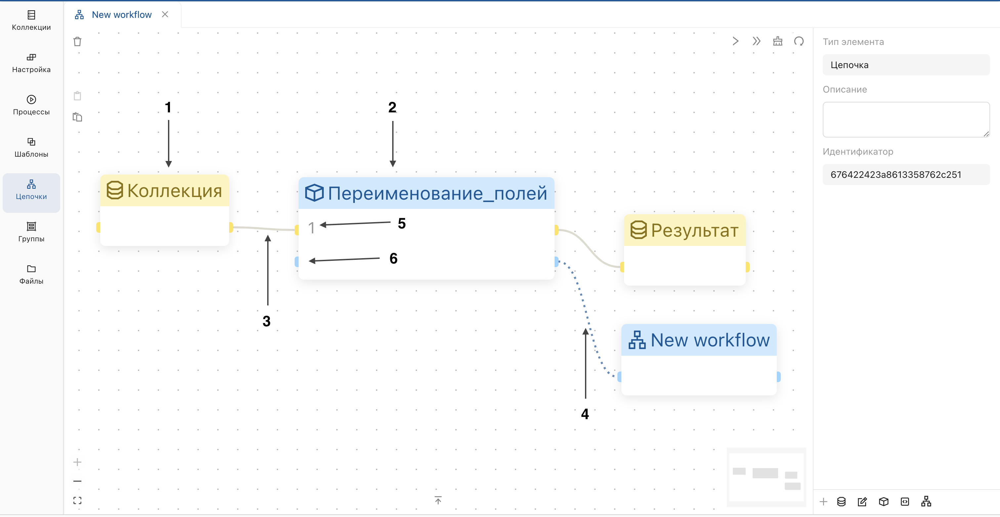
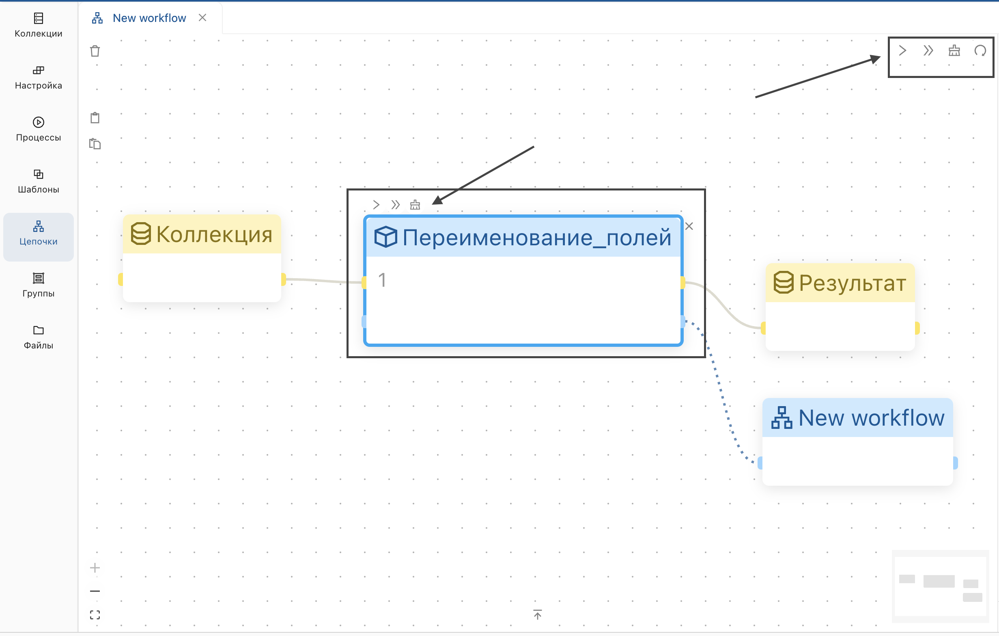
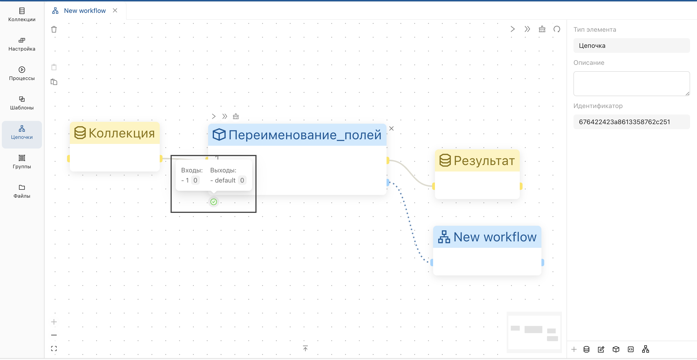
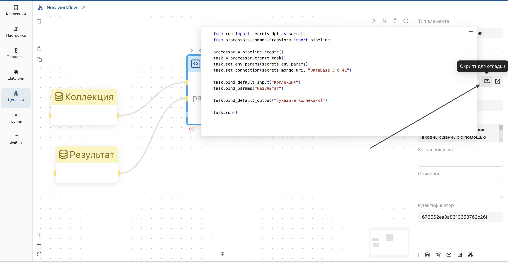
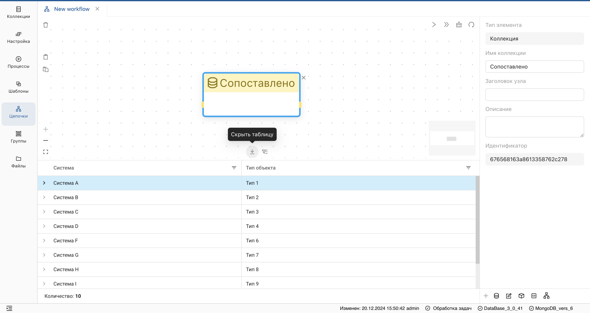
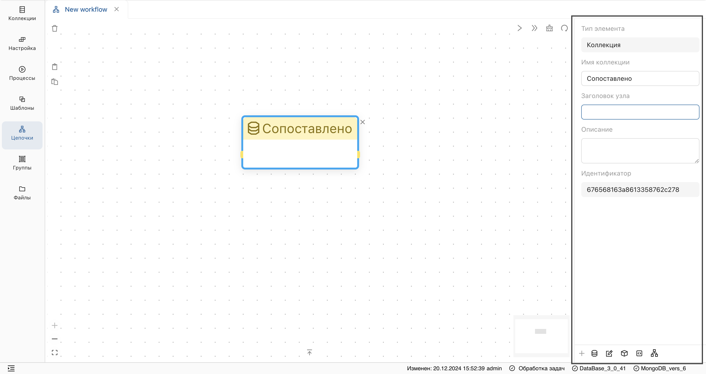

_Цепочки преобразований представляют собой последовательности действий, используемые для обработки данных._

# Создание цепочки

1. Перейдите в раздел **"Цепочки"** и нажмите **"+"**.
2. В открывшемся окне введите имя цепочки и подтвердите действие.  

**Результат:**

<ol start="1">
  <li>Созданная цепочка отобразится в списке объектов.</li>
  <li>Отобразится рабочая область, содержащая:
    <ul>
      <li>Меню удаления/копирования объектов цепочки.</li>
      <li>Меню настройки запуска блока цепочки.</li>
      <li>Основное меню для настройки объектов цепочки.</li>
      <li>Список объектов.</li>
      <li>Масштабирование и центрирование.</li>
    </ul>
  </li>
</ol>

# Настройка цепочки
Перейдите на страницу цепочки и добавьте элементы цепочки преобразований.

Звеньями цепочки являются:

**Блоки данных:**

1. **"Коллекция"** – ссылка на коллекцию базы данных.
2. **"Встроенный набор данных"** – входит в состав конфигурации цепочки, может использоваться для параметризации обработчиков.

**Обработчики:**

<ol start="3">
  <li><strong>"Процесс"</strong> – вызов процесса.</li>
  <li><strong>"Программный обработчик"</strong> – вызов программного обработчика.</li>
  <li><strong>"Цепочка"</strong> – вызов вложенной цепочки преобразований.</li>
</ol>

Предусмотрено два типа связей между звеньями цепочки преобразований: поток данных и поток управления.

**Поток данных** может связывать:

* Блок данных с входом обработчика.
* Выход обработчика с коллекцией.
* Выход обработчика с входом другого обработчика.

Такие связи определяют порядок передачи данных и соответственно порядок выполнения обработчиков.

**Поток управления** может связывать обработчики для определения порядка их выполнения без передачи данных.

Обработчик может иметь один или несколько входов и выходов для подключения потоков данных.

**Пример ниже содержит:**

1. Блок данных (коллекция).
2. Обработчик (вызов процесса).
3. Связь (поток данных).
4. Связь (поток управления).
5. Входы и выход для подключения потока данных.
6. Вход и выход для подключения потока управления.

> При наведении показывается статистика по входам и выходам, а в случае ошибки показываются детали по ошибке.

**Операции блока:**

* Запустить блок.
* Запустить цепочку до данного блока.
* Очистить статус блока.
* Удалить блок.

**Операции цепочки:**

* Запустить невыполненные блоки.
* Запустить всю цепочку сначала.
* Очистить статусы.
* Обновить.

> Операции блока отобразятся в результате нажатия на блок

### Статус блока

Статус операции может быть успешным или содержать ошибку.

В случае ошибки при запуске цепочки, выполните отладку:

* Нажмите на блок.
* В свойствах выделенного элемента, скопируйте скрипт и отладьте его в среде разработки.

> Для отладки скриптов, требуется знание Python. При необходимости обратитесь в поддержку.

### Отображение таблицы с данными. 
Таблица содержит данные выделенной коллекции или порта (вход, выход потока данных).

Для отображения таблицы, нажмите на **стрелку вверх** внизу рабочей области.

### Свойства выделенного элемента. 
Выделенным элементом может быть блок, связь, вход или выход, цепочка целиком. В зависимости от типа элемента набор свойств отличается.

