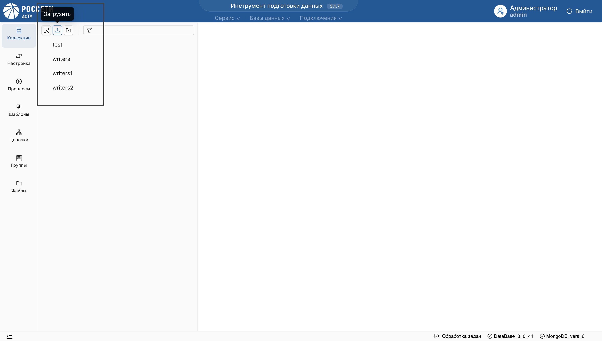
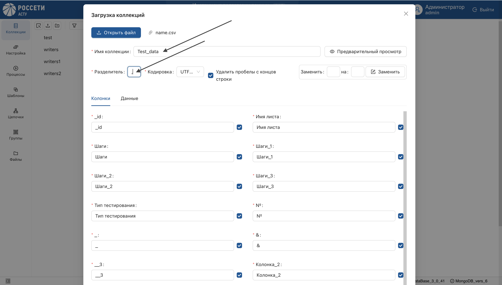
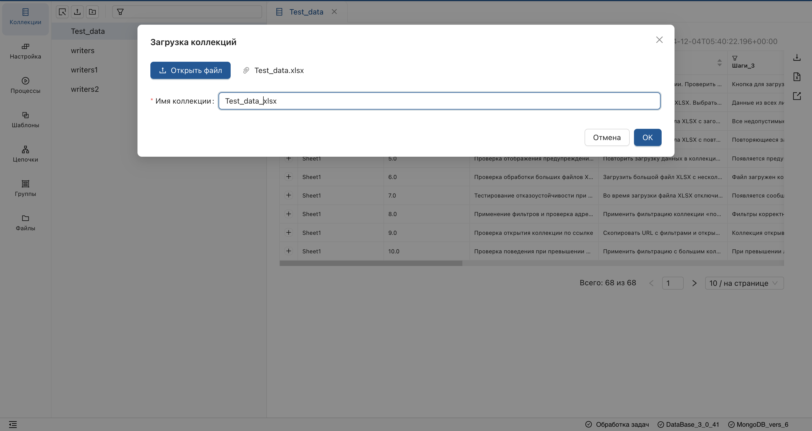

## Загрузка данных из CSV файлов

1. Перейдите в раздел **"Коллекции"** и нажмите на элемент загрузки над списком коллекций.

<ol start="2">
  <li>
    В диалоговом окне выберите файл CSV.
  </li>
</ol>

<ol start="3">
  <li>
    В открывшемся окне, выполните настройки загружаемого файла:
  </li>
</ol>

* Введите имя коллекции (не должно содержать символов `.` и `$`). 
* Настройте разделитель, чтобы привести данные к табличному виду. 
* Замените недопустимые символы в заголовках полей. 
* Отключите или переименуйте поля по необходимости.

 

**Результат**: 

* Статус загрузки отобразится в обработчике задач.
* Загруженный файл отобразится в списке коллекций.

> При необходимости, вы можете перезапустить задачу.

## Загрузка данных из XLSX файлов

1. Перейдите в раздел **"Коллекции"** и нажмите кнопку загрузки над списком коллекций.

<ol start="2">
  <li>
    В диалоговом окне выберите файл Excel.
  </li>
</ol>

<ol start="3">
  <li>
    В открывшемся окне, введите имя файла.
  </li>
</ol>

**Результат**: 

Загруженный файл отобразится в списке коллекций.

**Загрузка Excel файлов позволяет:**

1. Загрузить данные из всех листов файла в одну коллекцию.
2. Добавить поле с именем листа при загрузке нескольких листов.
3. Интерпретировать первую строку каждого листа как заголовок.
4. Создать отдельный документ коллекции для каждой строки.
5. Выполнять обработку заголовков полей:
   - Заменяет недопустимые символы (`.` и `$`) на `_` в заголовках полей.
   - Заменяет пустые заголовки на **Колонка N**, где N — номер колонки.
   - Добавляет индексы для повторяющихся заголовков.

> Вложенные массивы при загрузке интерпретируются как строка.
