_**Агрегация** — модуль для преобразования данных, позволяющий выполнять одну настройку за одну версию преобразования._  
Чтобы начать работу, откройте страницу версии настройки и выберите **[Агрегация](# "Модуль для объединения и преобразования данных, использующий настройки для создания производных версий данных")** на функциональной панели.

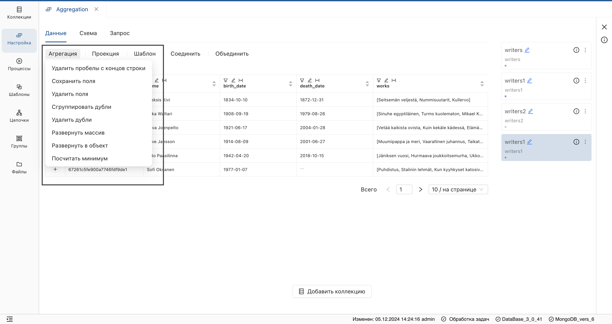
**Результат:** отобразится выпадающий список агрегаций.

## Сохранить поля
1. Выберите операцию **"Сохранить поля"** из списка.
2. В открывшемся окне:
    * Нажмите на переключатель.
    * Выберите поля.
    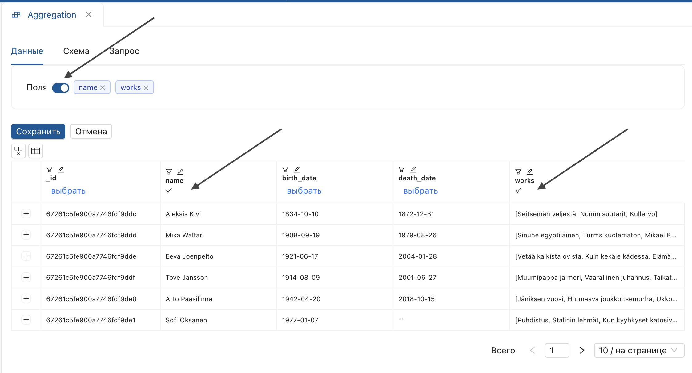
    * Нажмите **"Сохранить"**.

**Результат**: указанные поля добавятся в **производную версию**.

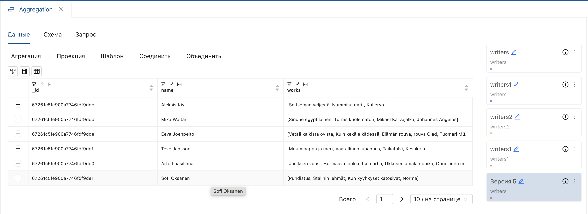

## Удалить поля
1. Выберите операцию **"Удалить поля"** из списка.
2. В открывшемся окне:
    * Нажмите переключатель.
    * Отметьте поля, которые нужно удалить.
    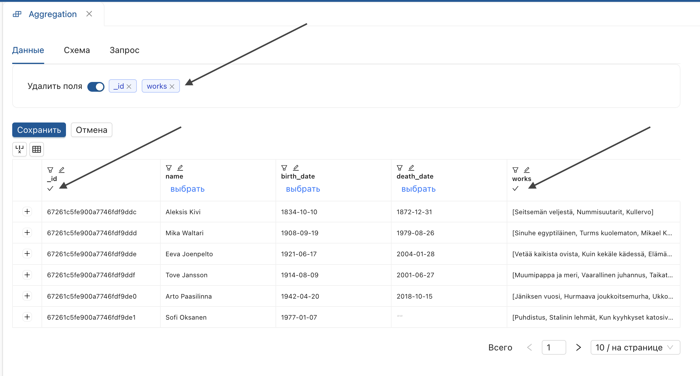
    * Нажмите **"Сохранить"**.

**Результат**:  
[Производная версия](# "Версия данных, полученная после применения операций преобразования") настройки не содержит указанные поля.

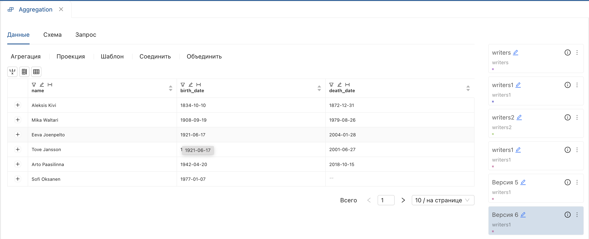

## Сгруппировать дубли
1. Выберите операцию **«Сгруппировать дубли»** из списка.
2. В открывшемся окне:
    * Установите переключатель **[поля для группировки](# "Поля, по значениям которых формируются группы записей")**.
    * Выберите поля и нажмите **"Сохранить"**
    
    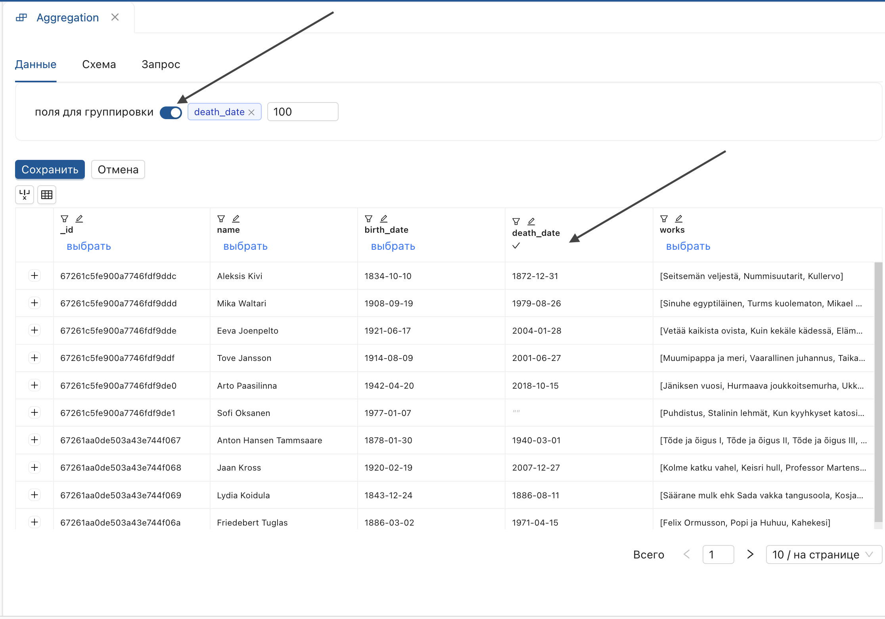
    
    **[Производная версия](# "Версия данных, полученная после применения операций преобразования") содержит:**
    
    - Поле с отображением длины массива **[BunchSize](# "Поле, отображающее количество записей в группе")**.
    - Поле с группами уникальных значений, вложенных в [массив данных](# "Поле, содержащее сгруппированные данные в виде списка").
    - Исходное поле.
    
    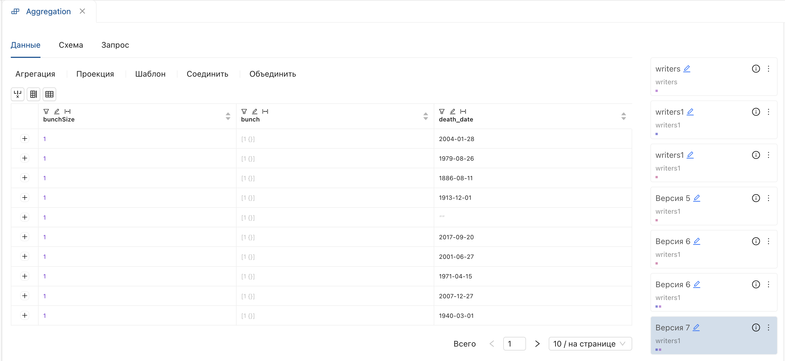
    
3. Для просмотра содержимого массива дважды нажмите по нему. 
    
    **Результат**:  
    Отобразится окно со списком полей, вложенных в массив.
     
    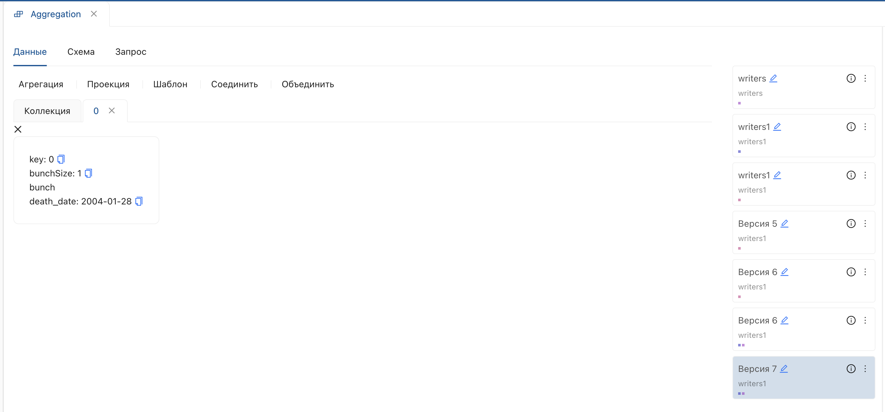

4. При нажатии на поле отобразятся данные массива.
    [Отображение данных вложенного массива](../../images/4_Nastroyka/4_2_Preobrasovanuya/4_2_2_Aggregate/9_Group_dubles_massive_data.png)
    > **Ограничение**: размер документа — 16 Мб. Ограничение может быть превышено после группировки. 
    
    Для корректного выполнения установите максимальное количество значений при заполнении параметров.  
    
    
5. Чтобы развернуть массив на верхний уровень, используйте агрегацию **"Развернуть массив"**.
    
## Удалить дубли

1. Выберите операцию **"Удалить дубли"** из списка.
2. В открывшемся окне:
    * Установите переключатель **"поля"**. 
    * Выберите поля и нажмите **"Сохранить"**.

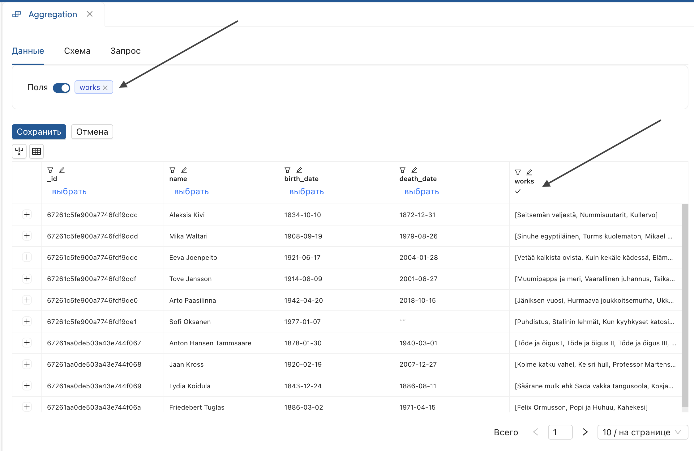

**Результат**:  
Будет создана [производная версия](# "Версия данных, полученная после применения операций преобразования") с уникальными значениями полей.

## Развернуть массив
_Разворачивает [массив данных](# "Поле, содержащее сгруппированные данные в виде списка") на верхний уровень._

> Для выполнения операции используйте коллекцию с вложенным массивом данных (в таблице отображается в виде квадратных и фигурных скобок **"[количество значений{}]"**).

1. Выберите операцию **"Развернуть массив"** из списка.
2. В открывшемся окне:
    * Установите параметр **"поле"** по заголовку поля, содержащего [массив данных](# "Поле, содержащее сгруппированные данные в виде списка").
    * Введите произвольный [префикс](# "Добавляемый текст перед названием новых полей, полученных из массива").
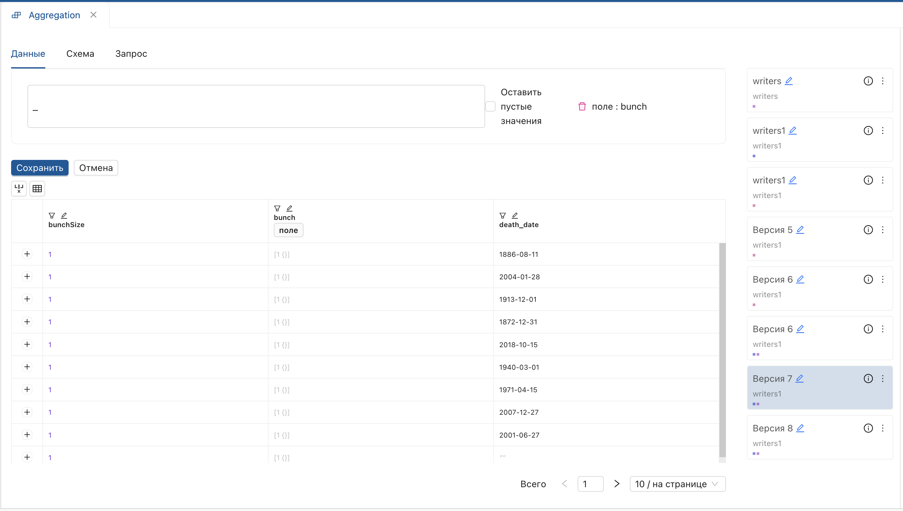
    * Нажмите "Сохранить".

**Результат**:  
Подмассивы вынесены на верхний уровень с указанным [префиксом](# "Добавляемый текст перед названием новых полей, полученных из массива")ом.  

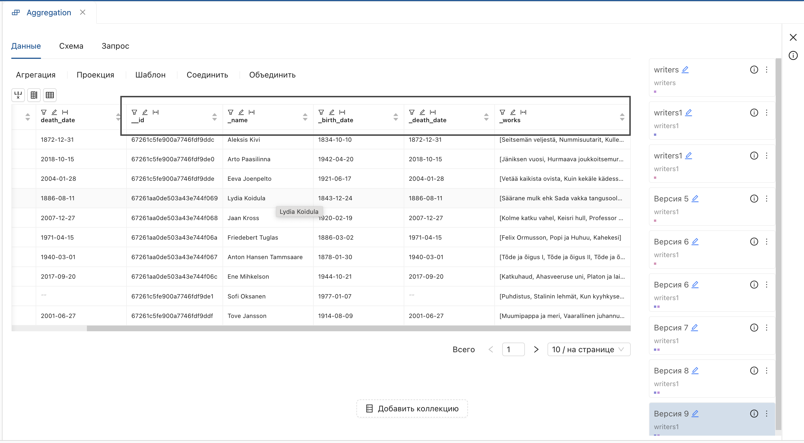

## Развернуть в объект

1. Выберите операцию **«Развернуть в объект»** из списка.
2. В открывшемся окне:
    * Установите параметр "поле" по заголовку поля, содержащего [массив данных](# "Поле, содержащее сгруппированные данные в виде списка").
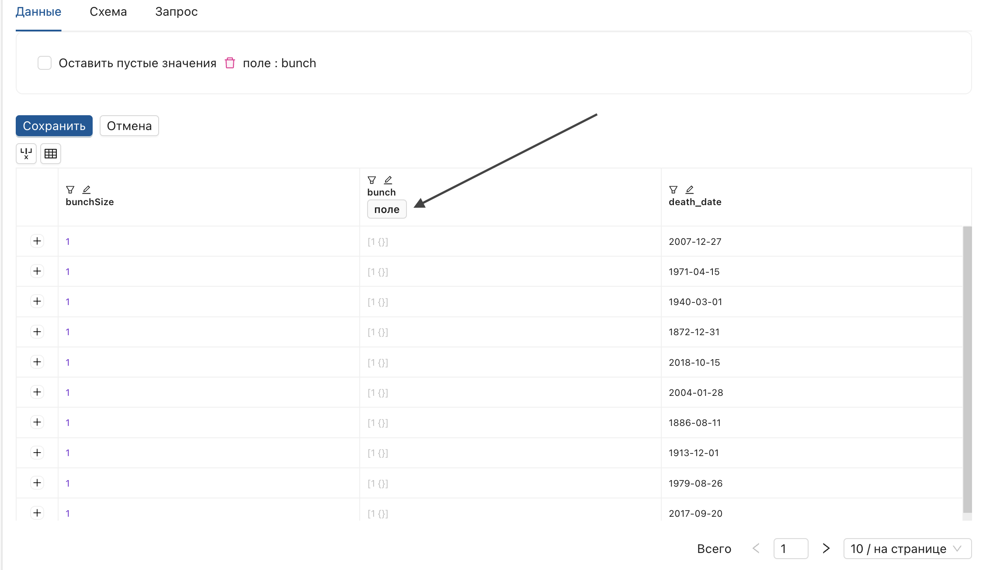
    * Нажмите "Сохранить".

**Результат**:  
Поля массива разворачиваются в объект (объект отображается с фигурными скобками).

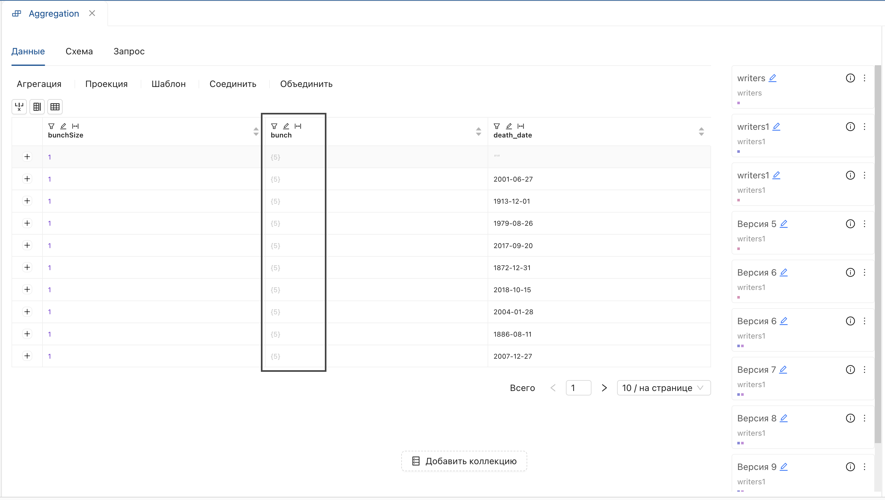
> В результате данной функции доступно назначение параметров ко вложенным данным.

#### Назначение параметров ко вложенному объекту
Для преобразования данных во вложенном объекте:

1. Выберите операцию преобразования.
2. Откройте [поля для группировки](# "Поля, по значениям которых формируются группы записей"), дважды щелкнув по ячейке.
3. Нажмите на **поле, содержащее [вложенную структуру](# "Поля, содержащие дополнительные данные в виде объектов или массивов")**. 
4. Дважды нажмите на объект для отображения данных. 
5. Выставьте параметры условия. 
6. Введите имя производного поля "Сохранить".

> Поля со вложенными структурами отображаются контрастно.

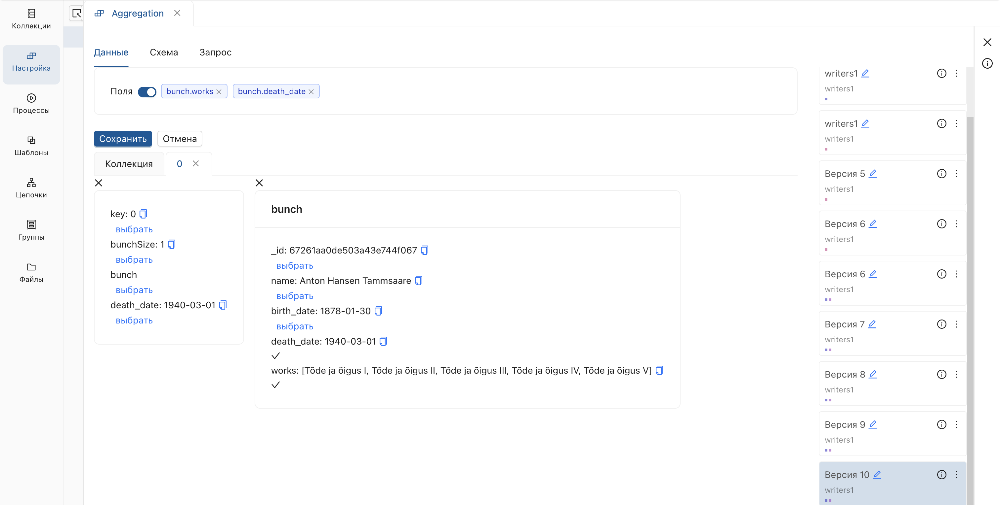

**Результат**:  
Операция будет применена к данным внутри объекта.

## Посчитать минимум
_Вычисляет минимальное значение для группы значений._

1. Выберите операцию **"Посчитать минимум"**.
2. В открывшемся окне:
    * Установите переключатель **[поля для группировки](# "Поля, по значениям которых формируются группы записей")**.
    * Выберите поля.
    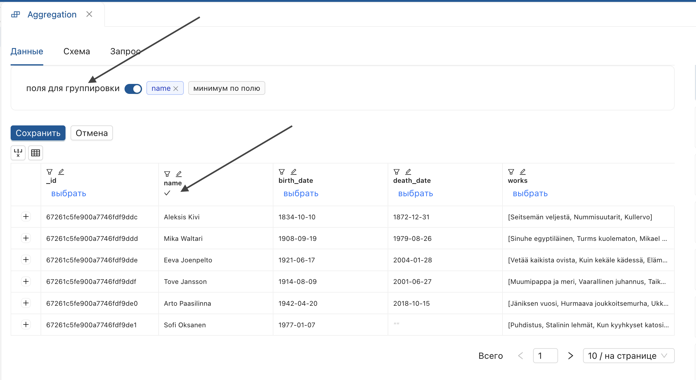
    * Установите параметр **"минимум по полю"**.
    * Выберите поля.
    
    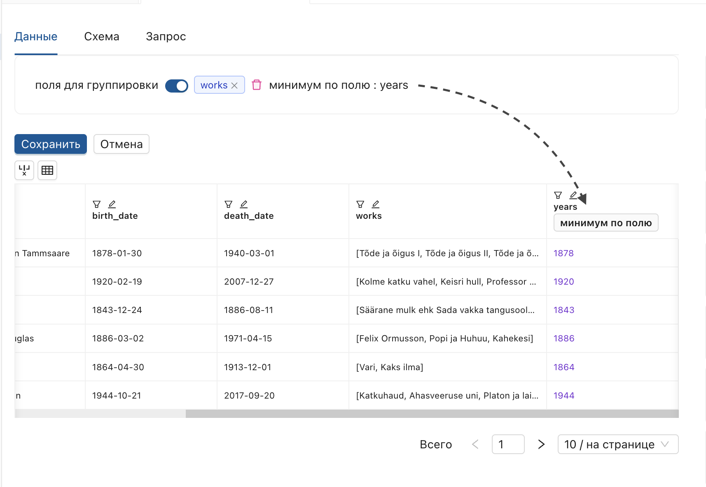

3. Нажмите **"Сохранить"**.

**Результат**:  
Созданы уникальные группы значений с рассчитанным минимумом для каждой.

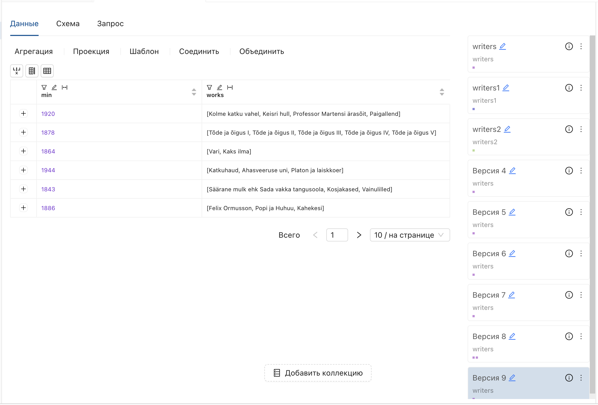