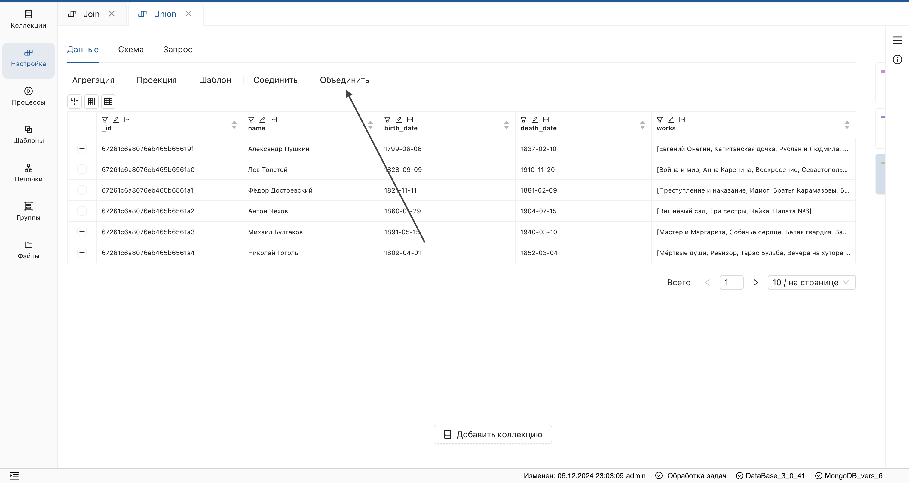
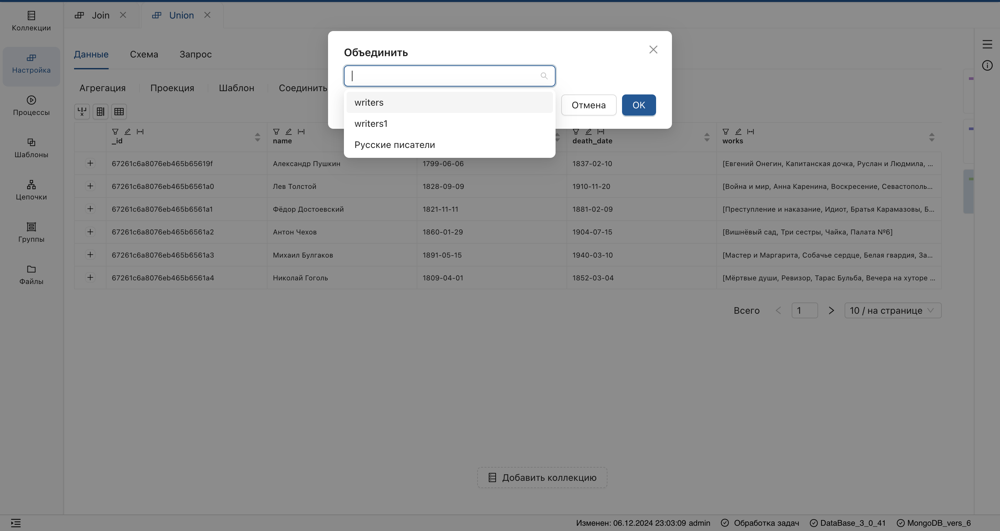

## Операция **"Объединить"**
_Объединяет построчно несколько коллекций._

1. Откройте настройку в рабочей области.
2. Откройте страницу источника и нажмите **"Объединить"**.
    
3. В отобразившемся окне выберите источник или версию настройки.
    

**Результат:**  
- Сформируется шаг, содержащий поля всех источников, вынесенные на верхний уровень.
- Одинаковые заголовки соединятся в одно поле.

> В результате применения данной функции может сформироваться **неоднородный состав полей**, что приведет к неполному отображению их в таблице.  

Для формирования однородного состава полей используйте опцию [выгрузку полей](Таблица%20коллекции.md#выгрузка-полей).
