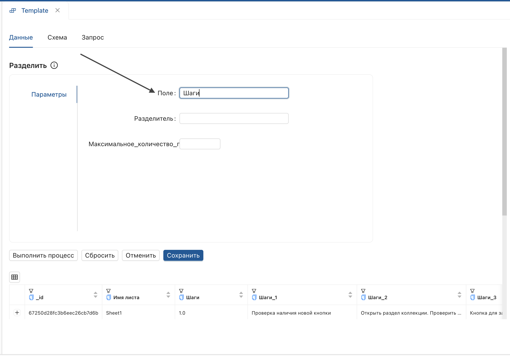

## Преобразование при помощи **[шаблона](# "Набор предустановленных операций, применяемых к данным для их обработки")**
_Применяет **[шаблоны преобразований](# "Набор предустановленных операций, применяемых к данным для их обработки")** из функционального раздела **Шаблоны** к шагу настройки._

1. Откройте страницу версии настройки и нажмите **Шаблон**.
    
2. Выберите **шаблон** из выпадающего списка.
    
3. В открывшемся окне скопируйте имя **заголовка** **поля**.
    
4. Вставьте его **(Ctrl+V)** в строке **Поле**.
    
5. Настройте прочие параметры и нажмите **"Выполнить процесс"**.

> В списке отображены шаблоны, созданные в рамках текущей БД, или **[общие шаблоны](# "Шаблоны, доступные для использования всеми пользователями текущей базы данных")**. Для присвоения функции **Общий шаблон** перейдите в функциональный раздел [Шаблоны](../../6_Шаблоны/Шаблоны.md). 

**Результат:**  
К **коллекции данных** будут применены настройки выбранного **[шаблона](# "Набор предустановленных операций, применяемых к данным для их обработки")**.

> Для каждого **шаблона** настраивается индивидуальный набор параметров.

Для сохранения настроек в коллекцию, нажмите **"Сохранить"**. Инструкцию по созданию и настройке [шаблона](# "Набор предустановленных операций, применяемых к данным для их обработки") описана в разделе [Шаблоны](../../6_Шаблоны/Шаблоны.md).