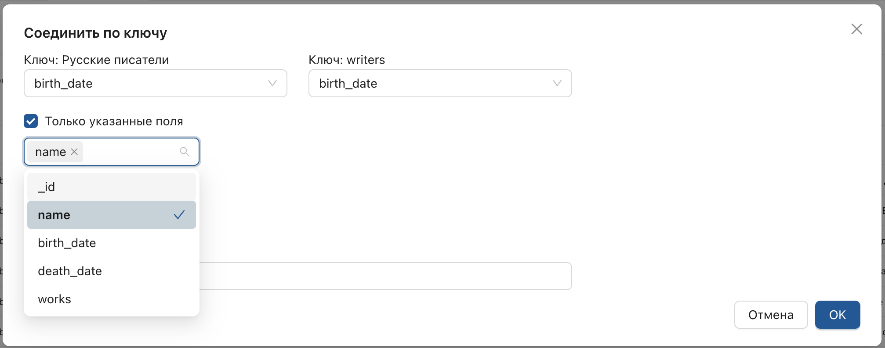

# Операция **"Соединить"**
_Присоединяет значения поля по **ключу**._

1. Откройте настройку в рабочей области.
2. Отобразите страницу источника и нажмите **"Соединить"**.
    
3. В отобразившемся списке выберите присоединяемый источник или версию преобразования.
    
    **Результат:**  
    В рабочей области отобразится окно с параметрами.
    
4. Укажите ключи (поля, по которым будет выполнено присоединение источников).
    
5. Введите имя производного поля и подтвердите действие.

> При необходимости укажите присоединяемые поля.

**Результат:**  
Будет добавлена производная версия настройки, содержащая поле с вложенным массивом данных и поле с количеством вложенных элементов.

> Операция может значительно увеличить объем данных, поэтому ограничьте количество вложенных документов в окне назначения параметров.

**Дополнительные действия:**  

* Дважды нажмите на значение производного поля, чтобы отобразить вложенный массив данных в соседней вкладке.

* Нажмите на поле, содержащее массив, чтобы отобразить его в виде таблицы.

