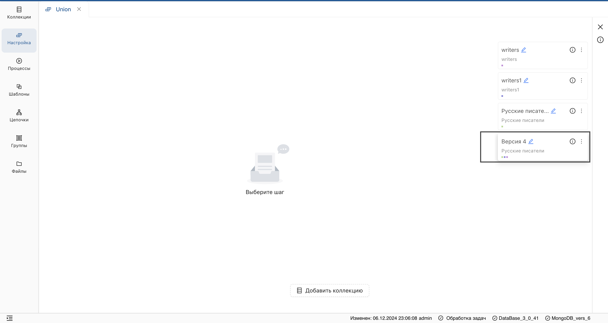
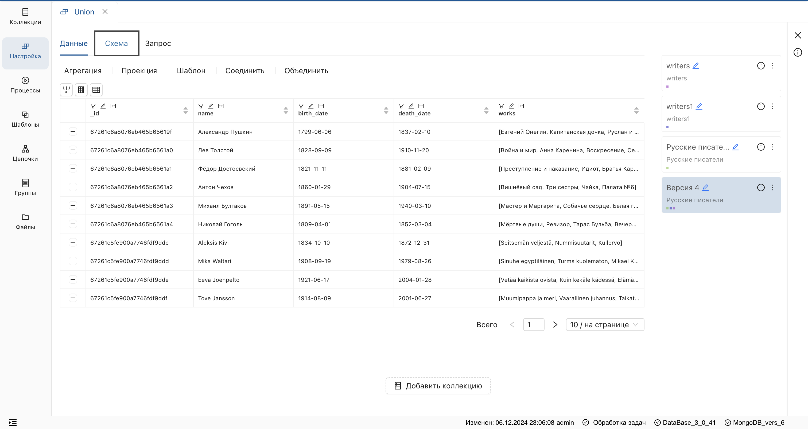
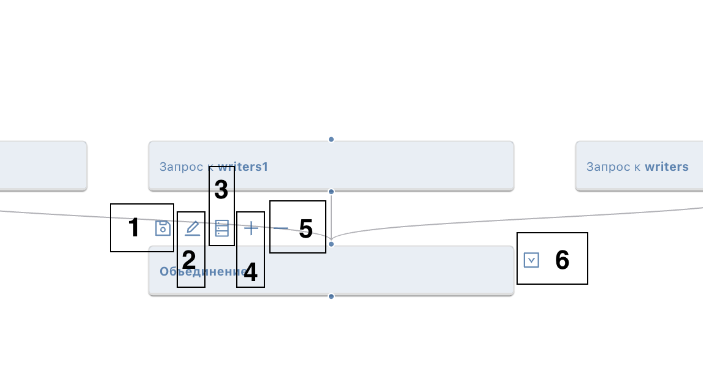
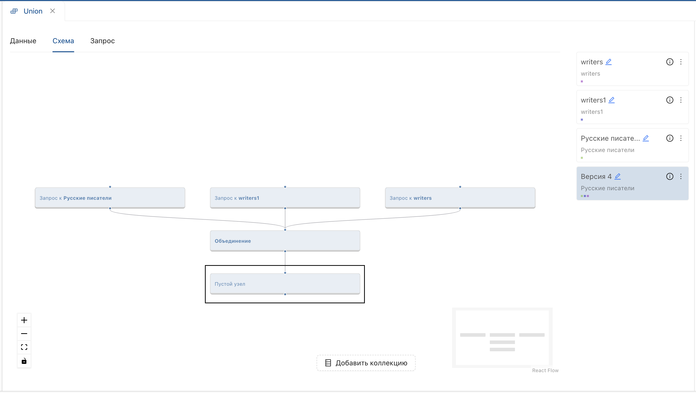
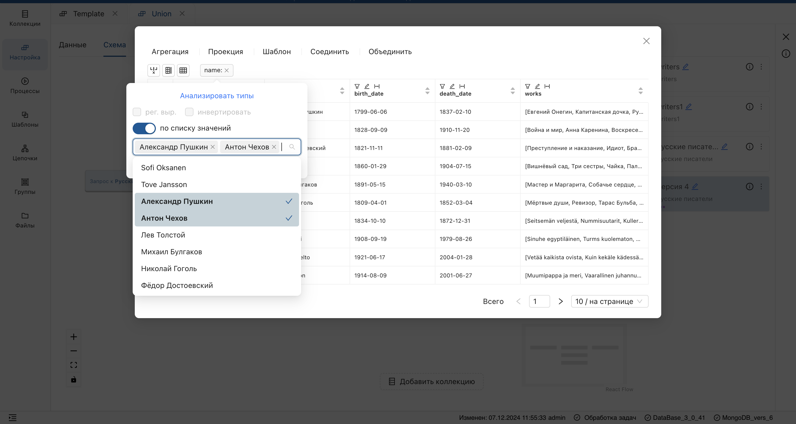
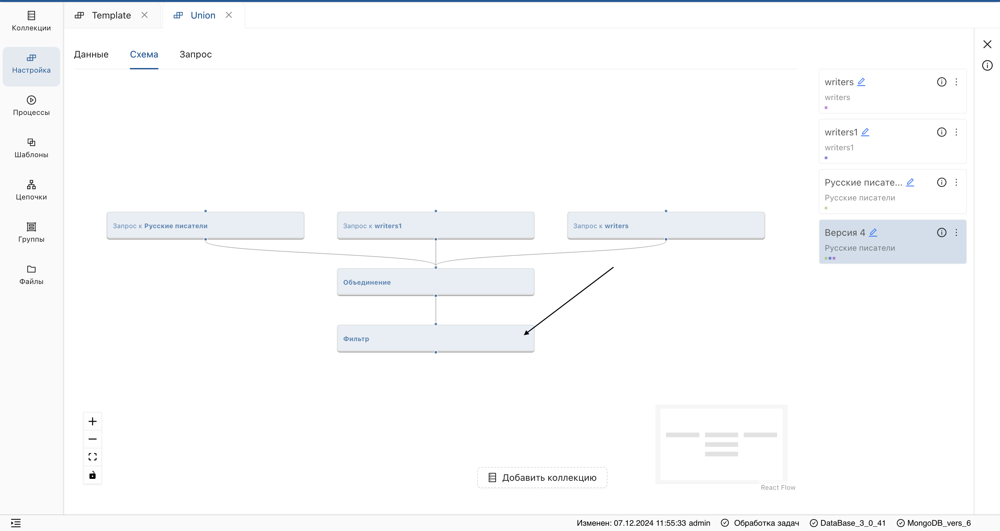
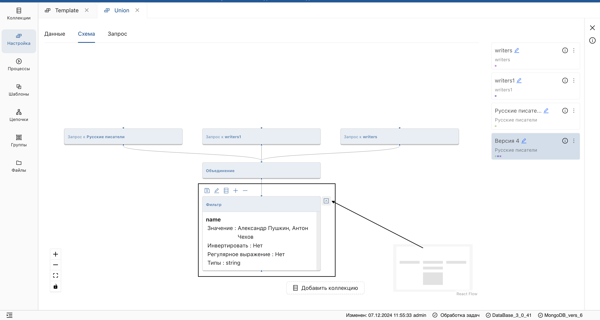

## Редактирование настройки
_Система позволяет настраивать цепочку преобразований с помощью панели инструментов и редактировать уже существующую настройку._

1. Выберите **версию настройки**, которую необходимо отредактировать.
    
2. Перейдите во вкладку **Схема** на странице настройки.
    
3. Нажмите на **блок** настройки.
    
    **Результат:**  
    Отобразится функциональность **блока**, содержащая (слева направо):

     * Опцию **персистирования** (отображена в виде дискеты) (1).
     * Редактирование параметров настройки (2).
     * Предпросмотр **версии настройки** в табличном отображении (3).
     * Добавление **шага настройки** (4).
     * Удаление **шага настройки** (5).
     * Просмотр параметров преобразования (6).
     
    
4. Выберите нужную функцию (например, **добавление шага преобразования**).

    **Результат:** будет добавлен пустой узел. 
    
5. Отредактируйте параметры шага, нажав на кнопку **Редактирование**.
    
    **Результат:** отобразится **[таблица данных](# "Отображение JSON-документов в табличной форме, где строки — отдельные документы, а колонки — пары ключ-значение")** и **инструменты преобразования**.  
6. Далее, выполните необходимое преобразование (например, примените **фильтр**).
    

**Результат:**

* Пустой узел преобразуется в шаг настройки.
* Данные коллекции будут преобразованы.

> Для отображения параметров шага настройки, нажмите на блок и в отобразившемся меню разверните информацию о шаге.

