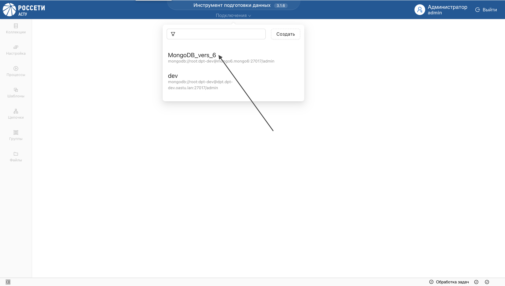

# Подключение к Системе
Для начала работы, авторизуйтесь в Системе:

* Введите имя пользователя и пароль.

**Результат:**

Авторизованный пользователь отобразится в заголовке приложения.

* Выберите подключение из списка.

* Далее, выберите базу данных из списка или создайте новую.

**Результат:**

Отобразится страница базы данных с функциональными разделами системы.

