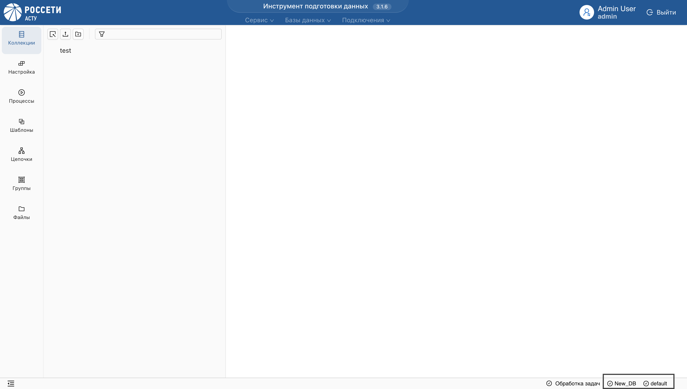

# Подключение к системе

Для начала работы, авторизуйтесь:  

**1.** Введите **имя пользователя** и **пароль**.
    

    
**Результат:**  
_Авторизованный пользователь отобразится в заголовке приложения._  

**2.** Выберите **подключение** из списка.
    
  

**3.** Далее, выберите **базу данных** из списка или создайте новую.  

**Результат:**  
_Отобразится страница базы данных с функциональными разделами системы._

