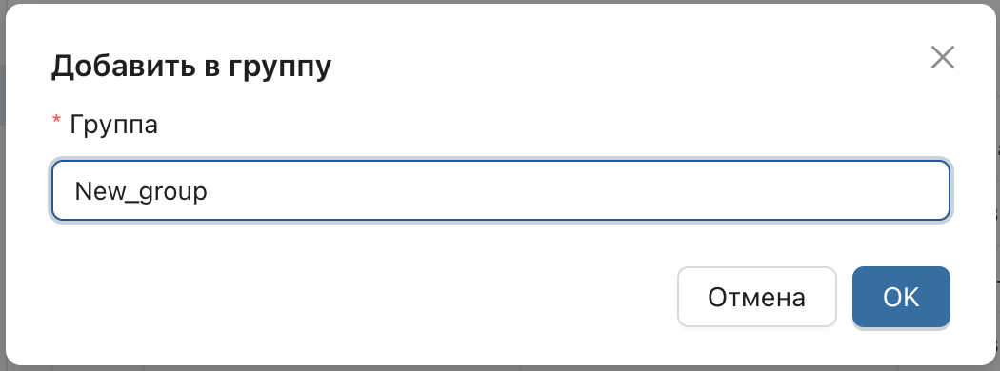
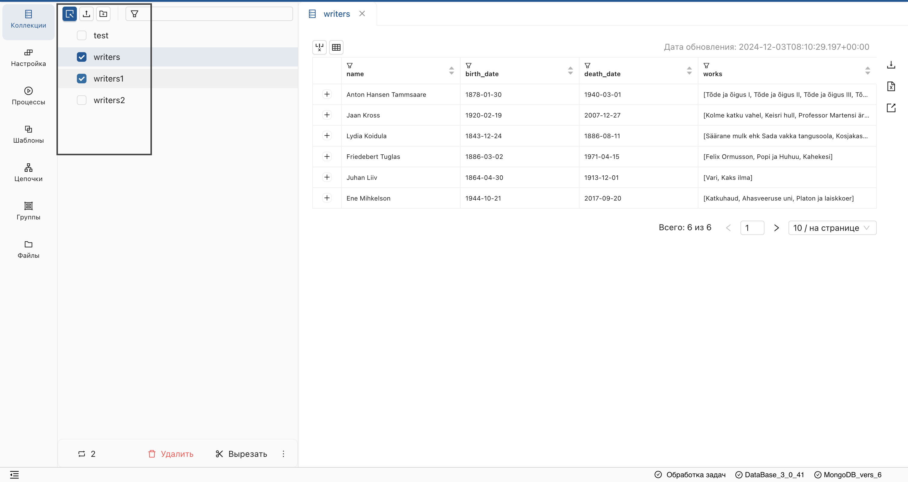

# Общие функции разделов
Функции, общие для всех разделов (**"Коллекции"**, **"Настройка"**, **"Процессы"**, **"Цепочки"**, **"Шаблоны"**), расположены в левом вертикальном меню и включают:

* Перенос артефактов между стендами.
* Отправку данных из одной БД в другую.
* Группировку объектов.
* Создание иерархической структуры.
* Удаление объектов.

Специфические функции, будут описаны в соответствующих разделах.

## Перенос объектов между стендами
_Сервис позволяет переносить пользовательские артефакты между стендами._

**Для экспорта объектов:**

1. Выберите пользовательскую БД из списка и нажмите на **"Сервис"** в заголовке приложения.

<ol start="2">
  <li>
    Выберите "Экспорт настроек".
  </li>
</ol>

<ol start="3">
  <li>
    В открывшемся окне выберите необходимые объекты и подтвердите действие.
  </li>
</ol>

**Результат:**  
Будет сформирован архив файлов. 

> При необходимости включите данные связанных коллекций, установив соответствующую галочку. Скачайте архив для дальнейшего импорта на другой стенд.

**Для импорта объектов:**

1. Выберите **"Импорт настроек"**.
2. Загрузите архив файлов и подтвердите действие.

> Для импорта доступны только файлы, экспортированные через данный сервис.

## Отправка данных из одной БД в другую
1. Перейдите в раздел, данные которого хотите отправить (например, **"Коллекции"**).
2. Включите [режим массового выделения](#работа-с-массовым-выделением) и выберите объекты.
3. Наведите курсор на многоточие под списком и выберите "Переместить/Копировать".

<ol start="4">
  <li>
    В открывшемся окне выберите Подключение и целевую БД.
  </li>
</ol>

> Вы можете создать БД непосредственно в окне перемещения - для этого просто введите имя новой БД и подтвердите действие.

> При экспорте настроек необходимо отправить коллекции-источники данных, иначе перемещенная настройка будет пустой.

## Группировка объектов
_Группировка позволяет создавать одноуровневые группы объектов в разделах: **"Коллекции"**, **"Настройка"**, **"Процессы"**, **"Цепочки"**, **"Шаблоны"**. В отличие от иерархической структуры, один и тот же объект может быть добавлен в несколько групп одновременно._

1. Перейдите в раздел, где находятся объекты, которые вы хотите добавить в группу.
2. Включите режим массового выделения и выберите объекты.
3. Наведите курсор на многоточие под списком объектов и выберите опцию "Группа".

<ol start="4">
  <li>
    Выберите уже существующую группу или создайте новую, указав ее имя.
  </li>
</ol>

**Результат:**  
Отмеченные объекты будут добавлены в указанную группу в разделе **"Группы"**.

> Вы можете добавлять в группу объекты различных сущностей, таких как Коллекции, Настройки и Процессы.

### Удаление группы
1. Перейдите в раздел **"Группы"** в левом меню.
2. Выберите нужную группу и отметьте объекты, которые хотите удалить из нее.
3. Нажмите кнопку **"Убрать из группы"**.

**Результат:**  
Объекты будут удалены из данной группы, но останутся в разделе, к которому они принадлежат.

> При удалении объекта из основного раздела, он автоматически удалится из всех групп.

## Группировка объектов в иерархической структуре
_Иерархическая структура позволяет организовать объекты в разделах: **"Коллекции"**, **"Настройка"**, **"Процессы"**, **"Цепочки"**, **"Шаблоны"**. В каждом разделе создается своя иерархия, где объекты могут располагаться как в корне, так и внутри папок. Папки и объекты сортируются по имени, и их имена должны быть уникальными в рамках раздела._

### Создание каталога
1. Перейдите в один из разделов: **"Коллекции"**, **"Настройка"**, **"Процессы"**, **"Цепочки"**, **"Шаблоны"**.
2. На верхней панели инструментов нажмите кнопку **"Создать папку"**.

<ol start="3">
  <li>
    Введите имя папки и нажмите OK.
  </li>
</ol>

**Результат:**  
Каталог будет создан в корне раздела. Имя каталога должно быть уникальным в рамках раздела.

### Создание подкаталога
1. Найдите каталог в дереве, в который хотите добавить подкаталог.
2. Нажмите на кнопку **"Создать дочернюю папку"** рядом с именем каталога.

<ol start="3">
  <li>
    Введите имя подкаталога и нажмите **OK**.
  </li>
</ol>

**Результат:**  
Дочерняя папка будет создана внутри выбранной папки.

### Создание объекта в корне
_Применимо для разделов **"Настройка"**, **"Шаблоны"**, **"Цепочки"**._

1. В разделе нажмите **Добавить элемент** на верхней панели инструментов.

<ol start="2">
  <li>
    Введите имя объекта и нажмите OK.
  </li>
</ol>

**Результат:**  
Объект будет создан в корне дерева и отображен в списке объектов. Имя объекта должно быть уникальным.

### Создание объекта внутри каталога
1. Найдите папку, в которой хотите создать объект.
2. Нажмите кнопку **"Добавить элемент"** рядом с папкой.

**Результат:**  
Объект будет создан внутри выбранной папки.

## Работа с массовым выделением
_Массовое выделение позволяет одновременно выделить несколько объектов и папок для выполнения операций._

### Включение режима массового выделения
Нажмите на элемент **Массовое выделение** на панели инструментов.

Отметьте несколько объектов и папок.

## Вырезание и вставка выделенных объектов
1. Включите режим массового выделения и выберите объекты.
2. Нажмите кнопку **"Вырезать"** на нижней панели инструментов.

  
  
  3. Найдите папку, куда нужно переместить объекты, и нажмите кнопку **Вставить** рядом с ее именем.

**Результат:**  
Выбранные объекты будут перемещены в указанную папку.

## Поиск объектов и папок
1. Введите имя объекта или папки в поле поиска на панели инструментов.
2. Нажмите **Enter**.

**Результат:**  
Найденные объекты и папки будут отображаться в своем месте в иерархии.

## Удаление объекта
_Удаление объектов доступно для всех разделов, кроме **Группы**._
1. Включите режим массового выделения и выберите объекты.
2. Нажмите кнопку **"Удалить"**.

**Результат:**
Выбранный объект будет удалён из списка.