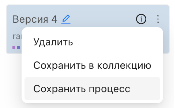
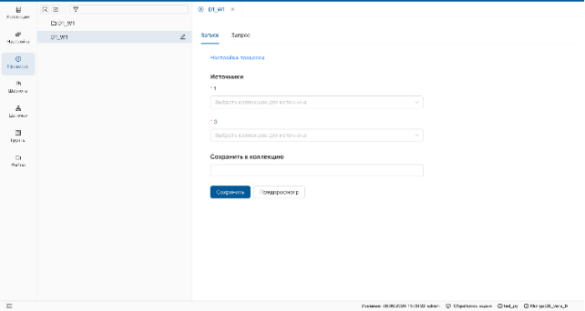

_Процесс создается в разделе **"Настройка"** и может быть выполнен в функциональном разделе **"Процессы"** и использован в функциональном разделе **"Цепочки"**._

## Создание процесса
1. Перейдите на страницу настройки и выполните необходимое преобразование (например, [объединение источников](../Настройка/Преобразование%20данных/Объединить.md)).
2. Наведите курсор на **троеточие** и выберите **Создать процесс**.
    

В открывшемся окне введите:
 
* **Имя процесса:** например, обработка данных клиента.
* **Код:** например, PROC_12345
* **Описание запроса:** например, формирование дубликатов.

>**Описание запроса** визуализируется при использовании процесса в цепочках.

**Результат:**  
**Процесс** отобразится в списке функционального меню раздела **"Процессы"**.

Каждый процесс представляет собой единицу преобразования, но может включать цепочку преобразований.

> Отмените **[персистирование](../Настройка/Редактирование%20настройки/Персистирование.md)** и **[выгрузку полей](../Настройка/Преобразование%20данных/Таблица%20данных.md)**, чтобы избежать потери данных.

## Выполнение процесса
1. Откройте раздел **"Процессы"**.
2. Отобразите страницу процесса в рабочей области.
    
3. Добавьте **источники** и введите имя производной коллекции.
    
    * Для предварительного просмотра результата нажмите **"Предпросмотр"**.
    * Для сохранения результата в физическую коллекцию нажмите **"Сохранить"**.

**Результат:** выполненный **процесс** сохранится в список коллекций.

**Для корректного выполнения процесса:**

- **Заголовки полей** подставляемой коллекции должны совпадать с **заголовками полей** источника запроса.
- Если применены функции [персистирования](../Настройка/Редактирование%20настройки/Персистирование.md) или [выгрузки полей](../Настройка/Преобразование%20данных/Таблица%20данных.md), отмените их.
