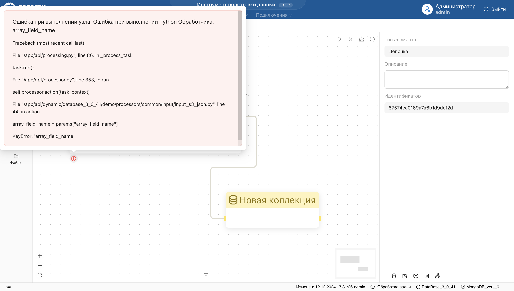
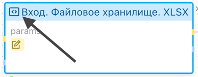
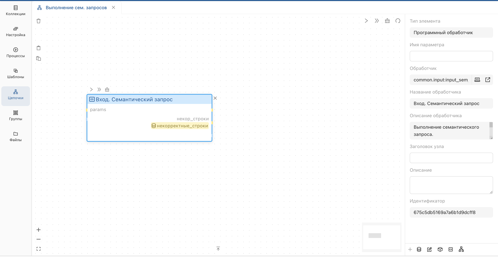
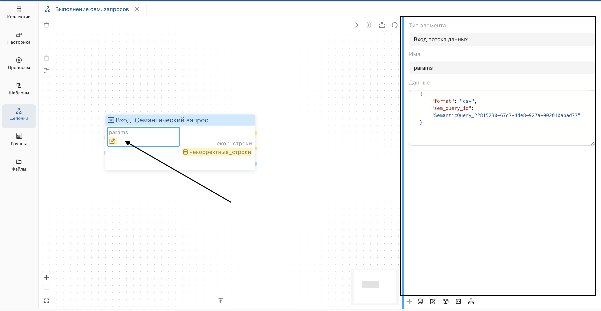
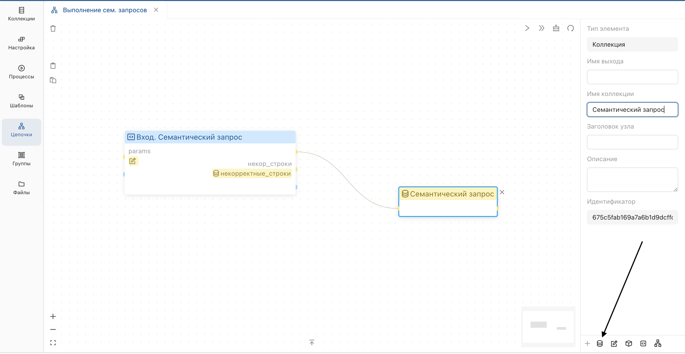
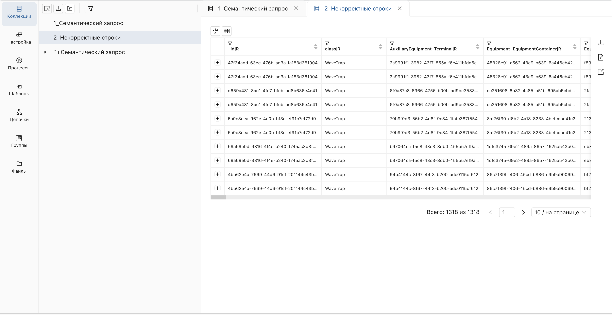
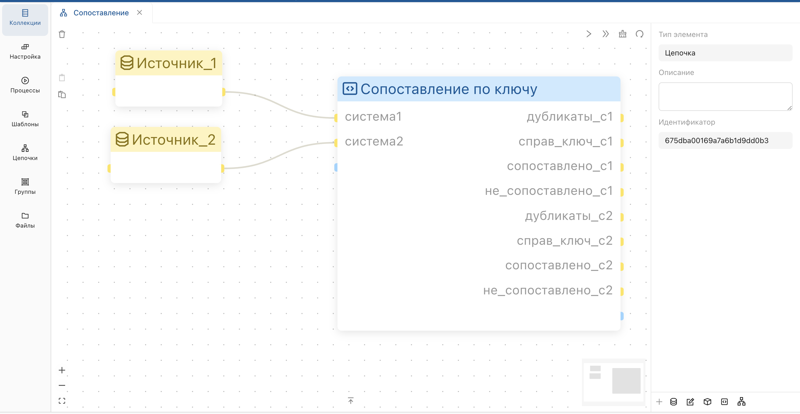
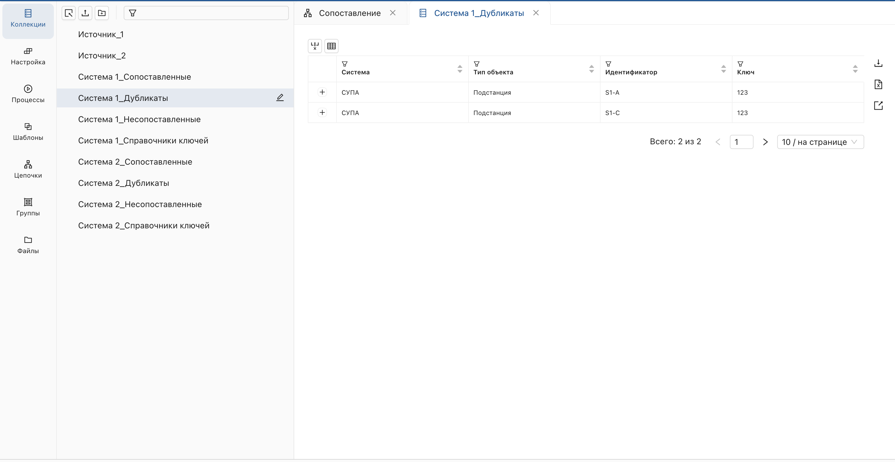

# Программные обработчики
Программные обработчики реализуются на языке **Python** по определённым правилам, и объединяются в логические модули и проекты для включения в состав конфигурации системы.
Создание программных обработчиков может быть выполнено с использованием любой IDE или редактора, который поддерживает программирование на **Python**.
Для описания программных обработчиков, модулей и проектов используются следующие классы.

**Processor** – обработчик.

Поля:

* name: str – имя процессора уникальное в пределах модуля
* title: str – заголовок
* description: str – описание
* inputs: dict[str, Port] – входы обработчика, каждый описывается объектом типа Port
* outputs: dict[str, Port] – выходы обработчика каждый, описывается объектом типа Port
* action: Callable[[Task], None] – функция реализующая алгоритм обработки с параметром типа Task, который обеспечивает доступ к входным данным по имени входа и запись выходных данных в заданный выход.

**Port** – вход или выход обработчика

Поля:

* name: str – имя процессора уникальное в пределах модуля
* title: str – заголовок
* description: str – описание.

**Module** - Модуль. Содержит набор программных обработчиков, каждый обработчик включен в один конкретный модуль.

Поля:

* name: str – уникальное имя модуля
* title: str – заголовок
* description: str – описание
* processors: dict[str, Processor] – набор обработчиков в модуле.

**Project** – Проект. Содержит набор модулей, один модуль может входить в разные проекты.

Поля:

* name: str – уникальное имя модуля
* modules: dict[str, Module] – набор обработчиков в модуле

Описанный с помощью перечисленных выше классов проект содержащий программные обработчики публикуется в определенную пользовательскую базу данных. После этого, программные обработчики проекта доступны для выбора в качестве звена цепочки преобразований.

Пример  
**Создание обработчиков.**

Приведен пример создания 2-х обработчиков,- модуля и проекта.

В данном примере все компоненты описаны в одном файле.
При реальной (особенно совместной) разработке важно уделить внимание декомпозиции.
Декларация обработчиков модулей и проектов может быть разнесена по отдельным функциям, файлам и папкам, оптимальная структура кода будет зависеть от особенностей проекта. 
> Рекомендуется хранение исходного кода обработчиков в GIT.

```
example_project.py

from datetime import datetime
from dpt import Module, Project, Task, Processor


# Создание обработчика simple
def create_simple_processor():
    processor = Processor(
        name="simple",
        title="Простой пример",
        description="Добавляет колонку с текущей датой и сообщением",
    )
    # Добавление входа и выхода
    processor.add_input()
    processor.add_output()


    # Объявление функции с алгоритмом обработки
    def action(task: Task):
        # Чтение входящего набора данных
        data = task.get_reader().read_all()
        # Обработка данных
        for item in data:
            item["info"] = "Обработано питоном " + str(datetime.now())
        # Запись исходящего набора данных
        writer = task.get_writer()
        writer.clear()
        writer.write_many(data)
        writer.close()


    # Назначение функции action в качестве действия для процессора
    processor.set_action(action)


    return processor


# Создание обработчика multiport
def create_multiport_processor():
    processor = Processor(
        name="multiport",
        title="Пример с несколькими портами",
        description="Объединяет данные из двух наборов данных в один. Дополнительно выдает набор данных со статистикой",
    )


    # Добавление именованных входов и выходов
    processor.add_named_input("data_set1")
    processor.add_named_input("data_set2")
    processor.add_named_output("all_data")
    processor.add_named_output("stat")


    # Объявление функции с алгоритмом обработки
    def action(task: Task):
        # Получение входящих наборов данных по имени порта
        reader1 = task.get_named_reader("data_set1")
        reader2 = task.get_named_reader("data_set2")


        # Запись данных в выход all_data
        all_data_writer = task.get_named_writer("all_data")
        all_data_writer.clear()
        all_data_writer.write_many(list(reader1.read_all()))
        all_data_writer.write_many(list(reader2.read_all()))
        all_data_writer.close()


        # Запись данных в выход stat
        stat_writer = task.get_named_writer("stat")
        stat_writer.clear()
        stat_writer.write_many(
            [
                {"name": "data_set1", "count": reader1.get_count()},
                {"name": "data_set2", "count": reader2.get_count()},
            ]
        )
        stat_writer.close()


    # Назначение функции action в качестве действия для процессора
    processor.set_action(action)


    return processor


def main():
    # Создание модуля и добавление в него 2-х обработчиков
    module = Module("examples")
    module.add_processors([create_simple_processor(), create_multiport_processor()])


    # Создание проекта и добавление в него модуля
    project = Project("example")
    project.add_module(module)
    return project
```


**Публикация**

Публикация проекта с программными обработчиками в заданный экземпляр и базу данных препаратора с помощью скрипта.
```
from dpt import management
# Строка соединения с Mongo DB (из подключения в препараторе)
management.set_connection("mongodb://...")
# База данных
management.set_workspace("demo")


management.deploy_project(
    # Корневая папка в которой находятся Python файлы с определением обработчиков
    root_path=r"C:\Repos\datafabric\dpt-python-config\configuration",
    # Папки и файлы которые нужно включить в сборку (по умолчанию входит все содержимое корневой папки)
    include=["processors/example_project.py"],
    # Файл в котором находится функция создающая и возвращающая проект
    main_file_path=r"processors/example_project.py",
    # Имя функции которая создает и возвращает проект
    main_func_name="main",
)
```

В результате публикации обработчики становятся доступны для выбора в разделе «Цепочки».

Ниже приведено описание следующих программных обработчиков:

* Импорт JSON.
* Импорт Excel.
* Семантический запрос.
* Сопоставление.
* Отправка сообщений в платформу.

Дополнительно, доступна следующая функциональность:

* Набор коллекций по маске.
* Сводный отчет по результатам сопоставления.

# Импорт JSON
Программный обработчик предназначенный для импорта данных из JSON файла, размещенного в файловом хранилище.

#### Загрузка файла в файловое хранилище
Перейдите в раздел [Файлы](../Файлы/Файлы.md) и загрузите **файл формата JSON** с данными.


**Пример файла:**
```json
{
     "data": [
       {
         "id": 1,
         "name": "Объект 1"
       },
       {
         "id": 2,
         "name": "Объект 2"
       }
     ]
   }
```
> Корневой объект должен содержать одно поле с массивом объектов (в данном примере — поле data).

Убедитесь, что файл успешно добавлен в файловое хранилище.


#### Настройка параметров обработчика
В разделе [Цепочки](Цепочки%20преобразований.md) настройте **программный обработчик**:

1. Выберите программный обработчик из списка.
    
       
    **Результат:**  
    В рабочей области появится объект обработчика в виде блока с синим заголовком.
    
2. В разделе [Цепочки](Цепочки%20преобразований.md) настройте параметры **обработчика**:
    
    * Нажмите **params** на блоке, в результате чего отобразится панель для настройки параметров.
    
    * В форме **"Данные"** пропишите параметры процессора в формате **Json**:
        * Скопируйте путь к загруженному [Цепочки](Цепочки%20преобразований.md) из раздела [Файлы](../Файлы/Файлы.md).
        
        * В поле "**file_path**" подставьте путь к файлу в файловом хранилище.
        * В поле "**array_field**": введите имя поля, содержащего массив объектов (в данном примере — data).
        
        
```json
{
    "file_path": "путь_к_JSON_файлу.json",
    "array_field": "data"
}
```
Сохраните импортированные данные в коллекцию:

* Выберите коллекцию из списка на нижней панели.


**Результат:**  
В рабочей области появится объект обработчика в виде блока с желтым заголовком.

* Подключите **выходную коллекцию** к **обработчику**.


#### Запуск обработчика
Нажмите кнопку запуска на блоке обработчика.


**Результат:**  
В рабочей области отобразится статус успешного выполнения.


#### Проверка результата
В разделе **"Коллекции"** убедитесь, что данные из JSON-файла корректно добавлены в выбранную коллекцию.


#### Отладка скрипта
Если обработчик возвращает ошибку:


Нажмите на заголовок блока, чтобы открыть панель настройки обработчика.

В панели настройки вызовите функцию скрипта для отладки.

Скопируйте текст скрипта в среду разработки и выполните отладку.

# Импорт Excel
_Программный обработчик предназначенный для импорта данных из Excel файла, размещенного в файловом хранилище._

В разделе [Файлы](../Файлы/Файлы.md) загрузите файл формата **Excel**.


#### Инициализация обработчика
В разделе [Цепочки](Цепочки%20преобразований.md) настройте обработчик.

Выберите обработчик из списка.

**Результат:**
Выбранный объект отобразится в рабочей области в виде блока с синим заголовком.

Скопируйте путь к файлу в разделе [Файлы](../Файлы/Файлы.md).

Задайте параметры в поле **params**:
```json
{
    "file_path": "путь_к_тестовому_файлу.xlsx"
}
```
Подключите выходную коллекцию к обработчику.

Запустите обработчик.


**Результат:**
В рабочей области должен отобразиться статус успешного запуска процесса, а в списке коллекций объект с данными из хранилища.

Проверьте, что данные из ```XLSX``` файла корректно добавлены в раздел [Коллекции](../Коллекции/Коллекции.md).
#### Отладка скрипта
В случае, если запуск обработчика возвращает ошибку, отладьте скрипт вручную:

1. Нажмите на заголовок блока.
      
    **Результат:**  
    Слева отобразится панель настройки обработчика.
2. Вызовите функцию скрипта для отладки.
    
3. Скопируйте текст и отладьте его в среде разработки.
    

# Семантический запрос
Ниже описан пример настройки цепочки преобразований с использованием объекта **Программный обработчик**, выполняющего семантический запрос.

#### Загрузка данных и подготовка
Перейдите в программное приложение **Редактор модели** и, в списке **"Онтологии"**, выберите **"Семантические запросы"**.

Скопируйте идентификатор запроса без префикса.


#### Инициализация обработчика
В разделе "Цепочки" настройте программный обработчик:

* Выберите обработчик для семантического запроса из списка.
* Обработчик отобразится в рабочей области в виде блока с синим заголовком.



#### Настройка параметров обработчика
В блоке обработчика нажмите **params**, чтобы открыть панель настройки параметров.


Задайте параметры обработчика в формате JSON:

* format: укажите формат данных на выходе (csv для плоского формата или json для иерархического).
* sem_query_id: задайте идентификатор семантического запроса без префикса.
* root_entity_ids: перечислите идентификаторы объектов без префиксов (необязательный параметр). Если он отсутствует, запрос применяется ко всем объектам нужного типа.

Пример параметров для csv-формата:

```json
{
    "format": "csv",
    "sem_query_id": "SemanticQuery_22815230-67d7-4de8-927a-002010abad77"
}
```
Пример параметров для json-формата:

```json
{
    "format": "json",
    "sem_query_id": "SemanticQuery_c061e503-c81c-4c64-9ad9-7047cb2e9ed6",
     "root_entity_ids": [
            "e6e30190-624c-4664-b649-47f833d2a869",
            "556bcf33-0d51-4303-b193-62a6ad389318"
        ]
}
```
Подключите выходную коллекцию:

* Выберите коллекцию из списка в нижней панели.
* Соедините блок обработчика с выходной коллекцией.


> В результате запуска обработчика может возникнуть ошибка, связанная с некорректным форматированием входного CSV-файла.

* Добавьте еще одну коллекцию на вход для записи расхождения в данных.


> Коллекция должна быть добавлена в тот же порт.

#### Запуск обработчика
Нажмите на элемент запуска блока обработчика.


**Результат:** 

В рабочей области отобразится статус успешного выполнения. Данные будут сохранены в формате JSON или CSV в зависимости от указанных параметров.

#### Проверка результата
В разделе "Коллекции" убедитесь, что данные корректно добавлены в выбранную коллекцию.



# Сопоставление
Программный обработчик "**Сопоставление**" выполняет следующие задачи:

* Сопоставление объектов из различных систем по выделенному ключу.
* Формирование выходных данных в соответствии с алгоритмом:
     * Дубликаты объектов.
     * Справочники ключей без дубликатов. 
     * Сопоставленные объекты с указанием идентификаторов систем. 
     * Несопоставленные объекты для каждой системы.

#### Входные данные
Для корректной работы обработчика необходимо соблюсти имена полей коллекции:

* Система: идентификатор системы (например, "СУПА"). 
* Тип объекта: тип объектов (например, "подстанции"). 
* Ключ: уникальный ключ для сопоставления. 
* Идентификатор: уникальный идентификатор объекта.

#### Выходные данные
После выполнения обработчика пользователь получает следующие результаты:

1. **Дубликаты:** список объектов, имеющих повторяющиеся ключи сопоставления. Выводится отдельно для каждой системы.
2. **Справочники ключей:** список входных объектов без дубликатов.
3. **Сопоставленные объекты:** объекты, для которых ключи совпадают, объединяются следующим образом:
    * Запись из справочника ключей системы 1 с добавлением идентификатора системы 2.
    * Запись из справочника ключей системы 2 с добавлением идентификатора системы 1.
4. **Несопоставленные объекты:** списки объектов, для которых не найдено совпадение по ключу, отдельно для каждой системы.

#### Порядок работы
1. Добавьте обработчик в рабочую область.  
   

2. Добавьте входные коллекции и подключите их к процессору.  
   

   Обработчик поддерживает два способа подключения входных данных:

   - **Явное подключение**: пользователь вручную задаёт коллекции для системы 1 и системы 2.
   - **Подключение по маске**: использованием маски можно подключить сразу несколько коллекций, соответствующих указанным условиям (например, все типы оборудования из определённой системы).

<ol start="3">
  <li>Добавьте выходные данные и задайте им имена.</li>
  <li>Запустите обработчик.</li>
</ol>


**Результат:**  
Выходные данные будут добавлены в раздел коллекции.  


# Набор коллекций по маске
Данная функция предназначена для подключения набора коллекций в **обработчике** с использованием маски. Это позволяет:

* Обрабатывать данные сразу из нескольких коллекций.
* Разделять данные из одной коллекции (выход обработчика) на несколько коллекций.

#### Входные данные
**Порядок работы:**

Откройте исходную цепочку преобразований.

> Обратите внимание, что в источнике параметры не заполнены.

Задайте маску в параметрах цепочки преобразований:

* Нажмите на объект, по которому хотите задать маску.
* В отобразившемся окне, введите параметры маски через нижнее подчеркивание:
    * Укажите постоянную часть маски для общей части наименования коллекции.
    * Укажите переменную часть маски в фигурных скобках.


**Результат:**
Обработчик автоматически найдет все коллекции, содержащие постоянную часть маски


**Пример 1:**

* Введите маску **"СК-11_{x}"**, где **"СК-11"** является постоянной частью, а **"{x}"** - переменной.
* Введите маску **"СУПА_{y}"**, где **"СУПА"** является постоянной частью, а **"{y}"** - переменной.

**Результат:**

В окно с параметрами подтянутся все коллекции из текущей БД:

* В имени которых будет присутствовать постоянная часть маски **"СК-11"** и **"СУПА"**.
* Структура маски будет соответствовать - **"[постоянная часть]\_{переменная часть}"**.

**Пример 2:**

* Задайте маску **"{x}\_{y}\_unmatched"**, где **"x"** и **"у"** - переменные, а **"unmatched"** - постоянная часть.

**Результат:**

В окно с параметрами подтянутся все коллекции из текущей БД:

* В имени которых будет присутствовать постоянная часть маски **"unmatched"**.
* Структура маски будет соответствовать - **"{переменная часть}\_{переменная часть}\_[постоянная часть]"**.

После настройки маски запустите обработчик. Для проверки результата, нажмите на необходимый блок и отобразите данные.


**Результат:**

Производные данные содержат поля с наименованием переменной части коллекции, а также поле, с результатом сопоставления по условию.


#### Выходные данные
Для распределения выходных данных задайте маску по аналогии.
**Например:**

{type}_{system}_processed

**Результат:**

Обработчик создаст отдельные коллекции для каждого типа объекта и системы:

* transformer_SK-11_processed
* circuitbreaker_SPA_processed.

> Если маска не совпадает с именами коллекций, данные не будут обработаны. Имена коллекций должны быть стандартизированы и соответствовать заданной структуре.


# Сводный отчет по результатам сопоставления
Программный обработчик **"Сводный отчет"** принимает на вход коллекции, и на выходе формирует таблицу со статистикой. Таблица позволяет анализировать данные, переходить к исходным коллекциям и применять фильтры.

#### Входные данные
На вход могут подаваться следующие типы коллекций:

* **Исключены из выгрузки:** коллекции с перечнем объектов, исключенных из сопоставления.
* **Выделено:** коллекции с перечнем сопоставляемых объектов.
* **Дубликаты:** коллекции, содержащие список объектов из коллекции «Выделено» с повторяющимся ключом сопоставления.
* **Справочник ключей:** коллекции с перечнем сопоставляемых объектов без дубликатов.
* **Сопоставлено:** коллекции с объектами, которые были успешно сопоставлены.
* **Не сопоставлено:** коллекции с объектами, которые не удалось сопоставить.


Входные коллекции должны содержать обязательные поля:

* Система.
* Тип объекта. 


Несколько коллекций могут быть подключены к одному входу обработчика как:

* **Явно:** пользователь вручную выбирает коллекции для входа.

* **По маске:** используется набор коллекций, соответствующих определенным условиям (например, все коллекции одного типа).

#### Запуск обработчика
Запуск обработчика происходит по аналогии с другими обработчиками текущего раздела.

#### Формирование отчета
На выходе обработчика формируется коллекция со статистикой (таблица).

**Колонки таблицы:**  

* **Исключены из выгрузки:** количество строк в соответствующих входных коллекциях.  
* **Выделено:** количество строк в коллекциях сопоставляемых объектов.  
* **Дубликаты:** количество строк с повторяющимися ключами.  
* **Справочник ключей:** количество строк сопоставляемых объектов без дубликатов.  
* **Сопоставлено:** количество успешно сопоставленных строк.  
* **Не сопоставлено:** количество не сопоставленных строк.  
* **% сопост:** процент строк в категории «Сопоставлено» относительно «Выделено».  


#### Работа с таблицей
* Переход к исходным коллекциям

При нажатии на ячейку в колонках «Исключены из выгрузки», «Выделено», «Дубликаты», «Справочник ключей», «Сопоставлено» или «Не сопоставлено» осуществляется переход в исходную коллекцию с наложением фильтра по колонкам Система и Тип объекта.

> Этот функционал реализован с использованием сохранения значений фильтра таблицы в адресной строке браузера.

#### Пример использования
*** Входные коллекции:**

* Коллекция «Исключены из выгрузки»: 10 строк.
* Коллекция «Выделено»: 100 строк.
* Коллекция «Дубликаты»: 20 строк.
* Коллекция «Справочник ключей»: 80 строк.
* Коллекция «Сопоставлено»: 70 строк.
* Коллекция «Не сопоставлено»: 30 строк.

| Система  | Тип объекта | Исключены из выгрузки | Выделено | Дубликаты | Справочник ключей | Сопоставлено | Не сопоставлено | % сопост |
|----------|-------------|-----------------------|----------|-----------|-------------------|--------------|-----------------|----------|
| System A | Object 1    | 5                     | 50       | 10        | 40                | 35           | 15              | 70%      |
| System B | Object 2    | 5                     | 50	      | 10        | 40                | 35	          | 15    	         | 70%      |

