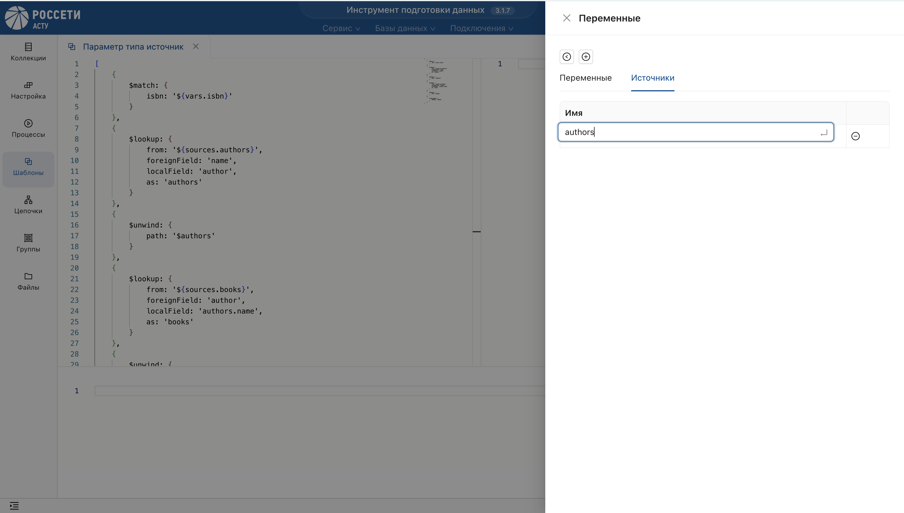
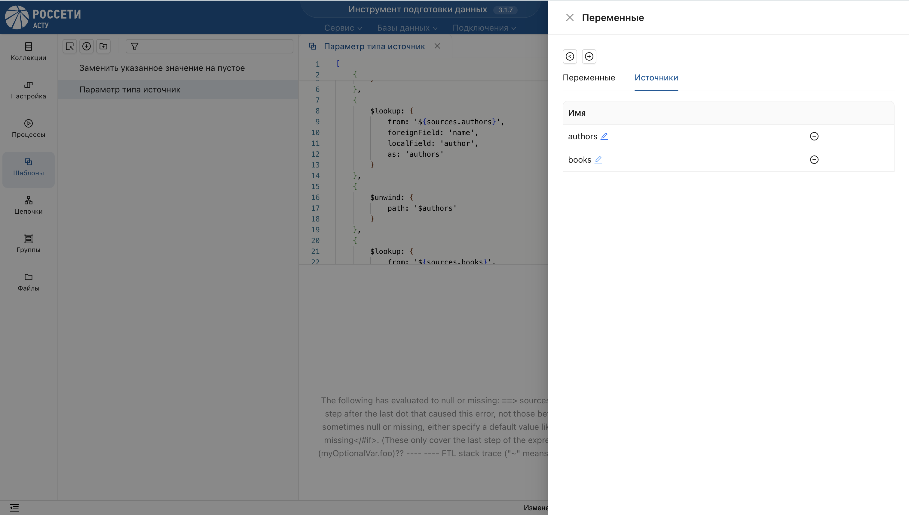

## Описание
_В разделе **"Шаблоны"** реализован параметр типа **источник** для работы с несколькими источниками **настройки**._

## Пример шаблона

Для коллекции **books** находит все **книги**, написанные **автором** с заданным **ISBN**.

Создайте новый шаблон, используя текст **пайплайна**:
```json
[
    {
        $match: {
            isbn: '${vars.isbn}'
        }
    },
    {
        $lookup: {
            from: '${sources.authors}',
            foreignField: 'name',
            localField: 'author',
            as: 'authors'
        }
    },
    {
        $unwind: {
            path: '$authors'
        }
    },
    {
        $lookup: {
            from: '${sources.books}',
            foreignField: 'author',
            localField: 'authors.name',
            as: 'books'
        }
    },
    {
        $unwind: {
            path: '$books'
        }
    },
    {
        $replaceRoot: {
            newRoot: '$books'
        }
    }
]
```

Параметризируйте шаблон и настройте переменные:

* Во вкладке **"Переменные"** введите переменную **"isbn"**.

* Во вкладке **"Источник"** введите переменные **"authors"** и **"books"**.


**Выгрузите** шаблон и **сохраните** его.

**Протестируйте** шаблон.

> Чтобы опубликовать шаблон для всех пользователей, используйте функцию **"Общий шаблон"**.